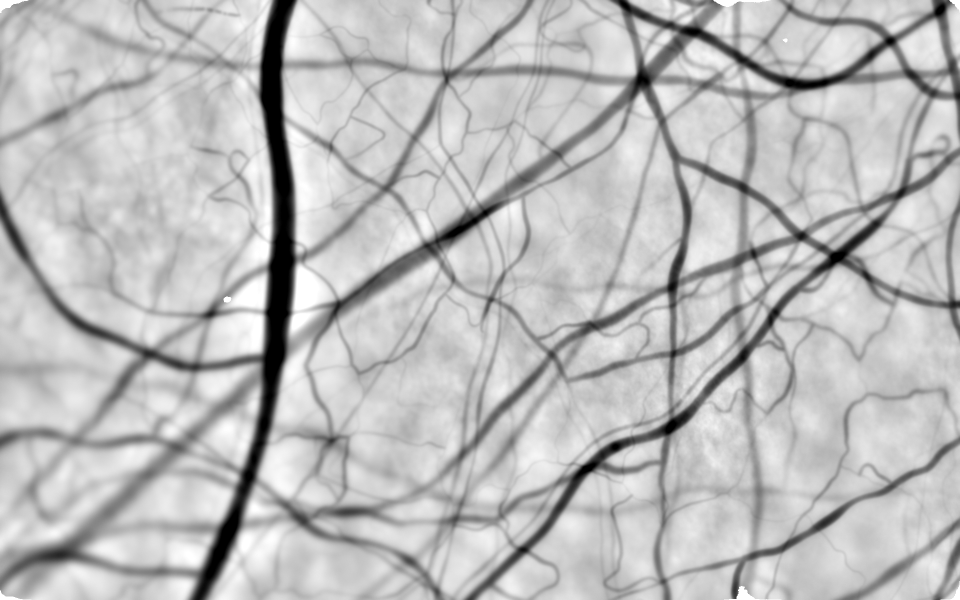
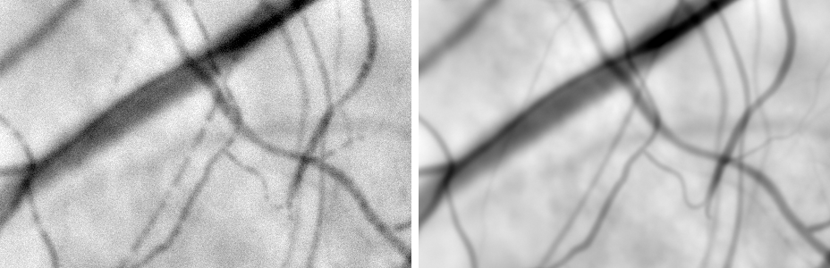
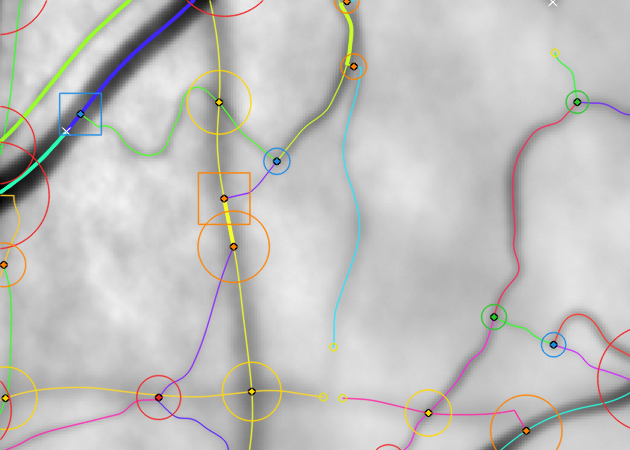

# vesselscene

**Physiological synthetic stills of the conjunctival and episcleral blood vessels, with exact ground truth.**

`vesselscene` generates images of the bulbar conjunctiva as a high-magnification slit-lamp camera sees it under green light: dark vessels on bright, patchy sclera, with sharp, tortuous superficial vessels crossing over larger, straighter, blurred deep ones. It produces both the stabilized average of a burst and single frames. Every image comes with its complete ground truth. Each vessel is a spline with its radius, depth and haematocrit along it, on a directed graph that follows the blood flow.

It exists so that algorithms that annotate real images of the conjunctival microvasculature can be developed and measured on data whose truth is known. Examples are vessel segmentation, vessel identification through crossings and branch points, and fitting a spline network. It was built for the [LIMBUS](https://github.com/karimghabra/limbus) project, and its realism is measured against LIMBUS's real stabilized stills with the same annotation-free statistics on both.



*A synthetic stabilized still (healthy preset, 1920 × 1200 px shown at half size). Everything in it is synthetic.*



*The same anatomy as a single frame (left) and as the average of the burst (right), at 1:1. A frame is noisier. Its vessels carry red-cell clumps and plasma gaps, and capillaries can be momentarily empty. The average is fuller and slightly softer.*



*The observable ground truth over the average, at 1.5×: what a careful person could see and measure in this image. Each line is one vessel in its own colour. Circles are junctions, coloured by type: bifurcation, confluence, crossing or compound. Small rings mark vessels fading out, and × marks a fork whose branch is too faint to see.*

## What it models

- **The network is a flow digraph of splines.**
  - One vessel is one edge, from upstream to downstream. A vessel ends at every fork and confluence, so at a fork the parent ends and two vessels begin.
  - Crossings of vessels at different depths are not nodes.
  - Each centreline is a clamped cubic B-spline. Radius, depth and haematocrit are splines along each vessel.
  - Flow is solved with Poiseuille's law, which orients every edge.
- **Normalized units.** Anatomy is measured in capillary diameters (d_c, about 6 µm). An image is rendered at k pixels per d_c, so structure is relative and the absolute scale is a single parameter.
- **The anatomy follows physiological rules.**
  - Episcleral trunks and a deep plexus.
  - A web of long conjunctival arterioles and venules joined by arcades.
  - Collecting veins, arteriole–venule pairs and bundles.
  - A capillary mesh between the trees.
  - Murray-law calibres, branching angles from the flow split, and tortuosity by vessel class.
  - Presets: `healthy`, `pathologic` (dilated, very tortuous vessels) and `random` (wide ranges, for training).
- **The rendering is in closed form.**
  - Tubes are integrated along the centreline with the curvature Jacobian, so tight bends, hairpins and coils are exact.
  - Where vessels meet at a node, their lumens are drawn as a union, blurred in closed form with Owen's T function.
  - Crossings are composited by depth.
  - Contrast follows a chord law with light scattered past deeper vessels, and blur grows with depth over a focal surface that varies across the frame.
  - Everything is checked against a supersampled oracle to within 1 %.
- **Image formation is calibrated on real stills.** Illumination, scleral texture, sensor noise, residual registration blur, and red-cell filling and granularity at measured conjunctival red-cell speeds (about 0.5 mm/s).
- **There are two ground truths per image.**
  - *Observable*, the annotation target. It contains the vessel stretches that stand clearly out of the noise and texture (CNR ≥ 3 over at least one vessel width), and junctions typed only from those. It also gives the image graph a perfect annotator would draw, and a don't-care mask for the borderline.
  - *Complete*, for fitting. It is the whole network and every junction, with the visibility along every vessel.
- **An image-junction truth.** It lists every place where vessels meet or overlap in the 2-D image: bifurcation, confluence, crossing, compound, touching or pseudo-T. For each junction it gives the arms (direction, width, blur, contrast, visibility), which arms belong to the same vessel, the parent → children lineage and a difficulty record. It is meant for developing intersection identification, where a branch point and a crossing look alike in 2-D.

The full technical reference is in [docs/reference.md](docs/reference.md). It covers the model and why, the rendering and imaging, the outputs, both ground truths, the realism checks, limitations and tests. The development rounds, with their measurements, are in [docs/history.md](docs/history.md).

## Install

```bash
git clone https://github.com/karimghabra/vesselscene.git
cd vesselscene
pip install -e ".[test]"
```

Requirements:
- Python 3.10 or newer and PyTorch. A CUDA GPU is strongly recommended: a full 1920 × 1200 scene with its average, frame and truths takes about 2–3 minutes on an RTX 3080, and much longer on the CPU.
- numpy, scipy, opencv-python, tifffile, networkx, scikit-image, shapely ≥ 2 and matplotlib.

## Quick start

```bash
# scenes: average still, single frame, truth, junction truth, observable and complete truths
python -m vesselscene scene --seed 0 1 2 --preset healthy -o out/scenes
python -m vesselscene scene --seed 1 --preset pathologic -o out/scenes/pathologic_s001

# the observable truth at another threshold, without re-rendering
python -m vesselscene truth out/scenes/healthy_s000 --kind frame --cnr 2.5

# the image-junction truth drawn with a 3x zoom
python -m vesselscene junctions out/scenes/healthy_s000 --zoom 400,600,240,320
```

```python
from vesselscene.scene import make_scene, save_scene

sc = make_scene(0, "healthy")                # shape (1200, 1920)
sc.images["average"], sc.images["frame"]     # float32, NaN = no data, like a stabilized mean
sc.graph                                     # VesselGraph: the truth, in capillary diameters
sc.graph.to_digraph()                        # networkx MultiDiGraph, one edge per vessel
sc.junctions["average"]                      # the image-junction truth
sc.observable["frame"]                       # the observable truth of the frame (annotation target)
save_scene(sc, "out/scene0")                 # TIFFs, truth.json, GraphML, labels.npz, overlays
```

`save_scene` writes the following for each image (average and frame):
- the still (float32 TIFF);
- the truth (`truth.json`, `digraph.graphml`);
- the label rasters (`labels.npz`: dominant vessel, class, depth, radius, centrelines, junction heatmaps, the observable truth's rasters and don't-care mask);
- the junction truth (`junctions_*.json`), the observable truth (`observable_*.json` / `.graphml`) and the complete visibility profiles (`complete_visibility_*.npz`);
- overlays (PNG).

The [reference](docs/reference.md#outputs-save_scene) lists every key.

## Realism, and the real data

The point of the package is realism measured against real images, not just plausible-looking pictures. `stats.py`, `tells.py` and `realism.py` compute the same annotation-free statistics on synthetic and real stills, and score a synthetic set against the spread between real sites. The statistics include contrast and width distributions, edge widths, spectra, texture, junction and crossing rates, parallel pairs, focus variation, dark knots at crossings, along-vessel variation and frame-versus-average crispness.

- **The real images are not part of this repository.** They belong to the LIMBUS project. `vesselscene/data/` holds only aggregate statistics measured on them, which the scorecard compares against.
- **Rebuilding those statistics, or making side-by-side figures with real stills,** needs a LIMBUS checkout with its stabilization results. Set `LIMBUS_DATA` to it, or place it next to this repository as `limbus/`. Tests that need real images skip without it.
- **Exporting a scene to vesselmap's map format** (`scene.to_vesselnetwork`) needs vesselmap, the spline-network vessel mapper in the LIMBUS repository, on the Python path. Otherwise `save_scene` skips the export.

**Current state (v2).**

Close to the real stills:
- the overall layout: a web of long crossing vessels, density and calibre mix;
- crossing darkness;
- the widest vein's black level;
- focus varying across the frame;
- single-frame noise, sharpness and red-cell clump length.

Known differences that remain:
- hard-edged dark shapes where a tributary runs along the vein it joins;
- somewhat too few thin, dark, sharp lines;
- widest veins with too flat a floor;
- too few arteriole–venule pairs;
- capillary dotting in frames more regular than real.

See [limitations](docs/reference.md#limitations-and-known-issues).

## Tests

```bash
python -m pytest
```

There are 253 tests, about 11–15 minutes on a GPU machine. They cover:
- the renderer against the oracle;
- the graph invariants on generated anatomy (no free ends, acyclic, no lumen overlap within a layer, consistent depths);
- frames versus averages;
- junction and observable truth on hand-built cases with known answers;
- the statistics.

## Origin

`vesselscene` was developed in the LIMBUS repository (branch `vesselscene`) and moved here at v2. Its rendering builds on the closed forms of vesselmap's render-accuracy study (`vesselmap/render_study/` in LIMBUS). The spline basis and the nested-box profile constants are vesselmap's, copied in so the package stands alone.

## License

[MIT](LICENSE)
