# How the vessel annotator works: from image to graph, step by step

This report explains how the annotator turns one image of vessels into a graph. A graph here is a set of vessel
centrelines (edges) that meet at junctions (nodes). It is written for someone who wants to understand every
step well enough to implement it by hand.

The annotator has two parts:

- **Part 1 (steps 1-8) proposes a graph.** It uses fixed filters modelled on the early visual system: retina,
  then primary visual cortex (V1). The result is a first guess of where the vessels and junctions are.
- **Part 2 (steps 9-13) fits a drawing to the image.** The proposed graph becomes a set of smooth curves, each
  with a width and a darkness. Those curves are drawn ("rendered") into an image, and the curves are adjusted
  until the drawing matches the photograph as closely as possible. The adjusted curves are the output.

Every step below has the same parts:

- **Goal:** the problem it solves.
- **Idea:** the intuition, with the biology where there is one.
- **Algorithm:** code-like steps, faithful to the code, with every number.
- **Settings:** what each number controls.
- **How it works:** a figure that follows real pixels through the step.
- **On the whole image:** the step's output for the whole example image.
- **What to watch for:** where it goes wrong.

**The example image** is a development scene, healthy 7: the averaged still, 480 x 768 pixels. Development
scenes were used for tuning, so this image scores better than unseen ones ([REPORT.md](REPORT.md) has the
held-out numbers). In the whole-image figures, the top row is the full frame and the bottom row is a 192-pixel
zoom (the yellow box), chosen as the window with the most kinds of true junction.

**The figures are made by** `pipeline_figures.py` (whole image) and `pipeline_mechanisms.py` (how it works).
Both call the pipeline's own functions in its own order. In two places the "how it works" figures restate a
few lines of code so they can be drawn: the tracing step (step 6) and the junction events (step 7). Step 7's
restatement is checked against the pipeline: it finds every junction the pipeline finds, at the same place.
The truth (the scene generator's own graph) is used only to place figures and to score the result.

## Words used in this report

| term | meaning |
|---|---|
| pixel, px | one image sample; distances are in pixels |
| blur, G_s * X | a Gaussian blur of image X with width (standard deviation) s pixels |
| log, ln | the natural logarithm |
| optical density (OD) | how much light the blood absorbs at a pixel: OD = B - ln I. A vessel is a dip in brightness, so its OD is positive. Two overlapping vessels add their ODs (the Beer-Lambert law) |
| background (B) | a smooth estimate of what ln I would be without vessels |
| vessel mask (M) | pixels judged to be vessel. They are left out when the background is fitted |
| noise level, RMS | the typical size of the random fluctuations near a pixel, measured on background pixels. RMS = root mean square, the square root of the average squared value |
| robust | computed with medians, so a few extreme values (such as vessels) do not distort it |
| contrast-to-noise ratio (CNR) | a response divided by the noise level. A value of 3 is three times the typical fluctuation |
| orientation, theta | the direction a vessel runs, from 0 to 180 degrees, in 16 steps of 11.25 degrees (x to the right, y down) |
| orientation score U(x, y, theta) | how strongly the image looks like a line through pixel (x, y) running at orientation theta |
| tuning curve | one pixel's response at each of the 16 orientations |
| channel | a group of filter sizes: fine (1.5-3 px), medium (4.2-6 px), coarse (8.5-24 px) |
| ridge top (candidate) | a pixel whose response is higher than its neighbours on both sides across the line |
| trace | a polyline followed along a ridge, one point per pixel |
| junction | where vessels meet. Types: **3-way** (three arms), **crossing** (two vessels passing over each other: four arms in two straight pairs), **compound** (anything more complex) |
| arm | a vessel leaving a junction |
| edge | a vessel stretch from junction to junction (or to a free end) |
| free end | an edge end that is not at a junction |
| render, R | an image drawn from the graph: what the graph predicts the OD to be |
| residual | target minus render: what the graph does not yet explain |
| precision weight w | 1 / noise variance. Pixels in quiet areas count more than pixels in textured areas |
| minimum description length (MDL) | keep a part of the model only if the error it removes is worth more than the cost of describing it |
| B-spline, control points | a smooth curve defined by a few control points that it follows without passing through them |
| gradient descent, Adam | improve parameters in small steps, each step downhill on the error. Adam is a common variant that adapts each parameter's step size |

## Overview

| step | biological model | what it does | output |
|---|---|---|---|
| 1 | photoreceptors and horizontal cells | log of the image; a background fitted outside a vessel mask | the OD (the fit's target) |
| 2 | OFF-centre ganglion cells | centre-minus-surround responses at 6 sizes, over the local noise | contrast-to-noise map Z |
| 3 | V1 simple cells | line and edge filters at 16 orientations and 9 sizes | orientation score U |
| 4 | the non-classical surround | subtracts what is the same at every orientation, and the weaker flank | U with blobs suppressed |
| 5 | horizontal connections (association field) | supports a pixel when it is collinear with line evidence on both sides | completed score C |
| 6 | readout | follows each ridge of C, one pixel at a time, in its own orientation | traces |
| 7 | end-stopped cells | where traces end on or cross each other: typed junctions | the graph |
| 8 | render, compare, prune | draws the graph, removes edges that do not pay for themselves | pruned graph |
| 9 | (spline network) | one smooth curve per vessel, through crossings | the curves to fit |
| 10 | (render model) | draws each curve as a blurred cylinder; fixes forks and crossings | the drawing R |
| 11 | (loss) | weighted squared difference between OD and R, plus smoothness | one number to minimise |
| 12 | (fit schedule) | adjusts everything in stages; removes edges; recleans the target | the fitted curves |
| 13 | (export) | cuts curves at nodes; types junctions | the output graph |

The target of the fit is always the OD of step 1. The contrast-to-noise map Z of step 2 is never fitted.
It only decides which pixels count as background (step 1) and whether an edge is visible (step 8).

# Part 1. Proposing a graph

## Step 1. Optical density and the background

**Goal.** Turn brightness into a quantity where vessels are positive bumps on a flat zero, and where
overlapping vessels add up.

**Idea.** Blood absorbs light, so a vessel darkens the image by a factor. On a log scale that factor becomes a
subtraction: `ln I = B - OD`. To get the OD you need B, the brightness the background would have without the
vessel. B is estimated from the pixels around each vessel and interpolated across it. Photoreceptors respond
roughly to the log of intensity, and horizontal cells subtract the local average around each point. This step
does both.

**Algorithm.**

```
# Inputs: I (the averaged still), valid (pixels with data)
ok = valid & (I > 0) & (I < 4095)                  # empty or saturated pixels are not data
L  = ln(I) on ok pixels; elsewhere copy L from the nearest ok pixel

# A first guess of the background: an "upper envelope" that fills every dark line narrower than the
# closing disc (radius 60 px, so up to about 120 px wide)
B = upper_envelope(L, radius=60)
OD = B - L
S  = blur(OD, 1)
bg = ok & (S < median(S) + 2 * robust_sd(S))       # first guess of the background pixels

repeat 2 times:
    Z     = band_cnr(OD, bg)                       # step 2: contrast-to-noise, max over 6 sizes
    S     = blur(OD, 1)
    noise = local_rms(S - median(S[bg]), bg, window=48)
    M     = (Z > 2) | (S > 3 * noise)              # the vessel mask
    M     = dilate(M, disc of radius 2 px)
    bg    = ok & ~M                                # the background pixels: the mask's negative
    B     = masked_mean(L, bg, sigma=8)            # B fitted on background pixels only
    OD    = B - L
OD on not-ok pixels = OD of the nearest ok pixel
```

The helpers:

```
upper_envelope(L, radius):
    small = average L over 4 x 4 blocks                        # a grid 4x smaller, for speed
    small = grey_closing(small, disc of radius radius / 4)     # max-filter, then min-filter: dark lines
                                                               # narrower than the disc are filled in
    small = blur(small, radius / 8)
    return small resized back to full size (bilinear)

masked_mean(X, w, sigma):          # "normalised convolution": the local mean of X over the pixels where w = 1
    num = 0; den = 0
    for k in 0, 1, 2, 3:           # a wider window fills holes the narrow one cannot reach
        num += 0.03^k * blur(X * w, sigma * 2^k)
        den += 0.03^k * blur(w,     sigma * 2^k)
    g = mean of X over w;  eps = 0.03^4
    return (num + eps * g) / (den + eps)

robust_sd(x) = 1.4826 * median(|x - median(x)|)       # the standard deviation, from the median

local_rms(D, bg, window):          # the typical size of D near each pixel, measured on background pixels
    g = 1.4826 * median(|D| over bg)
    Q = min(D^2, (3 g)^2)                              # cap outliers at 3 g
    return sqrt(max(masked_mean(Q, bg, window), (0.05 g)^2))
```

**Settings.**

| setting | value | what it controls |
|---|---|---|
| closing radius | 60 px | the first guess fills dark structures up to about twice this (the disc's width) |
| mask threshold | Z > 2, or OD > 3 x noise | what counts as vessel |
| mask dilation | 2 px | margin around the mask, so vessel edges do not leak into B |
| background sigma | 8 px | how locally B follows the illumination |
| iterations | 2 | mask, then refit B, then mask again |

**How it works.**

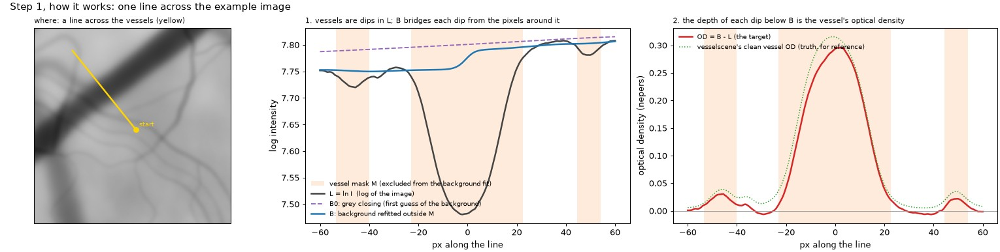

*One line across the example image (yellow). Middle: the log brightness L (black) dips at each vessel. B0, the
first guess (purple dashed), runs above the real background. B (blue) is fitted only outside the mask (orange
spans), so it bridges each dip from the pixels beside it. Right: OD = B - L is the depth of each dip. It
closely follows the scene generator's own clean vessel OD (green dotted, the truth). This OD is the target
for the whole fit.*

**On the whole image.**

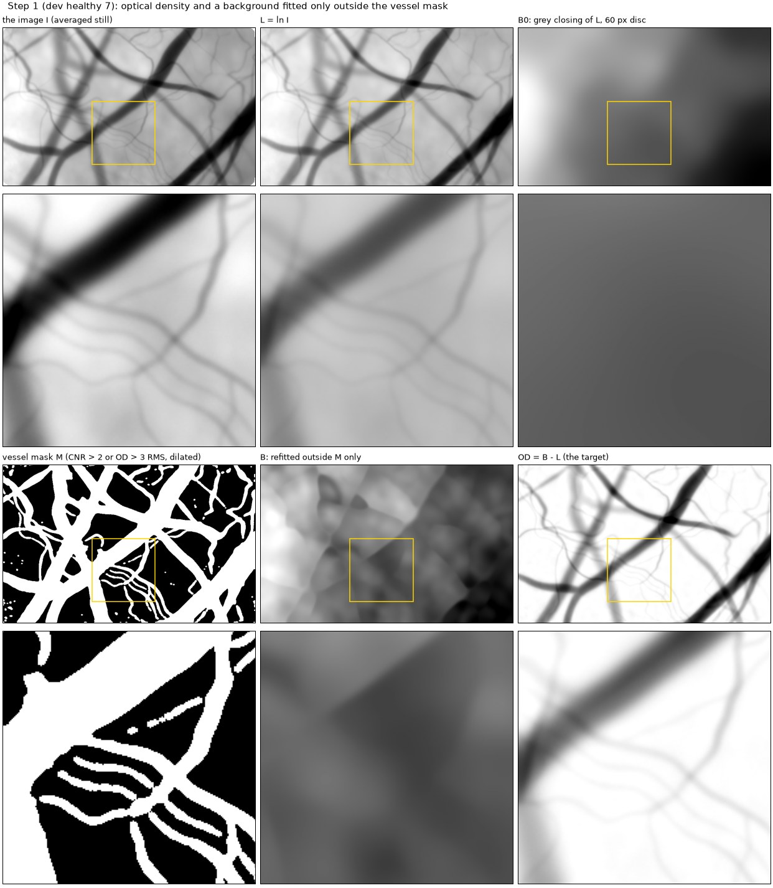

*Top: the image I, L = ln I, and the first guess B0. Bottom: the mask M, the refitted background B, and the
OD.*

**What to watch for: the background leak.** B is only as good as the mask. Wherever the mask misses part of a
vessel, B is fitted on the vessel itself, sags into it, and the OD loses that vessel's density. Faint and wide
vessels are hit hardest, because their contrast-to-noise is low at every filter size.

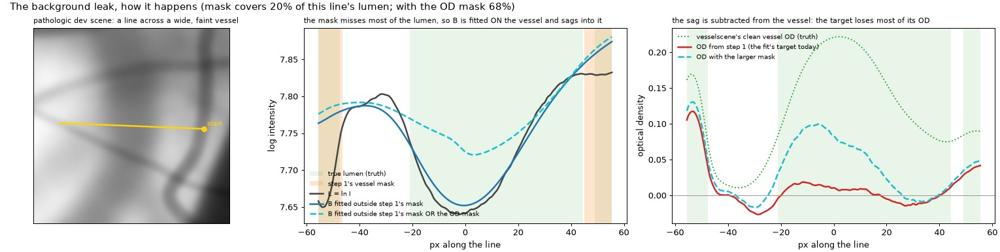

*The pathologic development scene, a line across a wide, faint vessel. The mask (orange) covers 20 % of this
line's true lumen (green). B sags into the vessel (blue), and the target (red) keeps almost none of the
vessel's true OD (green dotted). Fitting B outside a larger mask made from the OD itself (cyan dashed: 68 %
of the lumen covered) recovers roughly half of it. Change 1 at the end of this report builds on this.*

## Step 2. Contrast against the local noise

**Goal.** Measure how far each pixel stands out from its surroundings, in units of the local noise, at
several sizes.

**Idea.** An OFF-centre ganglion cell compares a small centre with a wider surround. Its gain is turned down
where the scene is busy, so it reports contrast relative to the local noise. A thin vessel stands out at a
small size, a wide vessel at a large size, so six sizes are used.

**Algorithm.**

```
for s in (1, 2, 4, 8, 16, 32):                     # the six bands
    D[s]   = blur(OD, s) - blur(OD, 2 s)           # centre minus a surround twice as wide
    RMS[s] = local_rms(D[s], bg, window=max(24, 4 s))
Z = max over s of D[s] / RMS[s]                    # the contrast-to-noise ratio of the best band
```

**Settings.** The bands (1-32 px) and the noise window (24 px, or 4 times the band if larger).

**How it works.**

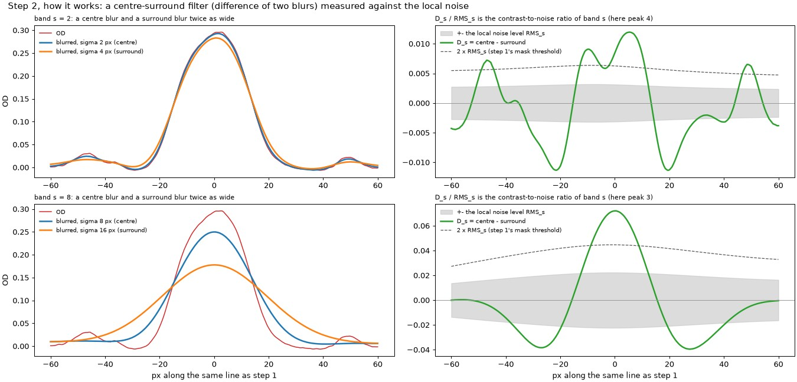

*The same line as step 1. Left: the OD, its centre blur and its surround blur. Right: their difference D
(green) against the noise band (grey) and twice the noise (dashed). Band 2 (top) picks out small-scale
structure in and around the wide vessel; band 8 (bottom) sees its whole width.*

**On the whole image.**

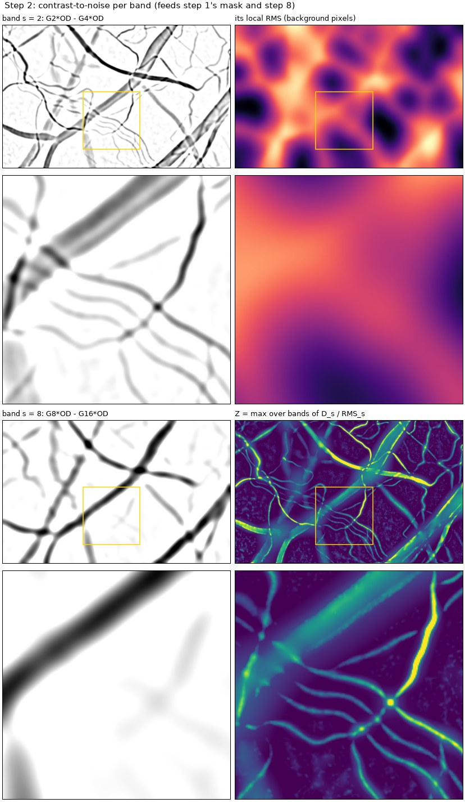

*Band 2 and its local noise level (top); band 8 and the maximum over bands, Z (bottom).*

**What to watch for.** The noise level is high where the background is textured, so the same vessel counts for
less there. A wide vessel with a gentle profile has a low Z in every band: this is where the mask, and so the
background, fails.

## Step 3. Oriented line and edge filters: the simple cells

**Goal.** For every pixel and every orientation, measure how much the image looks like a line through that
pixel at that orientation.

**Idea.** A V1 simple cell has an elongated receptive field. An even-symmetric cell (an excitatory stripe with
inhibitory flanks) detects lines. An odd-symmetric cell (excitatory on one side, inhibitory on the other)
detects edges. At a vessel's centre the line cell fires and the edge cell is silent. At a vessel's wall the
edge cell fires strongly. Subtracting the edge response therefore keeps centres and rejects walls. Separate
size channels keep a thin vessel crossing a wide one visible in the fine channel.

**Algorithm.**

```
for channel, (scales, grid factor f, elongation e) in:
        fine:   (1.5, 2.1, 3.0 px;        f = 1; e = 3.0)
        medium: (4.2, 6.0 px;             f = 2; e = 2.5)
        coarse: (8.5, 12, 17, 24 px;      f = 4; e = 2.0):
    X = OD averaged over f x f blocks;  bgc = background pixels on that grid
    pad X by reflection, take its 2-D Fourier transform F
    for each scale sigma (in grid pixels: sigma / f):
        for k in 0 .. 15:  theta = k * 180 / 16 degrees
            # wn, wt: spatial frequency across and along orientation theta
            G      = exp(-0.5 * sigma^2 * (wn^2 + e^2 * wt^2))     # an elongated Gaussian (e x longer along)
            even_k = inverse_FFT(F * sigma^2 * wn^2 * G)            # = -sigma^2 x 2nd derivative across
            odd_k  = inverse_FFT(F * 1j * sigma * wn * G)           # = sigma x 1st derivative across
        rms_even = local_rms of all 16 even responses together, over bgc, window max(24, 4 sigma)
        rms_odd  = the same for the odd responses
        z_k = even_k / rms_even - 0.7 * |odd_k| / rms_odd           # line evidence, in noise units
    U[k] = max over the channel's scales of z_k;   S[k] = which scale won
```

The filters are applied exactly in the frequency domain, so all 16 orientations are equally sharp.

**Settings.**

| setting | value | what it controls |
|---|---|---|
| orientations | 16 (11.25 deg apart) | angular resolution |
| scales | 1.5, 2.1, 3.0, 4.2, 6.0, 8.5, 12, 17, 24 px | the vessel widths it responds to |
| elongation | 3, 2.5, 2 (fine, medium, coarse) | filter length along the vessel, in units of its width |
| edge weight | 0.7 | how strongly wall echoes are rejected |

**How it works.**

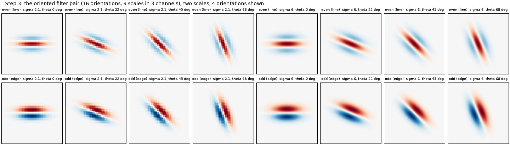

*The filter pair at two sizes and four of the 16 orientations: line (even, top) and edge (odd, bottom). Red is
positive, blue negative.*

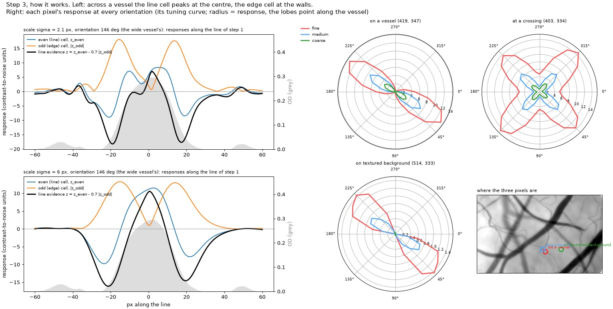

*Left: responses along the line of step 1, at the wide vessel's orientation, for a small (2.1 px) and a medium
(6 px) filter. The line cell (blue) is positive across the inside of the vessel. The edge cell (orange) is
large at the walls and near zero at the centre. The line evidence (black) peaks at the centre and is strongly
negative at the walls, so no trace can start on a wall. Right: tuning curves (radius = response at each
orientation). On a vessel there is one lobe pointing along it. At a crossing there are two lobes, one per
vessel. On background texture the response is weak (1.4).*

**On the whole image.**

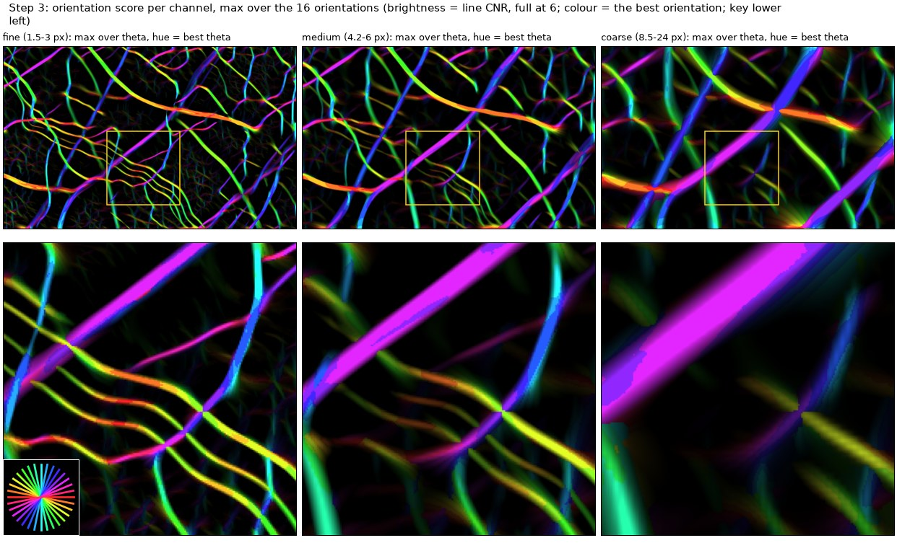

*The best response over orientation per channel. Brightness is the response, full at 6; colour is the winning
orientation (key in the lower left of the first zoom).*

**What to watch for.** A crossing gives two orientations at one pixel. This is what lets step 6 trace each
vessel straight through, so anything that merges the two lobes loses the crossing.

## Step 4. The surround: suppressing blobs and texture

**Goal.** Remove responses that come from blobs and texture rather than lines.

**Idea.** A V1 cell's response is reduced by the activity of cells of all orientations at its location
(cross-orientation suppression), and by cells of its own orientation beside it (surround suppression). A blob
excites every orientation; a line excites one. Texture surrounds a pixel on both sides, while a neighbouring
vessel lies on one side only, so only the weaker of the two flanks is subtracted.

**Algorithm.**

```
P   = max(U, 0)
iso = mean of the 8 smallest values of P over the 16 orientations      # per pixel: the orientation-blind part
U1  = U - 1.0 * iso
for each orientation k (tangent t, normal n), channel scale sigma:
    d1 = 2.5 sigma + 1;   d2 = d1 + max(6, 1.5 sigma);   step = max(1, sigma / 2)
    strip = the points d n + u t, for d from d1 to d2 in steps of `step`, u in {-1.5, -0.5, 0.5, 1.5} x step
    F_left[k]  = mean of P[k] over the strip on one side      # each point spread over a Gaussian of
                                                               # max(0.7, step / 2) px
    F_right[k] = mean of P[k] over the strip on the other side
    U2[k] = U1[k] - 0.3 * min(F_left[k], F_right[k])
```

**Settings.** Cross-orientation weight 1.0; flank weight 0.3; flank strips from 2.5 sigma + 1 px out.

**How it works.**

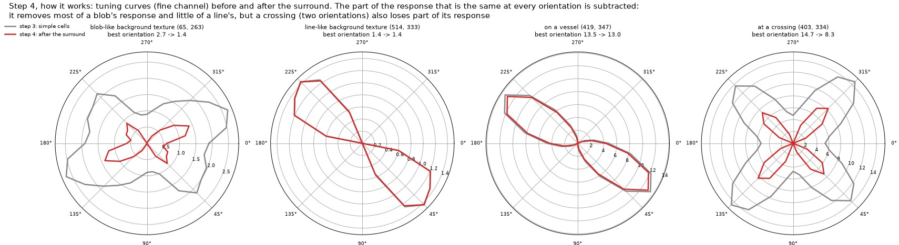

*Tuning curves before (grey) and after (red) the surround. A blob-like texture pixel loses half its best
response (2.7 to 1.4). A line-like texture pixel keeps it (1.4 to 1.4), but 1.4 is below the 1.5 a trace needs
to continue. A vessel barely changes (13.5 to 13.0). A crossing loses 44 % (14.7 to 8.3): with two lobes, its
"orientation-blind" part is large. That is a cost this step imposes on crossings.*

## Step 5. The association field: completing lines

**Goal.** Bridge short weak stretches of a vessel between strong ones, without extending lines past their
ends.

**Idea.** Horizontal connections in V1 link cells whose receptive fields are collinear. A "bipole" cell fires
only when both of its lobes, ahead and behind along its orientation, are driven. So a gap between two line
pieces is filled, but a line is not extended beyond its end, where only one lobe is driven.

**Algorithm.**

```
l  = 8 * sqrt(max(1, sigma / 2))            # lobe length; fine channel: 8.2 px
w(d) = exp(-d^2 / (2 l^2))  for d = 1, 2, ..., 3 l
U0 = max(U2, 0);   C = U0
repeat 3 times:
    Pm[k] = max(C[k], 0.8 C[k-1], 0.8 C[k+1])                     # a contour may turn by one orientation step
    ahead[k](p)  = sum_d w(d) Pm[k](p + d t_k) / sum_d w(d)        # weighted mean along the line, ahead
    behind[k](p) = sum_d w(d) Pm[k](p - d t_k) / sum_d w(d)        # ... and behind
    bipole[k] = sqrt(ahead[k] * behind[k])                         # needs support on BOTH sides
    C = (U0 + bipole) / 2
```

**Settings.** Lobe length 8 px (scaled by the channel's size); 3 iterations; equal weight to the cell's own
response and to its bipole support.

**How it works.**

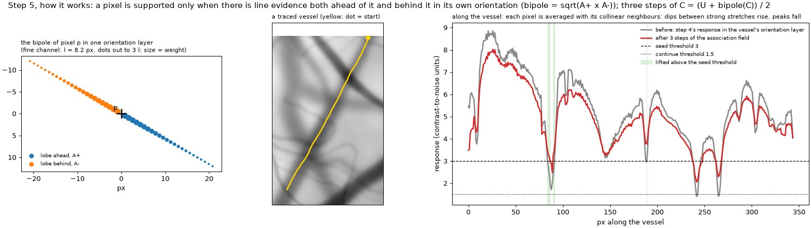

*Left: one pixel's two lobes in one orientation (dot size = weight). Right: the response along a traced vessel
before (grey) and after (red). Each pixel is averaged with its collinear support, so peaks fall and dips
between strong stretches rise. At about 240 and 265 px the response is 1.40 and 1.42 before, below the 1.5 a
trace needs to continue, so tracing would stop there. After, it is 2.06 and 2.29, and the trace runs through.*

**On the whole image (steps 3 to 5).**

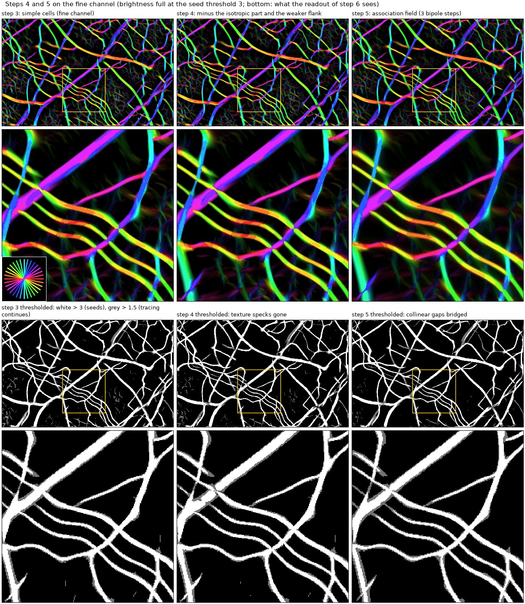

*Fine channel. Top: the score after steps 3, 4 and 5. Bottom: what the readout sees (white above the seed
threshold 3, grey above the continuation threshold 1.5). Step 4 removes texture specks on the left; step 5
bridges the dips at crossings in the zoom.*

## Step 6. Readout: tracing the vessels

**Goal.** Turn the score maps into polylines that follow each vessel's centre.

**Idea.** A vessel is a ridge of C in its own orientation layer. Keep only ridge tops ("non-maximum
suppression"), start traces at strong ridge tops, and continue them through weaker ones ("hysteresis": a high
threshold to start, a lower one to continue). Because each vessel lives in its own orientation layer, two
crossing vessels are two ridges that never touch, and a trace can follow its own ridge straight through the
crossing.

**Algorithm (per channel).**

```
# 1. Candidates: ridge tops
candidate[k, y, x] = C[k](p) >= C[k](p + n_k)  and  C[k](p) > C[k](p - n_k)     # top across the line (+-1 px)
                     and C[k] >= C[k-1] and C[k] > C[k+1]                         # top over orientation
                     and C[k](p) > 1.5                                            # t_low
                     and p at least 3 px inside the valid data

# 2. Seeds: candidates above 3 (t_high), strongest first
for each seed (k, y, x), strongest first:
    if already claimed by a trace: skip
    claim(k, y, x)
    walk forward along t_k, then backward along -t_k; the trace is backward + seed + forward

walk(k, y, x, direction d):
    loop:
        for step in 1, 2, 3:                                  # look up to 3 px ahead to cross small gaps
            options = for dk in (0, -1, +1) (layer k + dk), for o in (0, -1, +1) (px across):
                          position q = p + step * t_(k+dk) + o * n_(k+dk)   (t oriented along d)
                          keep q if it is a candidate, ahead of p, and not claimed by this trace
                          score = C[k+dk](q) * (1 - 0.15 |o|) * (1 - 0.1 |dk|)
            if any options: take the best and stop looking further
        if no option at any step: stop
        if the chosen point is claimed by ANOTHER trace:
            count it (it is not claimed); once more than 4 such points come in a row, drop all but the first
            and stop                                                   # running along another trace = a T
        else:
            reset the count and claim it
        move there; its layer becomes the new k

claim(k, y, x):   # a trace owns its lumen, so no second trace starts inside a wide vessel
    mark positions o * n_k for o in -h..h, with h = max(1, round(0.5 * the winning scale at p)),
    in layers k-1, k, k+1

# 3. Clean-up: drop traces with fewer than 3 points or shorter than 10 px; smooth (moving average of 5) and
#    resample at 1 px. Each point keeps c = its C value and w = 2.5 x its winning scale.
```

**Merging the three channels.**

```
sort all traces by their mean C, strongest first
for each trace:
    a point is "covered" if an already accepted trace passes within 3 px of it at an orientation within one
        step (11.25 deg), or if a trace from a COARSER channel covers it within 0.6 of that trace's width at
        the same orientation (the wall echo of a wide vessel)
    keep every uncovered run of at least 10 points as a new accepted trace
```

**Widths, from the OD (not from a filter).** For step 7, each trace's width is re-measured on the OD:

```
for every 2nd point of the trace:
    profile = OD sampled along the normal, over +-max(6, 1.5 w) px (at most 60), every 0.5 px
    baseline = mean of (median of the outer fifth on each side)
    peak = max of the 5 central samples - baseline
    width = distance between the half-peak crossings on each side
smooth the widths with a running median of 7 along the trace
```

**Settings.**

| setting | value | what it controls |
|---|---|---|
| t_high | 3 | the response needed to start a trace |
| t_low | 1.5 | the response needed to continue one |
| look-ahead | 3 px | the largest gap a trace jumps |
| pass-through | 4 px | how long a trace may run inside another's claim (a shallow crossing) |
| claim | 0.5 x scale (at least 1 px) | the lumen a trace owns |
| minimum length | 10 px | shorter traces are dropped |

**How it works.**

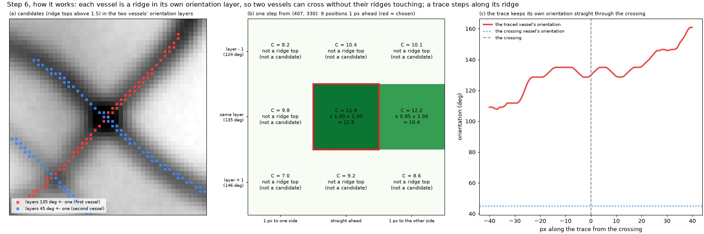

*(a) Around a crossing: ridge tops in the layers of the first vessel (red, 135 degrees) and of the second
(blue, 45 degrees). The two ridges cross without touching. (b) One step of a trace on the red vessel: of the
nine positions one pixel ahead, only two are ridge tops. Straight ahead in the same layer (C = 12.9, score 12.9)
beats one pixel aside (C = 12.2, score 0.85 x 12.2 = 10.4). (c) The trace's orientation stays near 130 degrees
through the crossing, far from the other vessel's 45.*

**On the whole image.**

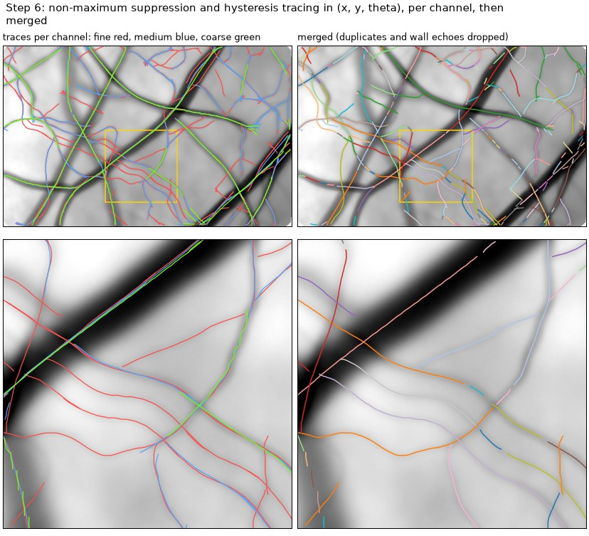

*Left: traces of each channel (fine red, medium blue, coarse green): 217, 138 and 73. Right: the 207 traces
after merging, one colour each.*

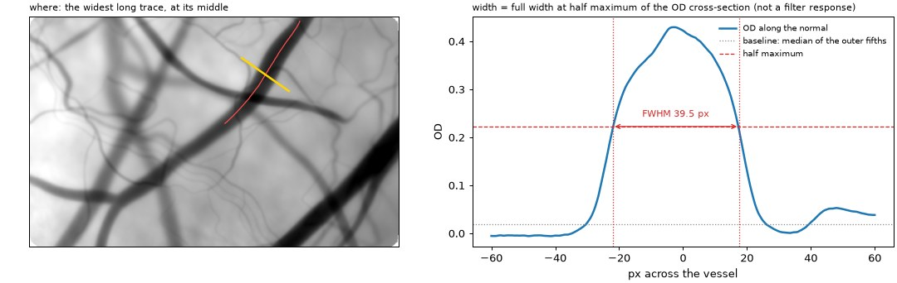

*One cross-section of the widest long trace and its width at half height.*

**What to watch for.** The merged traces break up around crossing clusters. Pieces of one vessel come from
different channels or stop at another trace's claim. Later steps inherit this fragmentation.

## Step 7. Junctions: the end-stopped cells

**Goal.** Find where vessels meet, decide what kind of meeting it is, and cut the traces into edges that run
from junction to junction.

**Idea.** End-stopped cells respond where a line ends inside their receptive field. A line that ends on
another line signals a junction (a T or a Y). Two lines that both continue through a point signal a crossing
(an X). Nearby events belong to the same junction, and the junction's type follows from the vessels leaving it.

**Algorithm.**

```
traces = traces at least 10 px long

# 1. Join collinear gaps (repeat until nothing changes):
for every pair of trace ends at most 14 px apart (from different traces):
    turn = angle between the two ends' outward directions (head-on = 0); for a gap longer than 2 px
           (unless it is under 6 px and offset sideways by at most max(3, 0.3 w)), also the turn onto the bridge
    if turn <= 40 deg: cost = gap length + 0.3 * turn
join the mutually best pairs (each is the other's lowest-cost partner) into one trace

# 2. Widths: every trace's width w = its OD width from step 6 (at least 1.5 px)

# 3. Events
T events: for each trace end p, with outward direction d:
    look for the nearest point q on another trace (or far along the same trace)
        within 6 + w_q / 2 px, where q is either inside that vessel's lumen (|q - p| <= max(2, w_q / 2))
        or ahead of the end (within 45 deg of d)
    the event is where the end's own line meets the other centreline (else at q);
    if the end lies outside the other lumen and that point is within 12 px, the end is extended to it later
X events: every point where two traces intersect

# 4. Group events into junctions (complete linkage: EVERY pair in a group must be close enough)
close(a, b) = distance(a, b) <= 4 + (thin_a + thin_b) / 2        # thin = the thinner vessel's width at the event
    and, if a and b share a trace: <= 4 + (other_a + other_b) / 2 is also enough   # other = the crossing vessel's width
    and never if they are more than 23.8 px apart
for each group:
    centre = mean of its events
    radius R = max over its events of (distance to the centre + 4 + the wider vessel's width / 2)

# 5. Arms: for each trace in the group, the stretches before and after its run through the disc, each kept
#    if it is at least 6 px long. Direction = from the centre to the point 4 samples outside the disc.

# 6. Type
if arms < 3:  no junction
if arms == 3: 3-way
if arms == 4: pair the arms into two lines (prefer pairs on the same trace, then the smallest worst turn);
              crossing if both pairs turn by at most 40 deg AND the two lines are at least 15 deg apart;
              else compound
if arms >= 5: compound
if R >= 16 px: compound, whatever the arms           # a prior fitted on development scenes

# 7. Extend the ends found in step 3 to their attachment points, then cut every trace at its point nearest
#    each of its junctions. Drop pieces that lie inside one junction, and free pieces whose stretch outside
#    the junction disc is under 6 px.
```

**Settings.**

| setting | value | what it controls |
|---|---|---|
| gap join | 14 px, turn under 40 deg | which broken pieces are rejoined |
| attachment reach | 6 px + half the other vessel's width | how far an end may be from a vessel to make a T |
| attachment cone | 45 deg | how far off its own direction an end may attach |
| r0 | 4 px | the base size of a junction region |
| minimum arm | 6 px | how long a stretch must be to count as an arm |
| crossing test | pairs turn under 40 deg, lines 15 deg apart | when 4 arms make a crossing |
| compound radius | 16 px | larger regions are typed compound |

**How it works.**

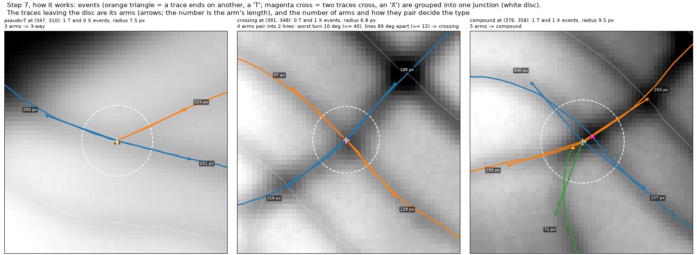

*Three junctions from the example image. Left: one trace ends on another (one T event), giving three arms:
3-way. Middle: two traces cross (one X event), giving four arms that pair into two straight lines (worst turn
10 degrees, lines 89 degrees apart): crossing. Right: one T and one X event close together merge into one
region with five arms: compound.*

**On the whole image.**

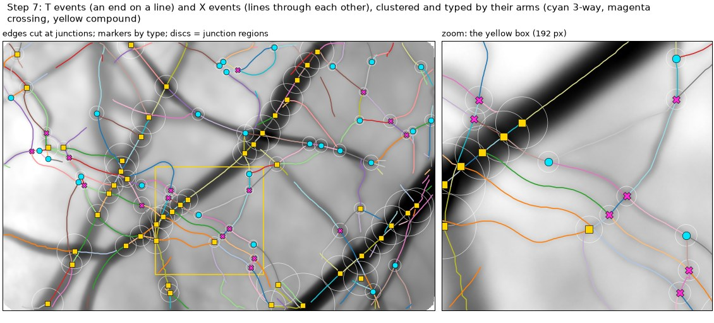

*Edges cut at junctions (one colour each), junctions by type (cyan 3-way, magenta crossing, yellow compound),
and their discs. There are 93 junctions and 230 edges.*

**What to watch for.** A junction's type is counted from traced arms. One lost arm turns a crossing into a
3-way, or a 3-way into nothing. Along wide vessels, each small vessel ending on them makes a junction, and
neighbouring ones merge into compound regions.

## Step 8. Render, compare, prune

**Goal.** Remove edges that the image does not support: duplicates, spurs, false arms.

**Idea.** Draw the whole graph as an image of OD and compare it with the target. An edge is kept only if it
explains enough of the target to be worth describing, and if it is visible above the noise. This is the
diffusion-model lesson, applied deterministically: predict the image, look at what is left over, revise.

**Algorithm.**

```
# 1. Profiles: every 6 px along each trace, take the median OD cross-section over +-max(6, w) px along the
#    trace and fit  a * box(u; r, s) + b,  with r <= 0.75 w + 2 (w = the trace's readout width):
#        box(u; r, s) = a flat-topped bar of half width r blurred by a Gaussian of width s, peak 1
#        (Phi = the normal cumulative distribution: (Phi((r - u)/s) - Phi((-r - u)/s)) / (Phi(r/s) - Phi(-r/s)))
#    r is searched on 22 values from 0.5 to 30 px, s on 10 values from 0.7 to 10 px; a and b by least squares.
#    Between fits: linear interpolation, and a running median of 3.

# 2. Render: every edge drawn as a tube with these profiles (each pixel takes the profile of its nearest
#    centreline point; the ends are cut square), all edges ADDED: R = sum of tubes.

# 3. Weights: w = 1 / sigma^2, with sigma = local_rms(OD - blur(OD, 8), bg, window=32)   # texture included
#    w = 0 on invalid pixels and inside every junction disc (radius 0.7 R), where the sum is known to be wrong

# 4. Two tests per edge k, with p = its tube and r = the residual without it (target - all other edges):
gain_k = (sum p r w)^2 / (sum p^2 w) / 6        # the weighted error it removes with its best contrast;
                                                 # divided by 6 px^2, the texture's correlation area
cost_k = 2 * (1 + length_k / 20)
cnr_k  = median(a) * max over bands b of (band-b response of its profile / median band-b noise along it)
value_k = min(gain_k / cost_k, cnr_k / 0.5)      # fails if below 1

# 5. Greedy pruning: only edges with a free end can be removed
#    (an edge between two junctions is part of a vessel that continues)
while some free-end edge has value < 1:
    remove the one with the lowest value
    recompute the value of every edge whose tube overlaps it

# Two rounds: build the graph (step 7), profile, prune; the traces lose the removed stretches; repeat.
```

**Settings.** Cost 2 x (1 + length / 20); visibility 0.5; correlation area 6 px^2; junction discs 0.7 x the
radius; 2 rounds.

**How it works.**

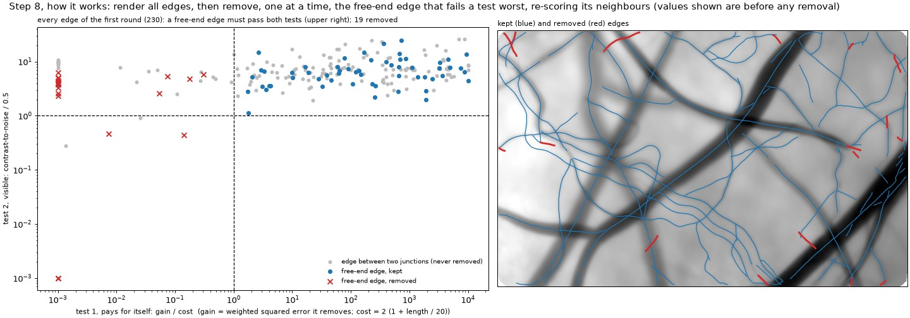

*Left: all 230 edges of the first round, by the two tests (values before any removal). Of the 78 edges with a
free end, 19 are removed. Most removed edges explain essentially nothing: they duplicate a vessel another edge
already explains, so the other edges "explain them away". A few fail the visibility test. Edges between two
junctions (grey) are never removed, even if they fail. Right: the removed edges on the image.*

**On the whole image.**

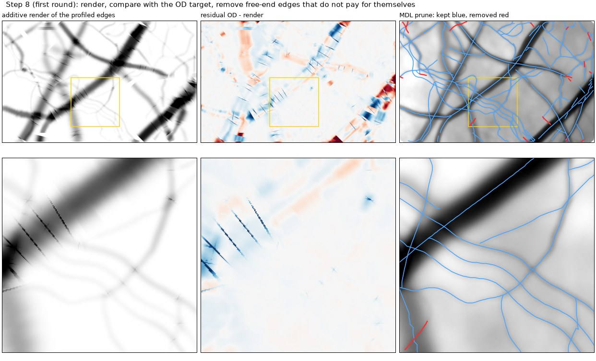

*The additive render, the residual (red: target OD not explained; blue: too much), and the first round's prune
(blue kept, red removed).*

**What to watch for.** The dark ticks across the wide vessel are cut points, where two pieces of one vessel
overlap and add up. They carry no weight here, but they show why step 10 treats junctions differently.

# Part 2. Fitting a drawing of the graph to the image

## Step 9. The spline network

**Goal.** Turn the proposal's edges into one smooth curve per vessel, so that a vessel crossing another is one
object, and a parent vessel continues through a branch point.

**Idea.** In the proposal, every edge stops at every junction. Real vessels pass through crossings and through
the points where branches leave them. A smooth curve per vessel has fewer parameters and no artificial ends.

**Algorithm.**

```
for each junction J, with its incident edge ends:
    if J is a crossing with exactly 4 ends:
        pair the ends into two lines (same trace first, then the straightest)
        if both pairs turn by at most 45 deg: link each pair (the vessel passes through); NO node
        (continue to the next junction)
    if J has exactly 2 ends of different edges turning by at most 60 deg: link them (a joint); no node
    if J has at least 2 ends: J is a node
        link pairs of ends of the SAME trace that turn by at most 40 deg (straightest first),
        keeping at least one end ending at the node: the parent passes through, the branch ends on it
chains = follow the links from every unlinked end: each chain is one vessel
for each chain:
    xy = the pieces' points joined; its ends moved onto their nodes
    profiles: half width = 1.2 x the box half width; blur s at least 0.65;
              contrast = box peak / the cylinder's blurred peak       # box -> cylinder (step 10)
    fit a clamped cubic B-spline to xy, its control points spaced as widely as the curve allows
    (it must follow the points within 0.15 x the vessel's calibre, at least 0.6 px)
    a node the chain passes through is moved onto the curve
```

**How it works.**

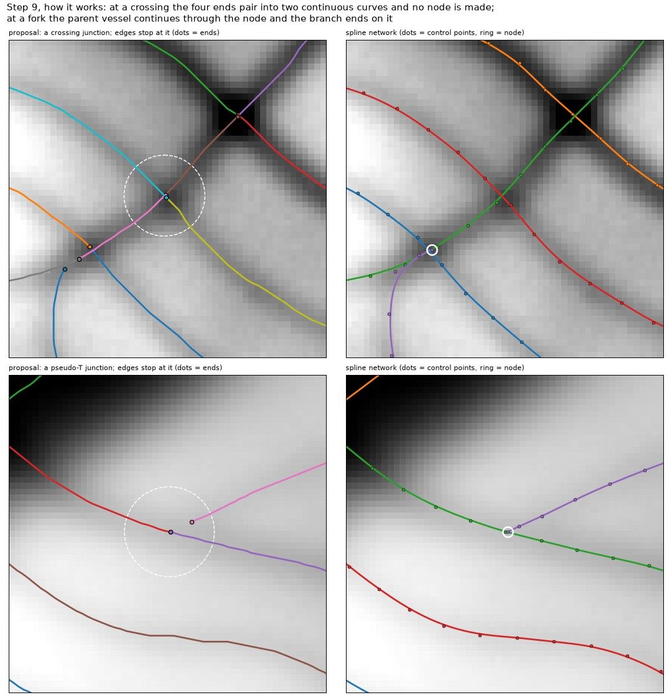

*Top: a crossing. In the proposal (left), four edges stop at it. In the network (right), they pair into two
continuous curves that cross with no node. Bottom: a 3-way. The parent vessel (green) passes through the node
(ring), and the branch (purple) ends on it. Dots are the curves' control points.*

**On the whole image.**

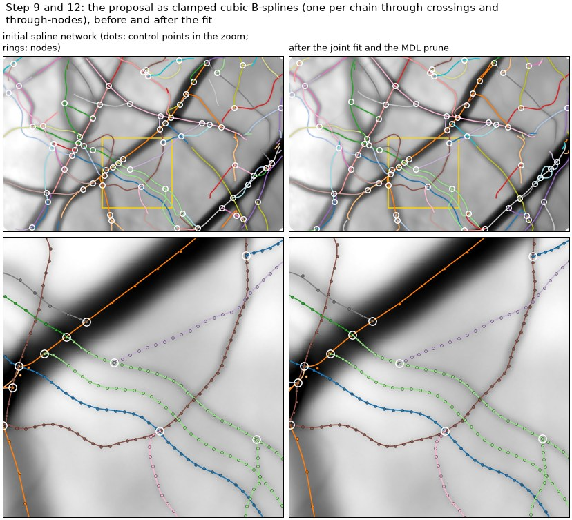

*The initial network (left) and the fitted, pruned network (right). Rings are nodes where three or more ends
meet.*

## Step 10. The render model

**Goal.** Draw the network as an OD image that can be compared with the target pixel by pixel, and that changes
smoothly as the curves move, so that gradient descent can adjust them.

**Idea.** A vessel is a cylinder of blood. The light path through it at distance d from its axis is the chord
`2 sqrt(r^2 - d^2)`, so its OD profile is a half-ellipse, blurred by the optics. Where vessels overlap, what to
draw depends on how they overlap:

- at a **fork** the lumens join into one volume of blood, so the drawing should be the union of the lumens,
  not their sum;
- at a **crossing** the vessels lie at different depths and their ODs nearly add.

**Algorithm.**

```
for each pixel near edge e (within r + 3 s + 1.5 px), with d = its distance from the centreline and the
nearest centreline point's half width r, blur s and centre OD a:
    m_e = a * P(d; r, s) * T_e
    P(d; r, s) = the chord profile sqrt(1 - (d / r)^2), built as 6 nested bars, each blurred by a Gaussian of
                 width s in closed form (with erf), so P is smooth in d, r and s
    T_e        = the end caps: the vessel fades over its last few pixels with the same blur, so two collinear
                 pieces meeting at a node sum to exactly one
V = sum over edges of m_e                            # the plain sum

# corrections in small windows ("sites") around nodes and crossings, computed on sharp lumens (blur 0.5 px)
# and then blurred to the local blur:
at a node:      D = max over the members of (lumen with a round end) - sum over the members of (lumen with a cut end)
                # replaces the sum by the union of the lumens
at a crossing:  D = -(1 - kappa) * (sum of the two lumens - the larger one)
                # removes (1 - kappa) of the overlap; kappa is fitted per image, starting at 0.87
                # a crossing site = two centrelines within 1 px of each other, at least 15 deg apart
V = V + D (blurred, tapered to zero at the window's edge)

R = (1 - h) * V + h * blur(V, s_h)                   # the halo: light scattered in tissue; h, s_h fitted
                                                      # (starting at 0.25 and 6 px)
```

**How it works.**

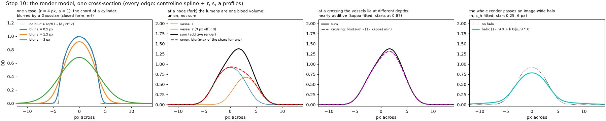

*One cross-section: a vessel's chord profile at three blurs; a fork, where the union is lower than the sum; a
crossing, where the OD nearly adds; the halo.*

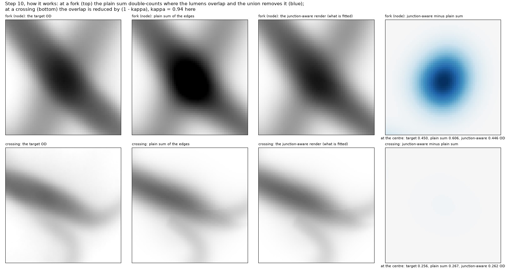

*On the fitted network. Top, a fork: the plain sum is too dark at the centre (0.606 OD against a target of
0.450); the union gives 0.446. Bottom, a crossing: the fitted kappa is 0.94, so the correction is small (sum
0.267, corrected 0.262, target 0.256).*

## Step 11. The loss

**Goal.** One number that says how badly the drawing matches the target, so that it can be minimised.

**Algorithm.**

```
loss = 0.5 * sum over valid pixels of w * (OD - R)^2               # the data error, precision-weighted
     + 600  * sum over consecutive control points of |c_i - 2 c_(i+1) + c_(i+2)|^2 / h^3
                                                                   # bending (h = the control spacing)
     + 2000 * sum of (fold-back between consecutive control spans)^2          # no cusps
     + 50   * sum of ((length of a span - length of the previous) / h)^2       # even spacing
     + 300  * sum of max(0, |ln r - mean ln r of its edge| - ln 1.6)^2         # a vessel's width may not
                                                                               # balloon or pinch locally
     + 20   * sum of (change of ln r, ln s, ln a between profile knots)^2      # smooth profiles
     + 2000 * sum of (sideways offset of a node from a curve passing through it)^2
     + sum of |position - starting position|^2 / (2 * 4^2)                    # anchor: positions stay within
                                                                               # about 4 px of where they started
```

w is the precision weight of step 8: 1 / (local texture variance), zero off valid data. On an averaged still,
texture is the main source of mismatch, so textured areas count less.

## Step 12. The fit schedule

**Goal.** Adjust every parameter (curve positions, widths, blurs, contrasts, halo, kappa) to minimise the loss,
in an order that avoids bad local solutions, and remove what does not pay for itself.

**Algorithm.**

```
stage 1: 30 iterations, profiles, halo and kappa only (positions fixed)
stage 2: 100 iterations, everything, positions included
         (Adam; step sizes: positions 0.15, profiles 0.04, halo 0.02, kappa 0.02;
          each stage's step sizes decay from 1x to 0.1x on a cosine;
          every 25 iterations the pixels are re-assigned to their nearest edge and the sites re-detected;
          after every step, widths and blurs are clipped to their limits)
stage 3: prune. For every edge (not only free-end edges):
         gain = how much the data error would rise if the edge were removed, everything else fixed
                (for an edge wider than 8 px: also with its low-frequency part given to a smooth background,
                 taking the smaller gain), divided by 6 (the correlation area)
         penalty = 0.25 * 0.5 * n_params * ln(max(the edge's pixels / 6, 2)),
                   n_params = 4 + 2 * length / 15 + 3 * max(2, length / 30 + 1)
         remove the edge if gain < penalty, or if it is wide and faint (mean contrast under 0.1) and its two
         flanks (at r + 2 s on each side) lie on valid data for less than half of its length
         then tidy the topology (merge joints, drop nodes no edge ends at)
         retarget: refit the background outside (stage 1's mask OR where the render exceeds 0.5 x the local
         noise, dilated 3 px), with sigma 16 px; the new target is OD = B - L
stage 4: 60 iterations, profiles, halo and kappa only, on the new target
```

**How it works.**

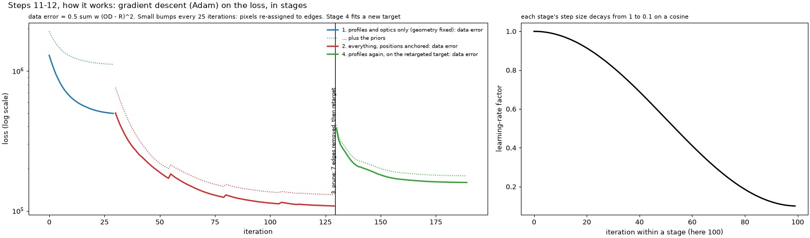

*The data error per iteration. Stage 1 (profiles only) cuts it from 1.29 million to 0.50 million. Stage 2,
with positions free, takes it to 0.11 million. The prune removes 7 edges, leaving 85. Stage 4 starts higher
(0.39 million) because the retargeted target contains OD the background used to absorb, and ends at 0.16
million. Right: each stage's step-size factor.*

**On the whole image.**

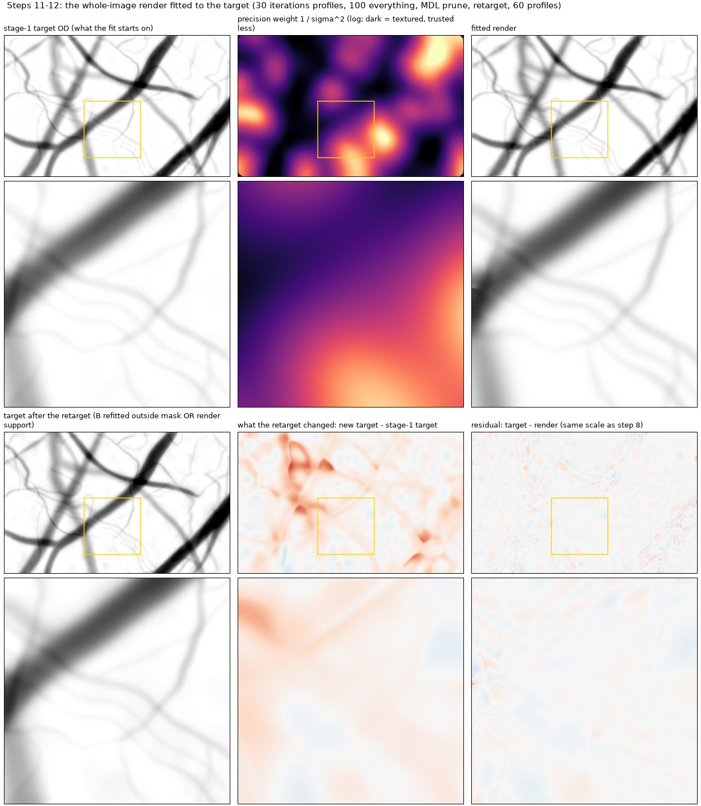

*Top: the stage-1 target, the precision weight (log scale; dark = textured, trusted less), the fitted render.
Bottom: the retargeted target, what the retarget changed (red: OD added, mostly around junctions and wide
vessels), and the final residual on the same scale as step 8.*

## Step 13. Export and the result

**Algorithm.** Every fitted curve is cut at each node it passes through, so each output edge runs from junction
to junction. Each node where three or more ends meet keeps the proposal's junction type if it had one; else it
is a 3-way (three ends) or compound (four or more). Each crossing found by the render (two curves within 1 px)
is output as a crossing.

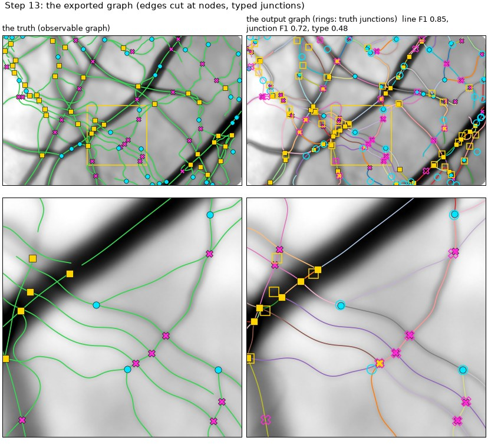

*The truth (left) and the output (right). Rings on the right are the true junctions; filled markers are the
output's.*

**How it is scored** (this image, development):

| score | meaning | value |
|---|---|---|
| centreline F1 | how well output and true centrelines overlap within 3 px (combines "output on a true vessel" and "true vessel found") | 0.85 |
| junction F1, strict | the same for junction positions, matched within 23.8 px | 0.72 |
| junction type, balanced | of matched junctions, the share with the right type (3-way, crossing, compound), averaged over the three types | 0.48 |
| edge cover | for each true edge, the share of its length covered by its single best output edge | 0.73 |
| explained OD | within the vessel band, 1 - (squared error of the render) / (squared OD), against the image's OD under the true background | 0.988 |

On the 6 held-out images the same pipeline scores 0.840, 0.672, 0.564 and 0.713 on the first four
([REPORT.md](REPORT.md), section 4).

# Where it falls short, and what to change

The 95 % bar applies per junction, not per image. Each true junction is asked three questions: was a junction
found within the strict radius; does it have the right type; does the render hold 95 % of the scene's clean OD
in its disc? Over the 500 junctions of the 6 held-out images:

| junction type | number | found | right type | render >= 95 % | all three |
|---|---|---|---|---|---|
| 3-way | 176 | 38 % | 24 % | 52 % | 11 % |
| crossing | 135 | 73 % | 36 % | 53 % | 23 % |
| compound | 189 | 74 % | 42 % | 54 % | 30 % |
| **all** | 500 | **61 %** | **34 %** | **53 %** | **21 %** |

For comparison, all three hold for 9 % of junctions with the proposal alone (step 8's output) and 10 % with
vesselmap.

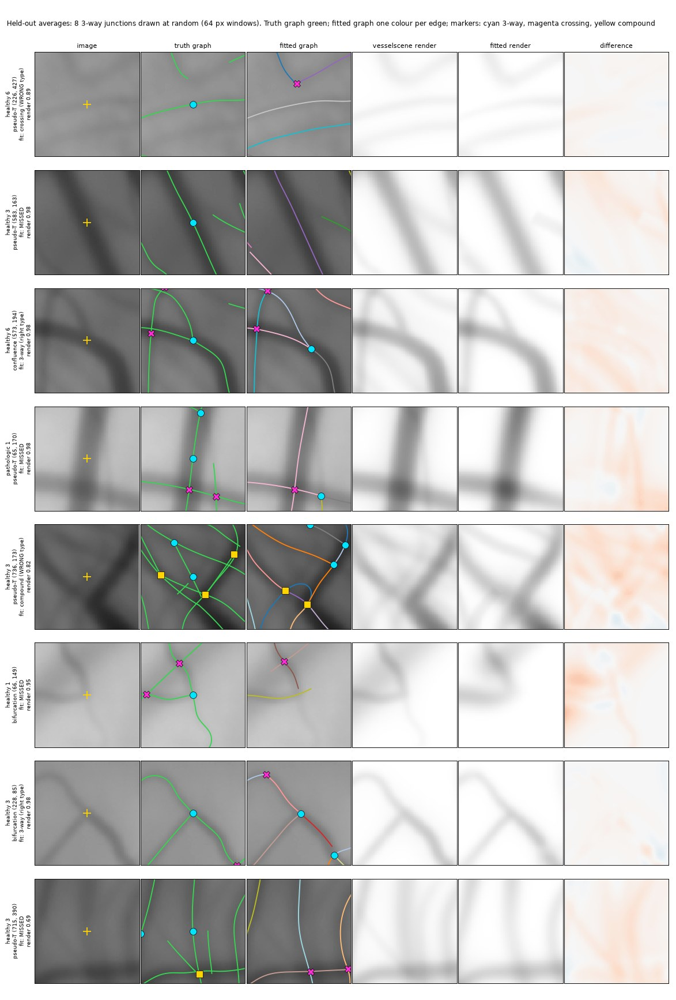

*Eight 3-way junctions drawn at random from the held-out images. Each row: the image, the true graph, the
fitted graph, the scene's own render, the fitted render, and their difference, 64 px around the junction.*

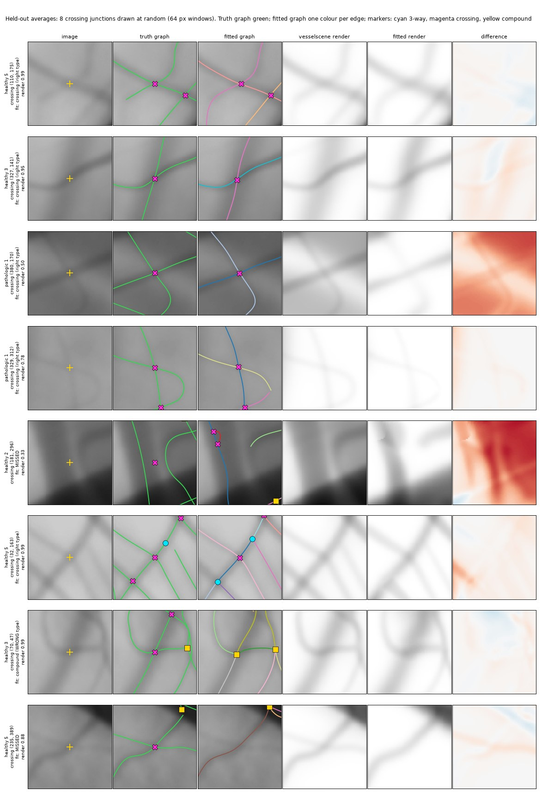

*The same for eight crossings.*

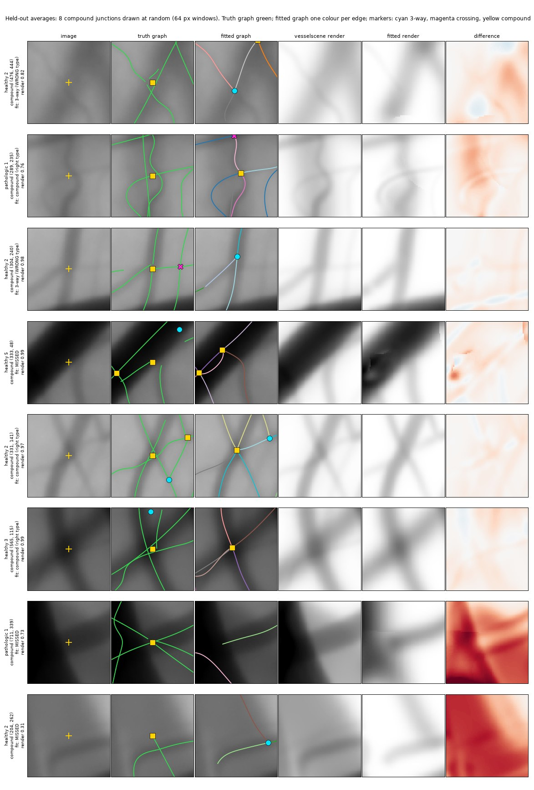

*The same for eight compound junctions.*

**The changes, in order.**

1. **Fit the background outside a mask made from the OD, not the contrast-to-noise mask** (step 1). On the
   pathologic development scene, step 1's mask covers 46 % of the true vessel area and 37 % of the wide
   vessels'. A hysteresis mask on the OD itself (seeds above 3 x the noise, grown above 1.5 x) covers 70 % and
   66 %; on the OD smoothed by 3 px, 75 % and 71 %. Everything the mask misses is lost from the target (the
   leak figure in step 1). The mask stays a background tool only: used as a fitting term (experiment E23),
   it made positions worse.

   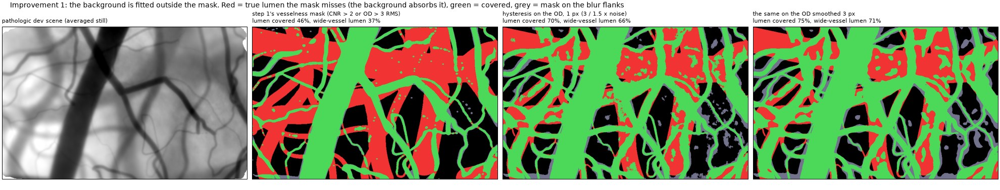

   *Red: true vessel area the mask misses, which the background absorbs. Green: covered. Grey: mask on the
   blurred edges of vessels.*

   **Tested through the full fit (experiment E24): not an improvement as built.** The target keeps 82 % of
   the true vessel OD instead of 72 %, but the OD mask also takes the dark half of the background texture.
   The background, fitted on the brighter rest, sits about 0.002 OD too high, and the fit turns that offset
   into darker, blurrier vessels. Added only at the retarget, the composite rose by 0.0025 (3 scenes up, none
   down), but the contrast and blur error guards vetoed it. Used for the target from the start it scored
   0.013 lower, and in the proposer 0.032 lower. The mask needs a criterion that separates vessels from
   texture: a line-like one (the orientation score of steps 3-5, or the traced lumens), not OD amplitude alone.

2. **Search for side branches along every traced vessel** (steps 6-7). Only 38 % of 3-way junctions are found,
   against 73-74 % of crossings and compounds. Step 7 makes a 3-way only when a trace ends on its parent within
   reach, so the junction is lost whenever the branch's trace stops short, never reaches the parent, or is
   pruned. Walk along each traced vessel instead and look, on each side, for a line leaving it in the score of
   step 5. Accept it by the drop in the fit's error, not by a fixed threshold.
3. **Type junctions by comparing local models** (step 7). Only 34 % get the right type, because the type is
   counted from traced arms and a lost arm changes it. Instead, draw each competing hypothesis in the junction
   disc (fork, crossing, T, two nearby forks), fit each to the OD, and keep the one with the smallest error
   plus description cost. Step 10's render already tells them apart: a fork is a union, a crossing nearly adds.
4. **Choose which vessel continues through a node by turn and width** (step 9). The parent is the pair of arms
   with the smallest turn and the most similar widths. The daughter widths should satisfy Murray's law,
   `r_parent^3 = r_1^3 + r_2^3`. This replaces the same-trace rule, which can only link pieces of one trace.
5. **Look again at the surround's cost to crossings** (step 4). It removes 44 % of a crossing's response in
   the step-4 figure, because a crossing's two lobes look partly "orientation-blind".
6. **Keep false-alarm control in the proposer** (steps 4-6). Linking pieces across gaps after the fact
   (experiment E22) let two false texture pieces become one edge that survived the prune. Continuity has to
   come from the tracing, with each piece judged on its own evidence.
7. **Measure per junction.** Image-level scores average over hundreds of junctions and hide the 21 %. Track
   the table above for every change.

# Reproduce

```
export OMP_NUM_THREADS=2
python -m experiments.splinefit.pipeline_figures --out experiments/splinefit/results/pipeline      # whole-image figures
python -m experiments.splinefit.pipeline_mechanisms --out experiments/splinefit/results/pipeline   # how-it-works figures
SPLINEFIT_ALLOW_HELDOUT=1 python -m experiments.splinefit.junction_gallery <the 6 held-out scene folders> \
    --out experiments/splinefit/results/heldout/junctions                                          # scorecard, galleries
python -m experiments.splinefit.report_html experiments/PIPELINE.md pipeline.html
```

Both figure scripts use the development scenes (healthy 7, and pathologic 0 for the mask figures), take about
3 to 4 minutes each on 2 threads, and are deterministic.
