# Vessel annotation of vesselscene stills: a neuromimetic proposer and a jointly fitted spline render

The full report of the two experiments in this folder:

- [neuromimetic](neuromimetic/README.md): a deterministic annotator modelled on the early visual system;
- [splinefit](splinefit/README.md): one spline network for the whole image, fitted jointly to the image's
  optical density, junctions included. The neuromimetic annotator proposes the network.

The annotated scenes in section 4 are held-out images. Every number comes from the committed JSONs, and every
figure was drawn from outputs whose digests match those JSONs.

## Bottom line

- **The neuromimetic annotator is a better proposer than curvature analysis.** On 6 held-out scenes (12
  images), it beats a tuned Hessian pipeline and LIMBUS vesselmap's `build_map` on every image in line F1 and
  strict junction F1.
  - Line F1 is 0.83 / 0.81 (averaged still / single frame), against 0.66 / 0.55 for the Hessian and
    0.64 / 0.72 for vesselmap.
  - It finds 25-32 % of the crossings; the curvature annotators find 5-12 %.
  - It takes 8 s per image and is deterministic.
- **Fitting the whole image's spline render on top of the proposal works, but only partly solves the
  problem.**
  - The fitted render explains 0.91-0.92 of the vessel OD, against 0.80-0.82 for the proposals' own
    profiles, and 0.93-0.94 in the junction discs. Vessel positions improve on 11 of 12 images.
  - Composite: 0.770 / 0.756, against 0.756 / 0.723 for the proposals and 0.668 / 0.692 for vesselmap. The
    fit beats vesselmap on composite, graph, position, crossings and line F1 on all 12 images.
- **Three things are not solved.**
  - **Topology still comes from the proposer.** The fit does not change the graph score (+0.001), so
    crossings (28-35 % recall) and junction types (balanced coarse accuracy 0.49-0.56) are the proposer's.
  - **At junctions the fit under-predicts.** The fit's remaining error sits at junctions, where the render
    under-predicts the OD. The evidence points at the target more than at the render: near junctions, OD is
    lost to the background before the fit begins.
  - **On hard images the target is the ceiling.** On the pathologic scene and on healthy seed 2, the
    background took part of the vessel OD. The target's fidelity to the true vessel OD was only 0.76-0.89
    there, and the fit explained 0.73-0.85. On the other 8 images the fidelity was 0.98-0.99 and the fit
    explained 0.97-0.99. No render can explain OD the target no longer holds.
- **A claim was refuted.** The junction-aware render (a union of lumens at nodes, near-additive crossings)
  is not what explains the junctions. A lesion with a plain additive render does as well. The gain comes from
  fitting profiles and positions jointly.
- **The overnight loop (Karpathy's autoresearch).** It ran 21 experiments and kept 4 changes plus a
  determinism fix. Development tier 2 rose from 0.7539 to 0.7606. Most of that came from one idea: freeze
  the geometry before the target is re-cleaned.

## 1. The question, and the residual rule

The question was whether vision science (photoreceptor contrast, edges, contours) or diffusion models could
give a deterministic annotator whose output matches the vertex-and-edge graph of a vesselscene still better
than curvature (Hessian) analysis. The end goal was then set higher: one optimisation of the whole image's
spline render, junctions and all, with the annotator only proposing vessels.

**The residual rule held throughout.**
- Every residual is the image's own OD minus a render: OD = B - ln I.
- The background B is fitted only on the **negative of the vesselness mask**, and B cleans the original
  image.
- No vesselness or orientation map is ever a target. Such maps distort the OD of bifurcations and crossings.
- An adversarial review checked the rule in the neuromimetic code. The fit takes stage 1's target and never
  sees a map or a mask as its target.
- The scorer does not use any pipeline's target. Its OD_obs takes an oracle background: the log image with
  the scene's known vessel darkening removed, then smoothed. A pipeline cannot raise its score by choosing an
  easy target.

## 2. The proposer: a neuromimetic annotator

Eight deterministic stages (`neuromimetic/neuromimetic.py`):

| stage | biology | algorithm |
|---|---|---|
| 1 | photoreceptors, horizontal cells | log image; background fitted outside the vesselness mask; OD = B - log I |
| 2 | OFF-centre ganglion cells, gain control | centre-surround OD bands divided by local noise: a contrast-to-noise ratio |
| 3 | V1 simple cells | even and odd oriented filters, 16 orientations, 3 frequency channels; every orientation kept at every pixel |
| 4 | non-classical surround | subtract the isotropic part of the tuning; flank suppression |
| 5 | association field (bipole cells) | collinear completion in (x, y, theta): gaps fill, line ends do not grow |
| 6 | readout | non-maximum suppression; tracing in SE(2), so a line passes through a crossing in its own orientation layer |
| 7 | end-stopped cells | an end on a line is a 3-way junction, two lines through each other a crossing, more arms a compound |
| 8 | diffusion-style refinement | render the graph, compare with the cleaned OD, prune what does not pay for itself (MDL) |

Held-out means over 6 scenes. Each cell is averaged still / single frame:

| annotator | line F1 | line P | junc F1 strict | crossing R | coarse balanced | edge cover | s / image |
|---|---|---|---|---|---|---|---|
| truth's own graph (ceiling) | 0.98 / 0.98 | 1.00 / 1.00 | 1.00 / 1.00 | 1.00 / 1.00 | 1.00 / 1.00 | 1.00 / 1.00 | - |
| **neuromimetic** | **0.83 / 0.81** | **0.93 / 0.89** | **0.68 / 0.64** | **0.32 / 0.25** | **0.60 / 0.50** | **0.70 / 0.69** | 8 / 8 |
| Hessian ridge + skeleton | 0.66 / 0.55 | 0.74 / 0.48 | 0.50 / 0.41 | 0.10 / 0.05 | 0.51 / 0.39 | 0.54 / 0.52 | 1 / 2 |
| vesselmap `build_map` | 0.64 / 0.72 | 0.56 / 0.71 | 0.44 / 0.44 | 0.12 / 0.10 | 0.37 / 0.39 | 0.62 / 0.65 | 697 / 534 |

What did the work:
- **About half of the gap to the Hessian is the V1-like orientation score.** The full gap is 0.17 on a
  composite. With the Hessian's ridge measure as stage 3 in the same pipeline, 0.08-0.09 of it is lost.
  The score's clearest effect is line precision: +0.19-0.20 on 12 of 12 images.
- **Contour integration and surround suppression buy precision on noisy frames only.** They add +0.10
  junction precision on 6 of 6 frames. On averaged stills they are neutral to slightly negative.
- **The diffusion-model ideas came back negative.** The render-compare-prune step is neutral. Re-proposing
  from the residual adds false arms.
- **Typing is weak.** Junction types beat a majority label by only 0.05-0.10, and that margin rests on one
  prior fitted on development data.


*Held-out frame (healthy seed 1, 2x zoom). Panels: truth (green), the Hessian baseline (traces both walls of
the wide vessel, plus texture), vesselmap (its splines loop), and the neuromimetic annotator (follows the
wide vessel's axis, keeps thin vessels). Junctions: cyan circle = 3-way, magenta X = crossing, yellow square
= compound.*


*The same frame. Left: truth. Middle: V1 alone at the full annotator's thresholds, which fires on texture.
Right: the full annotator, with surround, association field and refinement.*

## 3. The end goal: one jointly fitted spline render of the whole image

**Method** (`splinefit/`):
1. **Target.** The OD from stage 1's background, fitted on the vesselness mask's negative.
2. **Network.** The proposal becomes the network. Traced vessels are cut at typed junctions and become
   clamped cubic B-splines with radius, blur and contrast profiles. A 4-ended crossing becomes two through
   edges with no node. Other junctions become shared nodes.
3. **Render.** vesselmap's blurred-cylinder chord per edge, composed as a union of lumens at nodes and
   near-additively at crossings, with a halo.
4. **Joint fit.** Every parameter descends one precision-weighted residual:
   1. profiles, then everything jointly;
   2. an MDL prune: an edge must pay for itself, and a faint wide edge must be seen on both flanks;
   3. retargeting: the background is re-fitted outside the mask or the render's support;
   4. a final fit of profiles and optics, with the geometry frozen.

**Held-out scenes** (6 scenes, 12 images; measured once, after the freeze). Each cell is average / frame:

| row | composite | graph | pos | width | explained | explained at junctions | line F1 | junc F1 strict | crossing R | s / image |
|---|---|---|---|---|---|---|---|---|---|---|
| **fit** | **0.770 / 0.756** | 0.697 / 0.667 | 0.808 / 0.797 | 0.800 / 0.827 | 0.921 / 0.909 | 0.936 / 0.926 | 0.840 / 0.829 | 0.672 / 0.635 | 0.354 / 0.285 | 116 / 99 |
| proposals alone | 0.756 / 0.723 | 0.706 / 0.656 | 0.788 / 0.717 | 0.828 / 0.835 | 0.801 / 0.815 | 0.804 / 0.828 | 0.835 / 0.808 | 0.682 / 0.637 | 0.319 / 0.241 | 8 / 8 |
| vesselmap `build_map` | 0.668 / 0.692 | 0.520 / 0.547 | 0.708 / 0.703 | 0.786 / 0.841 | 0.953 / 0.968 | 0.964 / 0.982 | 0.644 / 0.716 | 0.444 / 0.439 | 0.116 / 0.100 | ~600 |
| fit started from the truth | 0.740 / 0.730 | 0.570 / 0.559 | 0.852 / 0.833 | 0.930 / 0.935 | 0.949 / 0.937 | 0.963 / 0.949 | 0.556 / 0.547 | 0.519 / 0.491 | 0.630 / 0.453 | 187 / 178 |
| the true network, rendered | 0.790 / 0.774 | 0.589 / 0.559 | 1.000 / 1.000 | 0.998 / 0.998 | 0.976 / 0.967 | 0.968 / 0.957 | 0.490 / 0.440 | 0.522 / 0.484 | 0.826 / 0.760 | - |

**The scores.**
- Composite = 0.5 graph + 0.5 mean(pos, width, explained).
- *explained* = 1 - SSR / sum(OD²) over a band within 3 px of the observable vessels, against the scorer's
  oracle-background OD.
- *pos* and *width* compare the fitted centrelines and radii with the true network's.
- The true network scores low on graph because it also holds vessels the image does not show.

The fit minus each row. Each cell is the mean per-image difference over all 12 images, with the number of
images where the fit is higher:

| fit minus | composite | graph | pos | width | explained | explained at junctions | line F1 | junc F1 strict | crossing R |
|---|---|---|---|---|---|---|---|---|---|
| proposals alone | +0.024 (11/12) | +0.001 (7/12) | +0.050 (11/12) | -0.018 (6/12) | +0.107 (12/12) | +0.115 (12/12) | +0.014 (10/12) | -0.006 (6/12) | +0.040 (6/12, 6 ties) |
| vesselmap | +0.083 (12/12) | +0.149 (12/12) | +0.097 (12/12) | +0.000 (8/12) | -0.046 (4/12) | -0.042 (3/12) | +0.155 (12/12) | +0.212 (12/12) | +0.212 (12/12) |
| fit from the truth | +0.028 (9/12) | +0.118 (12/12) | -0.040 (0/12) | -0.119 (0/12) | -0.028 (0/12) | -0.025 (0/12) | +0.283 (12/12) | +0.148 (12/12) | -0.222 (2/12) |

**The four scenes no development agent ever read** (healthy 3, 5, 6 and pathologic 1). Fit minus proposals:
+0.024 composite (7 of 8 images) and +0.117 explained (8 of 8). Fit minus vesselmap: +0.092 composite (8 of
8).

## 4. Annotated held-out scenes

How to read the figures:
- **The annotated view** is a 2 x 2 grid: truth, proposals, fit and vesselmap, each over the image.
  - The truth's observable centrelines are green, its junctions filled markers.
  - Under each annotator the truth is drawn faintly: a green halo along the lines, and rings at the
    junctions. A ring with nothing in it is a missed junction. A halo with no coloured line is a missed vessel.
  - Each annotated edge has its own colour. The fit's edges carry a shaded band, centreline ± fitted radius.
  - Junction markers: cyan circle = 3-way, magenta X = crossing, yellow square = compound.
- **The render view** shows the image, the fit's own target OD (background from the mask's negative) and the
  fitted render. Below them are the residuals, scorer OD minus render, for the fit, the proposals and
  vesselmap. Red = the render under-predicts, blue = it over-predicts.
- **The junction close-ups** show truth junctions picked by a rule, not by hand. For each coarse type, they
  are the junction at the median and the one at the maximum of the fit's summed |residual| in its disc.

<!-- FEATURED -->
Three images are shown in full. All three come from scenes no development agent ever read. The first is a
typical single frame. In the second the proposals were already good, and the fit only ties them. The third
is the pathologic scene, where the fit does worst.

### Healthy seed 3, single frame

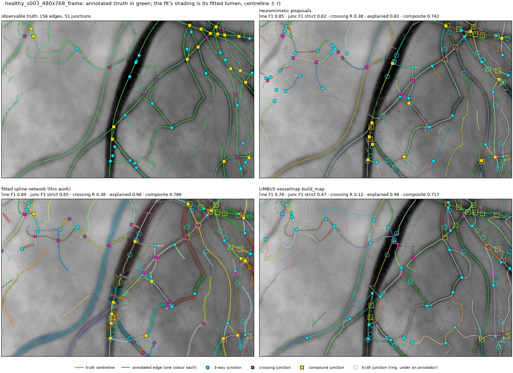

*Truth: 156 edges, 51 junctions. The fit keeps the proposals' graph and gives each vessel a position and a
width. Line F1 is 0.89 against the proposals' 0.85, strict junction F1 0.65 against 0.62, and crossing recall
0.38 for both. The faint, deep vessel at the lower left gets its full blurred width (the broad blue band). The
false compounds along the large vessel's wall come from the proposals and stay. vesselmap traces most
vessels but finds 0.12 of the crossings, and types most junctions as 3-way.*

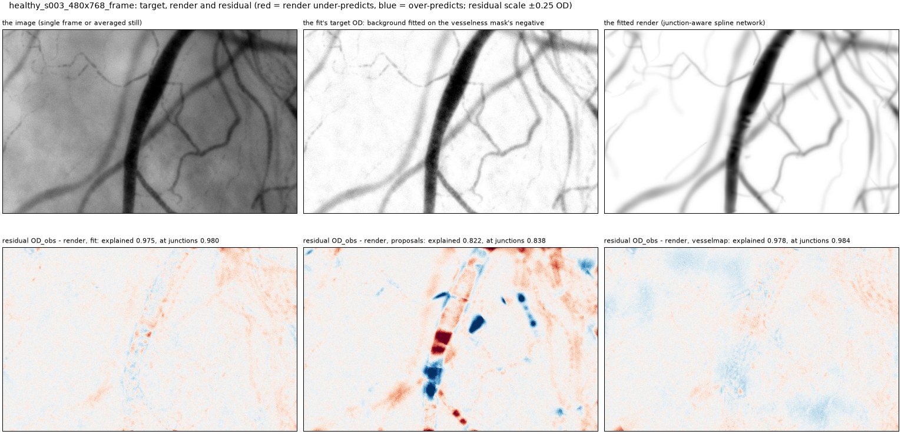

*The proposals' own profiles, drawn additively, leave strong over- and under-predictions along the large
vessel, from per-trace profiles and the butt ends at the cuts: explained 0.82. The fitted render leaves
little: explained 0.975, and 0.98 at junctions. What remains is faint red under-prediction, at junctions and
along vessels the proposer never traced (upper right).*

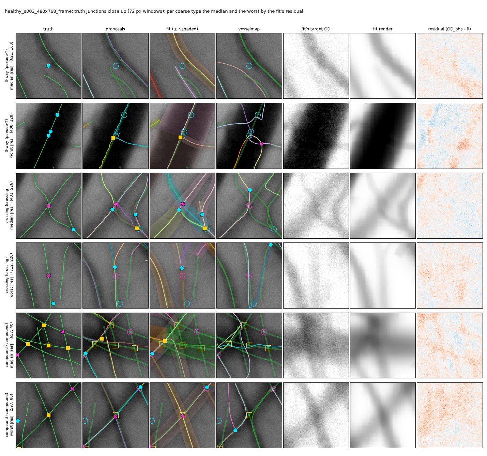

*Rows picked by rule (section 4). The worst cases show the topology errors the fit inherits:*
- *Worst 3-way (408, 128): three truth pseudo-T junctions sit on the large vessel's wall. Proposals and fit
  place one compound there.*
- *Worst crossing (712, 226): proposals and fit put a 3-way node where the crossing is, and vesselmap puts
  no junction.*
- *Worst compound (597, 80): proposals and fit place a crossing at the right spot, but the truth calls it a
  compound.*

*In every window the fitted render resembles the target, and the residuals are faint.*

### Healthy seed 5, averaged still


*Truth: 201 edges, 79 junctions. Here the proposals were already good (composite 0.841, explained 0.93), and
the fit only ties them (0.840).*
- *It gives the wide vessels their full lumens (shaded). It raises explained to 0.99 and position from 0.85
  to 0.88.*
- *But its graph score drops from 0.80 to 0.77, mostly in junction-type balance (0.75 to 0.63).*
- *Crossing recall is 0.64 for both, against vesselmap's 0.18. On an averaged still, outside its design,
  vesselmap also traces texture as wandering lines.*


*Median crossing (285, 242): proposals and fit type it a crossing, and vesselmap splits it into two 3-way
nodes. Worst crossing (355, 385): a thin vessel over a wide one, which proposals and fit call a compound.*

### Pathologic seed 1, averaged still


*Truth: 268 edges, 98 junctions. Proposals and fit agree on the graph: line F1 0.72 / 0.73, strict junction F1
0.63 / 0.63, crossing recall 0.29 / 0.33. vesselmap finds 0.04 of the crossings and loops through texture.
The fit's widths are worse than the proposals' here (0.63 against 0.77), consistent with fitting a target
that has lost part of the vessels' OD.*


*The failure mode of the whole approach, in one figure:*
- *The fit's residual is red along wide, blurred vessels, and along the large vessel at the bottom right.*
- *The fit's own target (top middle) does not hold them. Stage 1's fine-scale vesselness mask missed them,
  so the background fitted on the mask's negative absorbed their OD, and the target's fidelity is 0.77.*
- *vesselmap's own background kept more of it: explained 0.88 against the fit's 0.73. vesselmap's residual
  shows blue blobs where it over-predicts.*

*A coarse channel that adds deep vessels to the mask (E18-E20) was the loop's attempt at this. It stayed
off.*


*The worst compound (723, 430) lies on the large dark vessel at the bottom right. The image is dark there,
but the fit's target is nearly white: the background took the vessel, and the residual saturates. The median
compound (690, 46) is the same vessel near the top, where the target kept it. Most windows are red: the
fit under-predicts at junctions (net junction bias -0.42 on this image).*
<!-- /FEATURED -->

### vesselscene's render vs the fitted render

vesselscene renders each scene's vessels itself before it adds the background and camera noise: OD_img, the
clean vessel OD through the image formation's blur. The fit is trying to reproduce exactly this, so the two
renders can be compared directly. The scorer's `explained_true` measures it: 1 - sum (OD_img - R)^2 /
sum OD_img^2 over the vessel band.
- On healthy 1, 3, 5 and 6, where the fit's target is faithful, the fitted render explains 0.979–0.990 of
  vesselscene's render, and 0.978–0.993 at junctions.
- On healthy 2 it explains 0.83–0.85 (0.87–0.90 at junctions), and on pathologic 1, 0.73 (0.76–0.77).

What the comparison shows:
- **Wide, low-contrast vessels are missing on the two hard images.**
  - Each pixel carrying truth OD (OD_img > 0.03) was assigned the radius of its nearest truth centreline
    sample. This attribution is rough where vessels overlap.
  - On vessels of radius 8 px or more, the fit renders 92–96 % of vesselscene's OD on the eight good images,
    61–64 % on healthy 2, and 51 % on pathologic 1.
  - The loss is in the target, not the fit. The fit's own target keeps 67–69 % of that OD on healthy 2 and
    56 % on pathologic 1, against 92–98 % on the good images. The background took the rest, and the render
    comes within 6 points of its target, so no fit of that target can bring those vessels back.
  - The image does contain them. vesselmap, which fits its own background, explains 0.96–0.98 of
    vesselscene's render on healthy 2 and 0.88–0.95 on pathologic 1.
  - They count against the fit: of all the OD the fit misses, only 6–32 % lies on vessels the truth marks
    non-observable.
- **Faint beaded capillaries are not rendered.** The fitted network has no edges on them.
- **Texture inside wide vessels stays.** vesselscene draws granular texture inside the large vessels. A
  smooth tube cannot reproduce it, so it remains as fine red–blue speckle in the difference.
- **An edge that ends inside a vessel ends square.** Where the large vessel's fitted centreline breaks into
  short pieces, the render steps across the vessel. In healthy 3 frame, near (390, 217), the step is 0.04 OD
  between neighbouring pixels. A fresh re-render of the exported network keeps such steps (checked on three
  images), so they come from the broken geometry, not from a stale render. They are few and local.

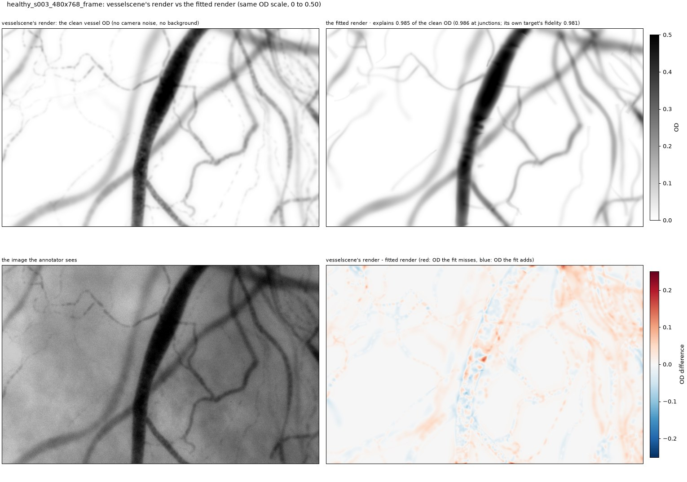

*Healthy 3 frame: the fitted render explains 0.985 of vesselscene's. The vessels the proposer traced are
reproduced closely, junctions included. The differences are faint:*
- *the beaded capillaries at the top left, never traced;*
- *diffuse red at the top right, where many faint vessels overlap;*
- *the granular texture inside the large vessel (the speckle along it);*
- *a step near (390, 217), where the large vessel's centreline breaks and an edge ends square.*

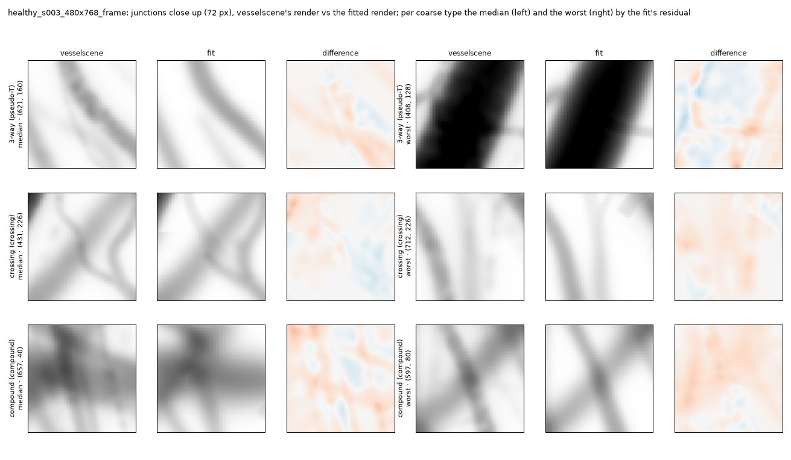

*The same windows as the junction close-ups above. At 72 px the fitted render matches vesselscene's at every
junction type. What differs is texture inside the vessels and a slight, mostly red under-prediction.*

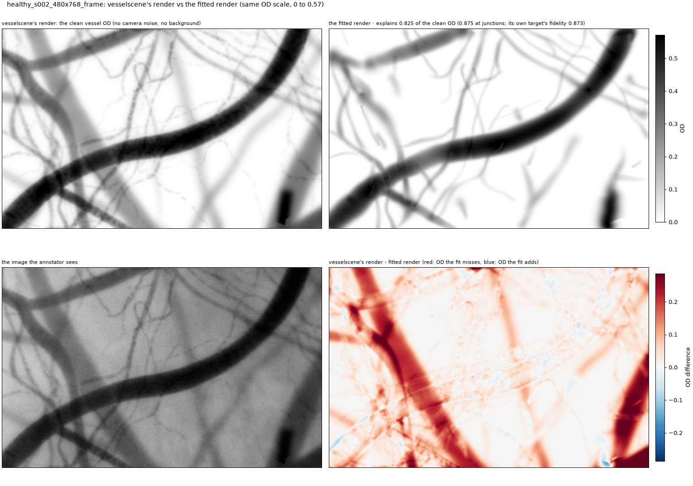

*Healthy 2 frame: explains 0.825. Two wide vessels of moderate contrast are absent from the fitted render:
one runs diagonally across the left half, the other is at the bottom right. Both are about 0.15–0.3 OD,
against 0.55 for the main vessel. The thin vessels match well.*


*Pathologic 1 average: explains 0.729. The wide, low-contrast vessels crossing the field and the lower part
of the large vessel at the right are missing from the fitted render. The fit draws the large vessel narrower and
lumpy, so both its flanks are red and its bulges blue.*

All 12 images can be compared interactively with a wipe between the two renders (section 9, `viewer`).

### Every held-out image

<!-- PERIMAGE -->
Means are in section 3; these are the single images. Each cell is fit / proposals / vesselmap. *digest* says whether the figures' outputs reproduce the committed held-out rows bit for bit (rounded to 0.001 px and 1e-4 OD).

| image | untouched | truth junctions (3-way, X, compound) | composite | explained | explained at junctions | line F1 | junc F1 strict | crossing R | digest |
|---|---|---|---|---|---|---|---|---|---|
| healthy 1 average | no | 58 (22, 19, 17) | 0.788 / 0.755 / 0.706 | 0.99 / 0.87 / 0.99 | 0.99 / 0.87 / 0.99 | 0.85 / 0.84 / 0.68 | 0.70 / 0.70 / 0.44 | 0.26 / 0.16 / 0.16 | same |
| healthy 1 frame | no | 49 (25, 17, 7) | 0.804 / 0.765 / 0.750 | 0.98 / 0.90 / 0.99 | 0.98 / 0.91 / 0.99 | 0.89 / 0.86 / 0.79 | 0.69 / 0.70 / 0.48 | 0.41 / 0.35 / 0.18 | same |
| healthy 2 average | no | 118 (30, 33, 55) | 0.716 / 0.714 / 0.631 | 0.85 / 0.75 / 0.96 | 0.90 / 0.82 / 0.97 | 0.76 / 0.75 / 0.63 | 0.63 / 0.63 / 0.49 | 0.24 / 0.24 / 0.06 | same |
| healthy 2 frame | no | 100 (30, 31, 39) | 0.696 / 0.678 / 0.655 | 0.82 / 0.76 / 0.97 | 0.87 / 0.82 / 0.98 | 0.73 / 0.72 / 0.66 | 0.59 / 0.61 / 0.45 | 0.16 / 0.16 / 0.06 | same |
| healthy 3 average | yes | 85 (48, 15, 22) | 0.804 / 0.777 / 0.679 | 0.99 / 0.80 / 0.98 | 0.99 / 0.75 / 0.98 | 0.91 / 0.90 / 0.66 | 0.64 / 0.70 / 0.43 | 0.27 / 0.27 / 0.13 | same |
| healthy 3 frame | yes | 51 (25, 8, 18) | 0.786 / 0.742 / 0.717 | 0.98 / 0.82 / 0.98 | 0.98 / 0.84 / 0.98 | 0.89 / 0.85 / 0.76 | 0.65 / 0.62 / 0.47 | 0.38 / 0.38 / 0.12 | same |
| healthy 5 average | yes | 79 (22, 28, 29) | 0.840 / 0.841 / 0.727 | 0.99 / 0.93 / 0.98 | 0.99 / 0.94 / 0.99 | 0.89 / 0.90 / 0.69 | 0.75 / 0.76 / 0.49 | 0.64 / 0.64 / 0.18 | same |
| healthy 5 frame | yes | 76 (24, 32, 20) | 0.809 / 0.790 / 0.772 | 0.98 / 0.91 / 0.98 | 0.98 / 0.91 / 0.99 | 0.89 / 0.88 / 0.82 | 0.69 / 0.72 / 0.50 | 0.25 / 0.25 / 0.19 | same |
| healthy 6 average | yes | 62 (31, 16, 15) | 0.816 / 0.791 / 0.669 | 0.98 / 0.84 / 0.93 | 0.99 / 0.82 / 0.93 | 0.90 / 0.90 / 0.61 | 0.68 / 0.67 / 0.35 | 0.38 / 0.31 / 0.12 | same |
| healthy 6 frame | yes | 51 (24, 14, 13) | 0.812 / 0.774 / 0.666 | 0.97 / 0.87 / 0.94 | 0.97 / 0.82 / 0.98 | 0.88 / 0.87 / 0.68 | 0.69 / 0.65 / 0.40 | 0.29 / 0.21 / 0.00 | same |
| pathologic 1 average | yes | 98 (23, 24, 51) | 0.657 / 0.656 / 0.594 | 0.73 / 0.61 / 0.88 | 0.76 / 0.64 / 0.91 | 0.73 / 0.72 / 0.60 | 0.63 / 0.63 / 0.47 | 0.33 / 0.29 / 0.04 | same |
| pathologic 1 frame | yes | 90 (26, 22, 42) | 0.628 / 0.586 / 0.592 | 0.73 / 0.63 / 0.94 | 0.77 / 0.66 / 0.96 | 0.69 / 0.67 / 0.59 | 0.50 / 0.52 / 0.33 | 0.23 / 0.09 / 0.05 | same |
<!-- /PERIMAGE -->

### Gallery: the fitted network on every held-out image

<!-- GALLERY -->
<div class="gallery">
<figure><figcaption>healthy 1 average: composite 0.788, explained 0.99, line F1 0.85</figcaption></figure>
<figure>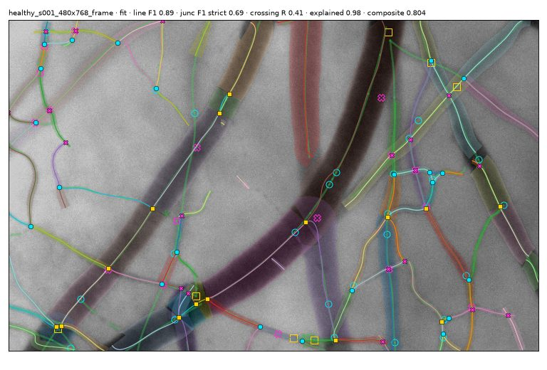<figcaption>healthy 1 frame: composite 0.804, explained 0.98, line F1 0.89</figcaption></figure>
<figure><figcaption>healthy 2 average: composite 0.716, explained 0.85, line F1 0.76</figcaption></figure>
<figure>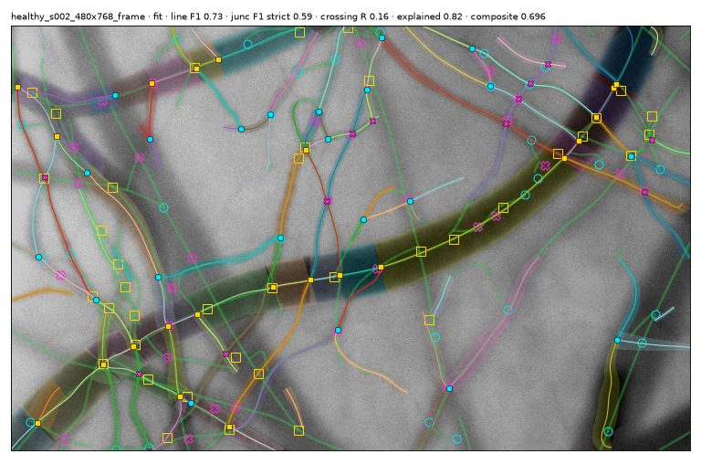<figcaption>healthy 2 frame: composite 0.696, explained 0.82, line F1 0.73</figcaption></figure>
<figure><figcaption>healthy 3 average (untouched): composite 0.804, explained 0.99, line F1 0.91</figcaption></figure>
<figure>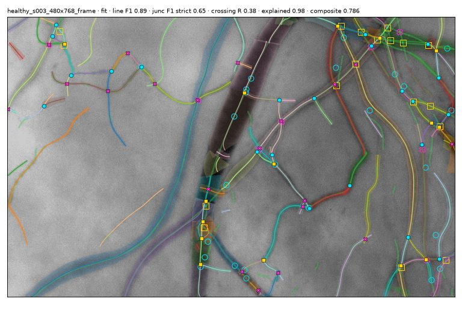<figcaption>healthy 3 frame (untouched): composite 0.786, explained 0.98, line F1 0.89</figcaption></figure>
<figure><figcaption>healthy 5 average (untouched): composite 0.840, explained 0.99, line F1 0.89</figcaption></figure>
<figure>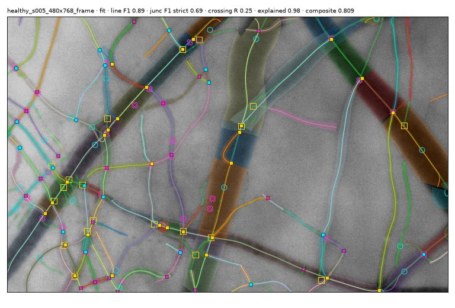<figcaption>healthy 5 frame (untouched): composite 0.809, explained 0.98, line F1 0.89</figcaption></figure>
<figure><figcaption>healthy 6 average (untouched): composite 0.816, explained 0.98, line F1 0.90</figcaption></figure>
<figure>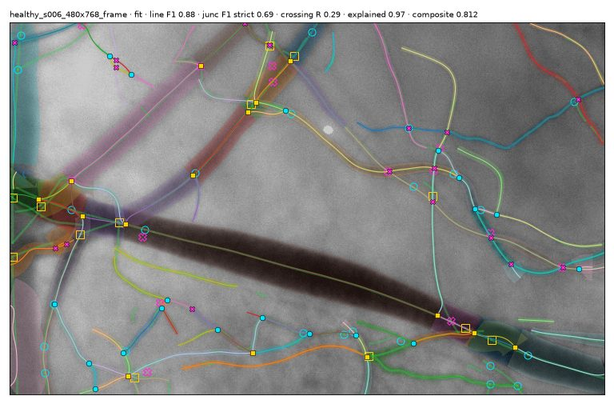<figcaption>healthy 6 frame (untouched): composite 0.812, explained 0.97, line F1 0.88</figcaption></figure>
<figure><figcaption>pathologic 1 average (untouched): composite 0.657, explained 0.73, line F1 0.73</figcaption></figure>
<figure>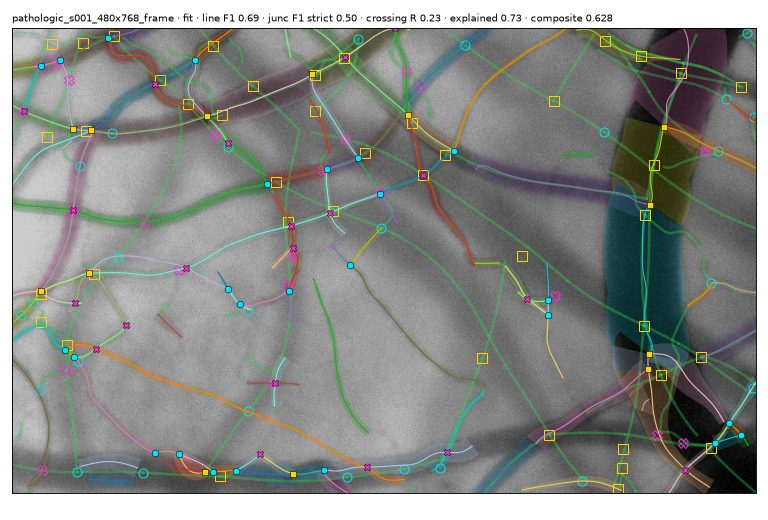<figcaption>pathologic 1 frame (untouched): composite 0.628, explained 0.73, line F1 0.69</figcaption></figure>
</div>
<!-- /GALLERY -->

## 5. The overnight autoresearch loop

Modelled on Karpathy's autoresearch:
- **The charter.** A frozen evaluator (`check_frozen.py` checks its hashes), one metric, and fixed-budget
  experiments that are kept or reset with git. Every run goes into a results log, and the
  [program.md](splinefit/program.md) charter governs it.
- **Two tiers.** Tier 1 (about 5 min): 10 fast crops plus a psychophysics battery of 34 small stimuli with
  exact truth. Tier 2 (about 30 min): every development image, twice, which must be deterministic.
  - A change was confirmed only by a paired per-scene tier-2 gain with no guard-metric veto.
  - That rule was added during the night, after reviews caught gains that did not hold.
- **The neuroscience framing.**
  - The render is the top-down prediction, and the residual is the prediction error.
  - Probe stimuli give tuning curves and thresholds, as in psychophysics.
  - Changes are tested as lesions, against multi-seed controls.
  - Hypotheses were pre-registered with their predicted effect.

About 10.5 hours after the freeze, the loop had run 7 batches: 21 experiments, 27 tier-1 runs and 10 tier-2
runs. Each kept change in batches 1-6 was reviewed adversarially, and the reviews opened the next batch.

**What survived** (tier 2: 0.7539 to 0.7606):
- **E3: geometry frozen in the final fit** (+0.0066), the one large gain. A cleaner target exposes OD the
  network does not yet explain, and free centrelines slide into it.
- **E5/E6: a faint wide edge must be seen on both flanks.** This removes false wide vessels over illumination
  lumps in the probes. On whole images it changes almost nothing.
- **E9: two MDL terms deleted** that never decided anything.
- **A determinism fix:** vesselmap's render runs eagerly, because torch.compile's per-shape cache made an
  image's result depend on the images run before it.

**What did not survive** (kept as switches, off):
- **Re-proposing arms from the residual** (predictive coding's "attend where error remains"). About half
  the arms were real, but no acceptance test separated faint true arms from texture echoes.
- **A coarse "magnocellular" channel** for deep, blurred vessels. Its gain was small (+0.0014 ± 0.0008 per
  scene) and the guard metrics vetoed it.

**Lessons:**
- Where a cleaner target enters decides whether it helps.
- On hard images the target, not the render, is the ceiling.
- Typing errors start in the proposer's event clustering, which the fit never revisits.
- Fast crops and a single-seed probe battery mislead in both directions. Whole images with a paired test and
  multi-seed controls are the honest test.


*The psychophysics battery at the loop's start (v0): the fitter's scores against vessel diameter, focus,
haematocrit, crossing angle and depth, and red-cell gap. Width (red) is the weakest score. It is lowest
for thin vessels (diameter under 4 px), for crossings at 30-45° and for 1 px gaps.*

## 6. What the evidence supports, and what it corrected

- **Supported:**
  - The joint fit explains more of the vessel OD than the proposals do, at junctions and overall, on
    every held-out image.
  - It improves positions.
  - It beats vesselmap on composite, graph, position, line F1 and crossings, on every held-out image.
- **Refuted, the junction-aware render.** On the 10 development images, an additive-render lesion of the
  same pipeline scores the same at junctions: -0.0003 explained at junctions, -0.0006 composite. On the true
  network, the union composition adds at most +0.014.
- **Corrected, where the error is.**
  - The fit's residual at junctions is an under-prediction. Its net junction bias is negative on all 12
    held-out images (-0.04 to -0.44), and 41 of 51 junctions are under-predicted in the healthy-3 frame.
  - The junction discs hold about 0.6 of the band's squared residual.
  - This points at the target (OD lost to the background near junctions) more than at the render.
- **Corrected, why vesselmap explains more.** The fit's explained follows its target's fidelity to the true
  vessel OD (1 - SSE / SS over the band):
  - 0.97-0.99 explained where the fidelity is 0.98-0.99 (healthy 1, 3, 5, 6);
  - 0.73-0.85 where it is 0.76-0.89 (healthy 2, pathologic 1).

  vesselmap's mean explained is higher only because of those 4 images, where its own background kept more of
  the OD (there the fit explains 0.12-0.22 less). On the other 8 images the two tie: the fit explains 0.011
  more on average, and is higher on 4 of 8.
- **Diagnostic, the fit started from the truth.** It keeps better widths and positions but prunes observable
  vessels it was given. Three gaps remain, and they are not separated:
  - the target's background leak;
  - width identifiability;
  - topology.

## 7. Caveats

- **Synthetic scenes only**, and few of them:
  - 5 development scenes;
  - 6 held-out scenes, one pathologic;
  - the average and frame of a scene share their anatomy.
- **The held-out scenes were used twice**, by the neuromimetic study and then the fit. During the first
  study an agent read the junction-type counts of healthy seeds 1 and 2. The four untouched scenes are
  reported separately and agree.
- **vesselmap was not run as designed.** Only `build_map` ran, at its defaults, typed by an adapter rule. On
  averaged stills it is outside its design.
- **Pre-registration was mostly, not fully, kept** (the E6 and E10 thresholds, E20's keep).

## 8. Next steps

This is my ranking, given section 6. The loop's own batch-7 ranking put deep edges first.

1. **Fix the target at junctions** first. A background mask that keeps junction regions applies the
   residual rule more thoroughly, and it is the direct test of section 6. The render comparison in section 4
   adds wide, low-contrast vessels to what the target loses.
2. **Topology moves decided by fit comparison** at junction clusters: fork against crossing against T, and
   adding or dropping an arm. This is where graph, crossings and types are lost.
3. **Deep edges with a pre-registered gate**, on more scenes with deep vessels.
4. **Blur as optics** (a per-image PSF floor), for the widths of thin vessels.
5. **Real stills**, once the synthetic gaps close.

## 9. Reproduce

```
export OMP_NUM_THREADS=2 SPLINEFIT_DEV=<heldout scenes> SPLINEFIT_ALLOW_HELDOUT=1
python -m experiments.splinefit.run_experiment --tier 2 --repeat 2 --out fit.json            # the fit
python -m experiments.splinefit.evaluate_fit --tier 2 --rows proposals vesselmap true_complete --out ref/
python -m experiments.splinefit.heldout_report --fit fit.json --reference ref/ --out experiments/splinefit/results/heldout
python -m experiments.splinefit.report_figures run  <scene> <kind> ...                       # annotated scenes
python -m experiments.splinefit.report_figures plot <scene> <kind> ... --out experiments/splinefit/results/heldout/figures/annotated
python -m experiments.splinefit.report_figures viewer <scene> <kind> ... --out render_vs_fit.html  # the wipe viewer
python -m experiments.splinefit.report_html experiments/REPORT.md report.html                # this page, self-contained
```
