# Vessel annotation of vesselscene stills: a neuromimetic proposer and a jointly fitted spline render

The full report of the two experiments in this folder:

- [neuromimetic](neuromimetic/README.md): a deterministic annotator modelled on the early visual system;
- [splinefit](splinefit/README.md): one spline network for the whole image, fitted jointly to the image's
  optical density, junctions included. The neuromimetic annotator proposes the network.

**Only the averaged still is fitted.** A vesselscene scene has an averaged still and a single frame of the
same vessels; the frame carries about 20x the noise variance (4-6x its standard deviation). From re-baseline R2 on, only the average is fitted and
scored, and every number here is for averaged stills: 6 held-out scenes, one image each. Both experiments
were developed and measured on both kinds; their single-frame results stay in the git history and in the
experiments' own READMEs. Section 5 re-judges the overnight loop's decisions on the averages alone.

The annotated scenes in section 4 are held-out images. The tables come from the committed JSONs
(splinefit/results/heldout, neuromimetic/results/heldout, splinefit/results/dev). The per-junction, wide-vessel,
step and texture numbers of sections 4 and 6 come from `report_diagnostics.py` on the cached held-out outputs
(splinefit/results/heldout/diagnostics_average.txt), and section 5's re-judgement from `rejudge_average.py`
(splinefit/results/dev/rejudge_average.txt). The section-4 figures were drawn from outputs whose digests match
the held-out JSONs.

## Bottom line

- **The neuromimetic annotator is a better proposer than curvature analysis.** On the 6 held-out averaged
  stills it beats a tuned Hessian pipeline and LIMBUS vesselmap's `build_map` on every image in line F1 and
  strict junction F1.
  - Line F1 is 0.83, against 0.66 for the Hessian and 0.64 for vesselmap.
  - It finds 32 % of the crossings; the curvature annotators find 10-12 %.
  - It takes 8 s per image and is deterministic.
  - vesselmap ran at its defaults on averaged stills, which are outside its design (section 7).
  - The stages that buy precision on single frames do not pay on averages: V1 alone at its own thresholds has
    a slightly higher graph score (0.718 against 0.705) in half the time, on the held-out images. On the
    development images it fails the false-alarm controls, so it is not adopted (section 5).
- **Fitting the whole image's spline render on top of the proposal works, but only partly solves the
  problem.**
  - The fitted render explains 0.92 of the vessel OD, against 0.80 for the proposals' own profiles, and 0.94
    in the junction discs (0.80). Vessel positions improve on 5 of 6 images.
  - Composite: 0.770, against 0.756 for the proposals and 0.668 for vesselmap. The fit beats vesselmap on
    composite, graph, position, crossings, line F1 and strict junction F1 on all 6 images.
- **Three things are not solved.**
  - **Topology still comes from the proposer.** The fit cannot add or retype junctions. The graph score is
    about unchanged (-0.009, lower on 3 of 6 images); crossing recall rises from 32 to 35 %, and balanced
    coarse typing falls from 0.60 to 0.56.
  - **The fit under-predicts the vessel OD, at junctions and along the vessels.** Its net junction bias is
    negative on all 6 images, and at 437 of 500 truth junctions its render is below the scorer's OD; away from
    the junctions the shortfall is as large or larger (4 of 6 images). The render is within 0.007 OD of its
    own target at the junctions: the OD is lost to the background before the fit begins, all along the band
    and most on wide vessels.
  - **On hard images the target is the ceiling.** On the pathologic scene and on healthy seed 2, the
    background took part of the vessel OD. The target's fidelity to the true vessel OD was 0.77 and 0.89
    there, and the fit explained 0.73 and 0.85. On the other 4 images the fidelity was 0.99 and the fit
    explained 0.98-0.99. No render can explain OD the target no longer holds.
- **A claim was refuted.** The junction-aware render (a union of lumens at nodes, near-additive crossings)
  is not what explains the junctions. A lesion with a plain additive render does as well. The gain comes from
  the fit itself (profiles and positions fitted jointly, with the prune and the retarget); no lesion separates
  those parts.
- **The overnight loop (Karpathy's autoresearch)** ran 21 experiments on both image kinds and kept 4 changes
  plus a determinism fix. On the development averages tier 2 rose from 0.7578 to 0.7665, most of it from one
  idea: freeze the geometry before the target is re-cleaned. Re-judged on the averages alone, 3 of its tier-1
  verdicts flip (E7, E8, E13); no tier-2 verdict and no controls veto changes. <!-- R2BOTTOM -->

## 1. The question, and the residual rule

The question was whether vision science (photoreceptor contrast, edges, contours) or diffusion models could
give a deterministic annotator whose output matches the vertex-and-edge graph of a vesselscene still better
than curvature (Hessian) analysis. The end goal was then set higher: one optimisation of the whole image's
spline render, junctions and all, with the annotator only proposing vessels.

**The residual rule held throughout.**
- Every residual is the image's own OD minus a render: OD = B - ln I.
- The background B is fitted only on the **negative of the vesselness mask**, and B cleans the original
  image.
- No vesselness or orientation map is ever a target. Such maps distort the OD of bifurcations and crossings.
- An adversarial review checked the rule in the neuromimetic code. The fit takes stage 1's target and never
  sees a map or a mask as its target.
- The scorer does not use any pipeline's target. Its OD_obs takes an oracle background: the log image with
  the scene's known vessel darkening removed, then smoothed. A pipeline cannot raise its score by choosing an
  easy target.

## 2. The proposer: a neuromimetic annotator

Eight deterministic stages (`neuromimetic/neuromimetic.py`):

| stage | biology | algorithm |
|---|---|---|
| 1 | photoreceptors, horizontal cells | log image; background fitted outside the vesselness mask; OD = B - log I |
| 2 | OFF-centre ganglion cells, gain control | centre-surround OD bands divided by local noise: a contrast-to-noise ratio |
| 3 | V1 simple cells | even and odd oriented filters, 16 orientations, 3 frequency channels; every orientation kept at every pixel |
| 4 | non-classical surround | subtract the isotropic part of the tuning; flank suppression |
| 5 | association field (bipole cells) | collinear completion in (x, y, theta): gaps fill, line ends do not grow |
| 6 | readout | non-maximum suppression; tracing in SE(2), so a line passes through a crossing in its own orientation layer |
| 7 | end-stopped cells | an end on a line is a 3-way junction, two lines through each other a crossing, more arms a compound |
| 8 | diffusion-style refinement | render the graph, compare with the cleaned OD, prune what does not pay for itself (MDL) |

Held-out means over the 6 averaged stills:

| annotator | line F1 | line P | junc F1 strict | crossing R | coarse balanced | edge cover | s / image |
|---|---|---|---|---|---|---|---|
| truth's own graph (ceiling) | 0.98 | 1.00 | 1.00 | 1.00 | 1.00 | 1.00 | - |
| **neuromimetic** | **0.83** | **0.93** | **0.68** | **0.32** | **0.60** | **0.70** | 8 |
| Hessian ridge + skeleton | 0.66 | 0.74 | 0.50 | 0.10 | 0.51 | 0.54 | 1 |
| vesselmap `build_map` | 0.64 | 0.56 | 0.44 | 0.12 | 0.37 | 0.62 | 697 |

What did the work, on averaged stills. The graph score is the mean of line F1, strict junction F1, balanced
coarse typing and edge cover (section 3's *graph*):
- **More than half of the gap to the Hessian is the V1-like orientation score, at most.** The full gap is
  0.15 on the graph score (0.70 against 0.55). With the Hessian's ridge measure as stage 3 in the same pipeline
  it is 0.61-0.62, so the orientation score is worth 0.08-0.09 of it (56-61 %, varying widely by image). This
  is an upper bound: every downstream parameter was tuned together with the orientation score. Its clearest
  effect is line precision: +0.19 on 6 of 6 images.
- **The stages that buy precision on single frames do not pay on averages.** The earlier both-kinds study
  (neuromimetic/README.md) found that surround suppression (stage 4), the association field (stage 5) and the
  render-compare-prune refinement (stage 8) buy precision on frames. On averaged stills, V1 alone (all three
  off) at its own development-best thresholds scores 0.718 against the full annotator's 0.705 (higher on 5 of
  6 images), finds 41 % of the crossings against 32 %, and takes 4 s against 8 s; its line precision is 0.02
  lower. At the full annotator's thresholds V1 alone scores 0.700, and the surround alone is worth +0.007.
  As the proposer of the fit, V1 alone fails the development controls (section 5).
- **The diffusion-model ideas came back negative.** Dropping the render-compare-prune step alone raises the
  composite slightly (+0.005, 5 of 6 images). Re-proposing from the residual adds false arms (junction
  precision -0.34).
- **Typing is weak.** Coarse junction types (plain accuracy) beat a majority label by 0.10 on average (0.56
  against 0.46), but fall below it on 2 of 6 images (healthy 2 and pathologic 1, where compounds are the
  majority). Without the one prior fitted on development data (the compound radius), the margin is 0.02.

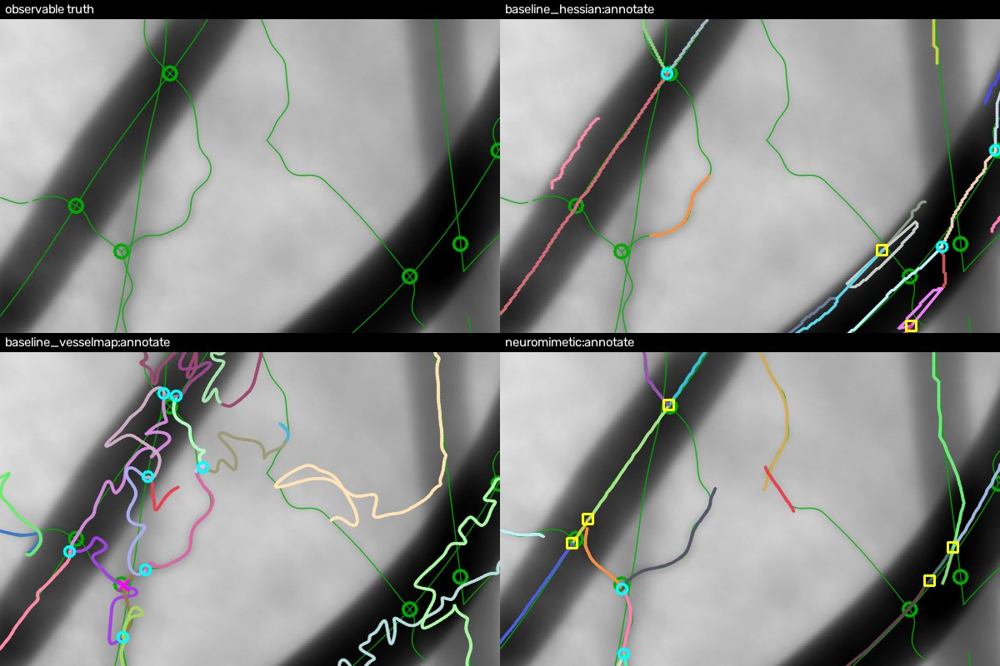

*Held-out averaged still (healthy seed 1, 2x zoom). Panels: truth (green), the Hessian baseline (traces the
walls of the wide vessel as separate lines), vesselmap (its splines loop through texture), and the
neuromimetic annotator (follows the wide vessels' axes and keeps more of the thin vessels than either baseline,
though it traces the long thin vessel through the centre only in short pieces). Junctions: cyan circle =
3-way, magenta X = crossing, yellow square = compound.*

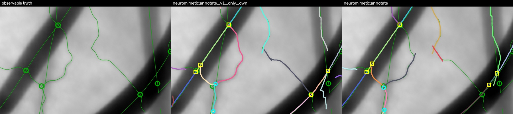

*The same window. Left: truth. Middle: V1 alone at its own thresholds, which on an averaged still traces more
of the thin vessels. Right: the full annotator, with surround, association field and refinement.*

## 3. The end goal: one jointly fitted spline render of the whole image

**Method** (`splinefit/`):
1. **Target.** The OD from stage 1's background, fitted on the vesselness mask's negative.
2. **Network.** The proposal becomes the network. Traced vessels are cut at typed junctions and become
   clamped cubic B-splines with radius, blur and contrast profiles. A 4-ended crossing becomes two through
   edges with no node. Other junctions become shared nodes.
3. **Render.** vesselmap's blurred-cylinder chord per edge, composed as a union of lumens at nodes and
   near-additively at crossings, with a halo.
4. **Joint fit.** Every parameter descends one precision-weighted residual:
   1. profiles, then everything jointly;
   2. an MDL prune: an edge must pay for itself, and a faint wide edge must be seen on both flanks;
   3. retargeting: the background is re-fitted outside the mask or the render's support;
   4. a final fit of profiles and optics, with the geometry frozen.

**Held-out averaged stills** (6 scenes; measured once, after the freeze):

| row | composite | graph | pos | width | explained | explained at junctions | line F1 | junc F1 strict | crossing R | s / image |
|---|---|---|---|---|---|---|---|---|---|---|
| **fit** | **0.770** | 0.697 | 0.808 | 0.800 | 0.921 | 0.936 | 0.840 | 0.672 | 0.354 | 116 |
| proposals alone | 0.756 | 0.706 | 0.788 | 0.828 | 0.801 | 0.804 | 0.835 | 0.682 | 0.319 | 8 |
| vesselmap `build_map` | 0.668 | 0.520 | 0.708 | 0.786 | 0.953 | 0.964 | 0.644 | 0.444 | 0.116 | ~700 |
| fit started from the truth | 0.740 | 0.570 | 0.852 | 0.930 | 0.949 | 0.963 | 0.556 | 0.519 | 0.630 | 187 |
| the true network, rendered | 0.790 | 0.589 | 1.000 | 0.998 | 0.976 | 0.968 | 0.490 | 0.522 | 0.826 | - |

**The scores.**
- Composite = 0.5 graph + 0.5 mean(pos, width, explained).
- *explained* = 1 - SSR / sum(OD²) over a band within 3 px of the observable vessels, against the scorer's
  oracle-background OD.
- *pos* and *width* compare the fitted centrelines and radii with the true network's.
- The true network scores low on graph because it also holds vessels the image does not show.

The fit minus each row. Each cell is the mean per-image difference over the 6 images, with the number of
images where the fit is higher:

| fit minus | composite | graph | pos | width | explained | explained at junctions | line F1 | junc F1 strict | crossing R |
|---|---|---|---|---|---|---|---|---|---|
| proposals alone | +0.014 (5/6) | -0.009 (3/6) | +0.021 (5/6) | -0.028 (3/6) | +0.120 (6/6) | +0.132 (6/6) | +0.005 (4/6) | -0.010 (4/6) | +0.035 (3/6, 3 ties) |
| vesselmap | +0.102 (6/6) | +0.178 (6/6) | +0.101 (6/6) | +0.014 (5/6) | -0.033 (3/6) | -0.028 (3/6) | +0.196 (6/6) | +0.228 (6/6) | +0.238 (6/6) |
| fit from the truth | +0.030 (5/6) | +0.127 (6/6) | -0.044 (0/6) | -0.130 (0/6) | -0.028 (0/6) | -0.027 (0/6) | +0.284 (6/6) | +0.153 (6/6) | -0.276 (1/6) |

**The four scenes no development agent ever read** (healthy 3, 5, 6 and pathologic 1). Fit minus proposals:
+0.013 composite (+0.025 to +0.028 on healthy 3 and 6; healthy 5 and pathologic 1 within 0.002) and +0.127
explained (4 of 4). Fit minus vesselmap: +0.112 composite (4 of 4).

## 4. Annotated held-out scenes

How to read the figures:
- **The annotated view** is a 2 x 2 grid: truth, proposals, fit and vesselmap, each over the image.
  - The truth's observable centrelines are green, its junctions filled markers.
  - Under each annotator the truth is drawn faintly: a green halo along the lines, and rings at the
    junctions. A ring with nothing in it is a missed junction. A halo with no coloured line is a missed vessel.
  - Each annotated edge has its own colour. The fit's edges carry a shaded band, centreline ± fitted radius.
  - Junction markers: cyan circle = 3-way, magenta X = crossing, yellow square = compound.
- **The render view** shows the image, the fit's own target OD (background from the mask's negative) and the
  fitted render. Below them are the residuals, scorer OD minus render, for the fit, the proposals and
  vesselmap. Red = the render under-predicts, blue = it over-predicts.
- **The junction close-ups** show truth junctions picked by a rule, not by hand. For each coarse type, they
  are the junction at the median and the one at the maximum of the fit's summed |residual| in its disc.

<!-- FEATURED -->
Three images are shown in full. All three come from scenes no development agent ever read. In the first the
fit gains most of its composite from the render. In the second the proposals were already good, and the fit
only ties them. The third is the pathologic scene, where the fit does worst.

### Healthy seed 3, averaged still

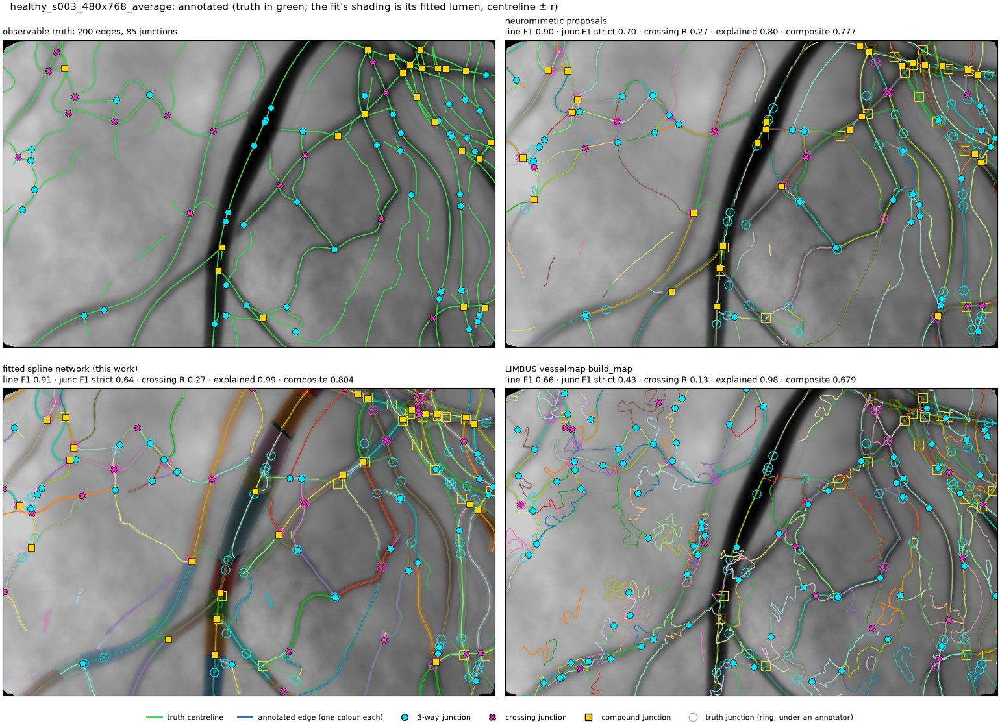

*Truth: 200 edges, 85 junctions. The fit starts from the proposals' graph and gives each vessel a position and
a width, but ends with 79 junctions against the proposals' 69 (23 crossings against 9): composite 0.804
against the proposals' 0.777.*
- *Explained rises from 0.80 to 0.99 and width from 0.82 to 0.84; line F1 is 0.91 against 0.90.*
- *Strict junction F1 falls from 0.70 to 0.64, and crossing recall is 0.27 for both.*
- *The faint, deep vessel at the lower left gets its full blurred width (the broad blue band). The large
  vessel's lumen is fitted in pieces, with compound nodes along it.*
- *vesselmap finds 0.13 of the crossings and, on an averaged still outside its design, traces texture as
  wandering lines.*

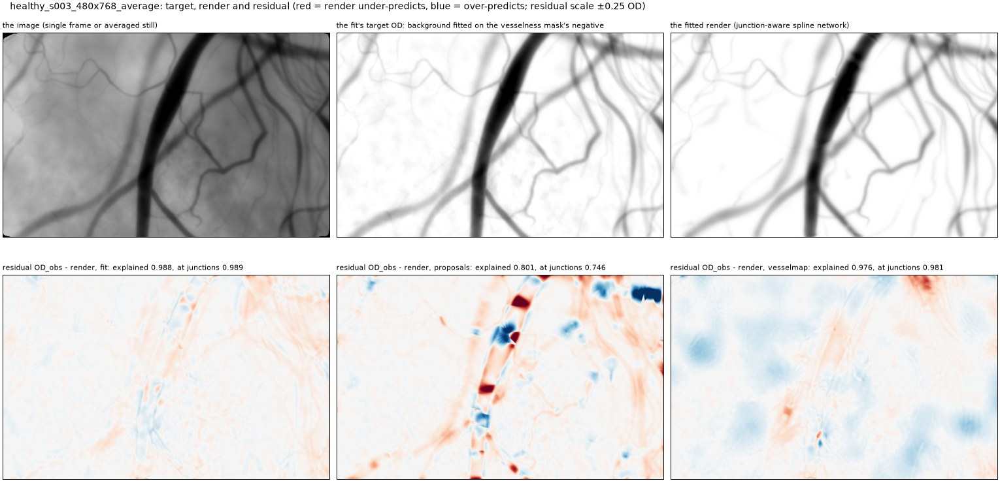

*The proposals' own profiles, drawn additively, leave strong over- and under-predictions along the large
vessel, from per-trace profiles and the butt ends at the cuts: explained 0.80, 0.75 at junctions. The fitted
render leaves little: explained 0.988, and 0.989 at junctions. What remains is faint red at the top right,
where many faint vessels run, and red–blue patches along the large vessel, where its lumen is fitted in pieces.
vesselmap's residual shows broad blue patches from its own background.*

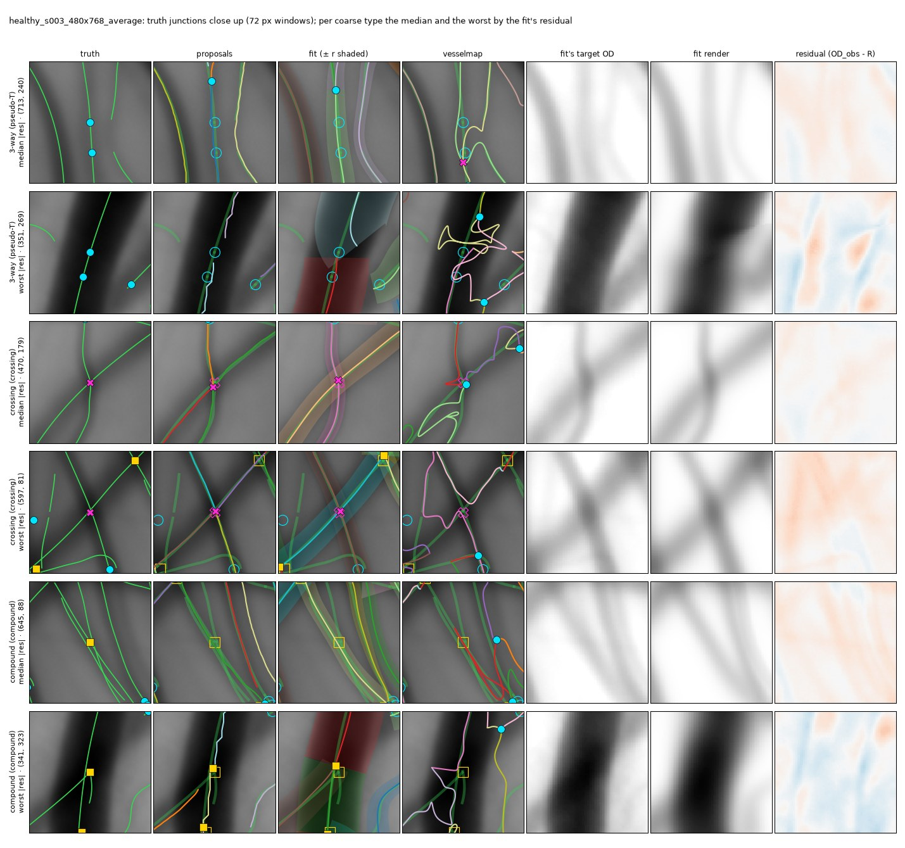

*Rows picked by rule (section 4):*
- *Both crossings are typed correctly by the proposals and the fit (within 3 px). vesselmap types the median
  one a 3-way and has no junction at the worst.*
- *The two pseudo-T junctions, including the worst at (351, 269) on the large vessel's axis, have no junction
  from any annotator within 10 px.*
- *The worst compound (341, 323), also on the large vessel, gets a compound from the proposals and the fit
  (within 5 px).*

*In every window the fitted render resembles the target, and the residuals are faint.*

### Healthy seed 5, averaged still

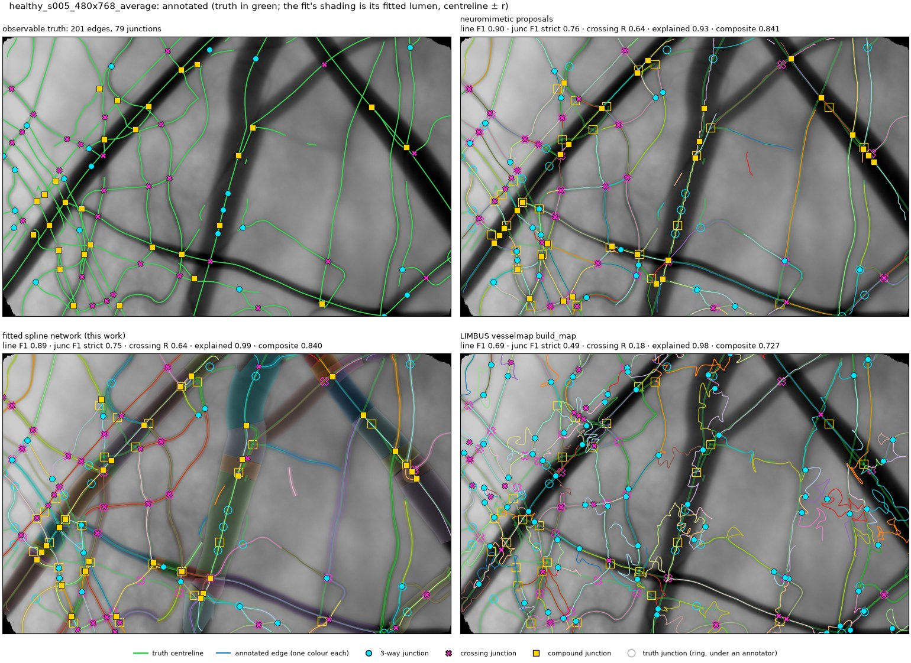

*Truth: 201 edges, 79 junctions. Here the proposals were already good (composite 0.841, explained 0.93), and
the fit only ties them (0.840).*
- *It gives the wide vessels their full lumens (shaded). It raises explained to 0.99 and position from 0.85
  to 0.88.*
- *But its graph score drops from 0.80 to 0.76, mostly in junction-type balance (0.75 to 0.63).*
- *Crossing recall is 0.64 for both, against vesselmap's 0.18. vesselmap also traces texture as wandering
  lines.*

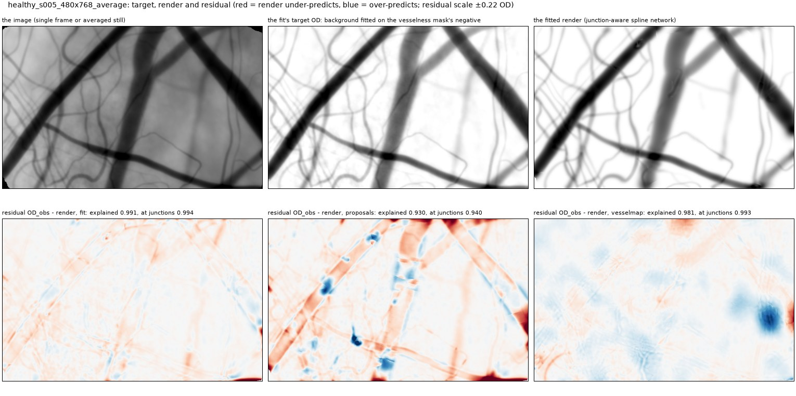

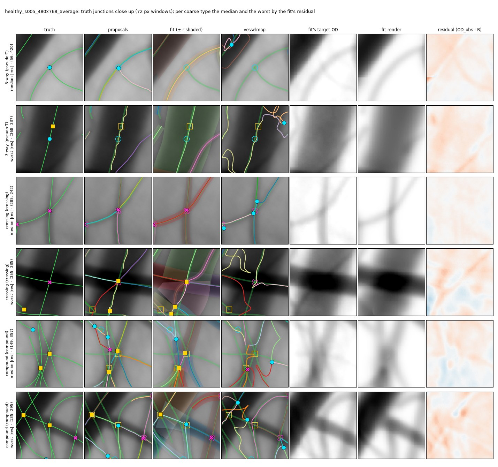

*Median crossing (285, 242): proposals and fit type it a crossing, and vesselmap splits it into two 3-way
nodes. Worst crossing (355, 385): a thin vessel over a wide one, which proposals and fit call a compound.*

### Pathologic seed 1, averaged still

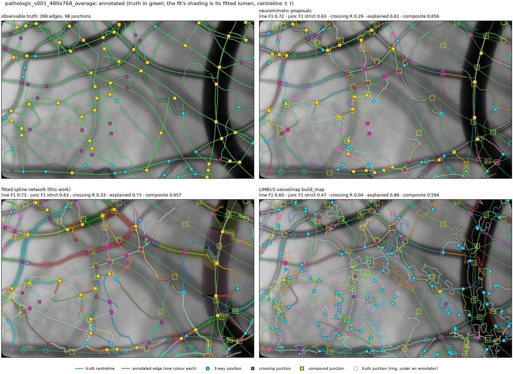

*Truth: 268 edges, 98 junctions. Proposals and fit agree on the graph: line F1 0.72 / 0.73, strict junction F1
0.63 / 0.63, crossing recall 0.29 / 0.33. vesselmap finds 0.04 of the crossings and loops through texture.
The fit's widths are worse than the proposals' here (0.63 against 0.77), consistent with fitting a target
that has lost part of the vessels' OD.*

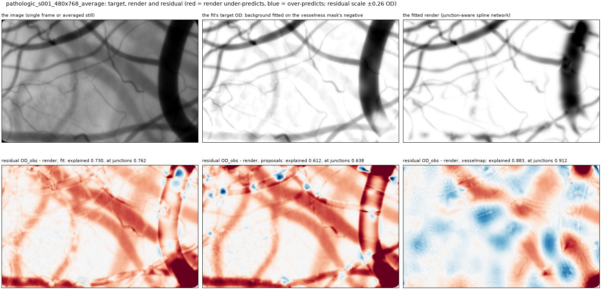

*The failure mode of the whole approach, in one figure:*
- *The fit's residual is red along wide, blurred vessels, and along the large vessel at the bottom right.*
- *The fit's own target (top middle) does not hold them. Stage 1's fine-scale vesselness mask missed them,
  so the background fitted on the mask's negative absorbed their OD, and the target's fidelity is 0.77.*
- *vesselmap's own background kept more of it: explained 0.88 against the fit's 0.73. vesselmap's residual
  shows blue blobs where it over-predicts.*

*A coarse channel that adds deep vessels to the mask (E18-E20) was the loop's attempt at this. It stayed
off.*

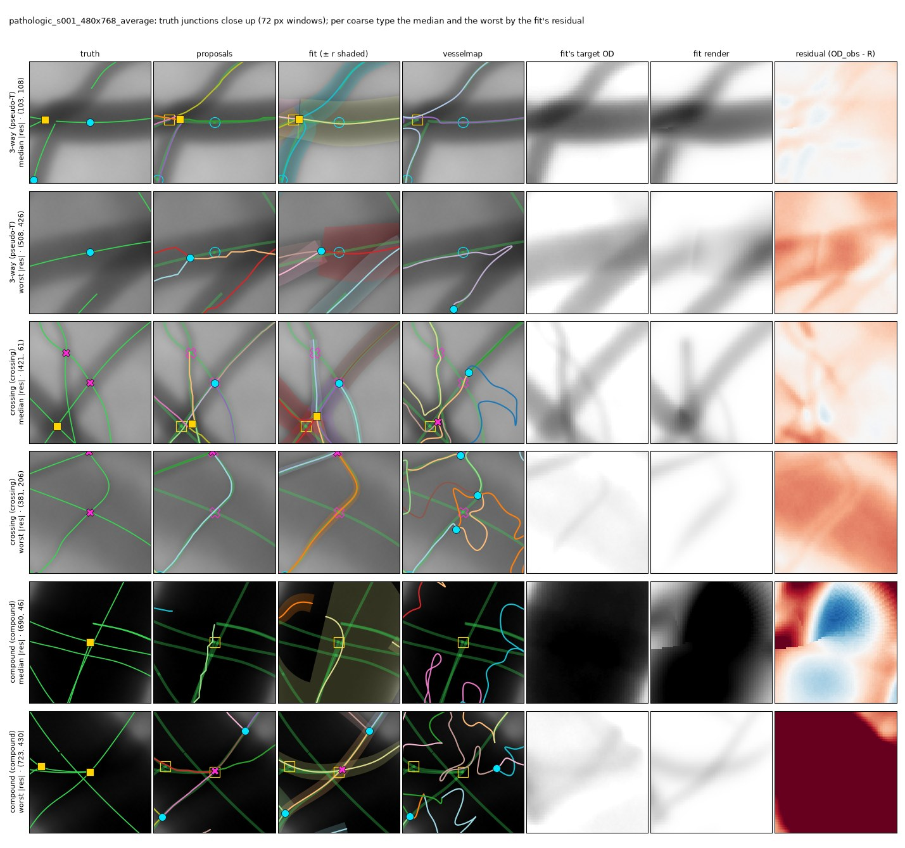

*The worst compound (723, 430) lies on the large dark vessel at the bottom right. The image is dark there,
but the fit's target is nearly white: the background took the vessel, and the residual saturates. The median
compound (690, 46) is the same vessel near the top, where the target kept it. Most windows are red: the
fit under-predicts at junctions (net junction bias -0.42 on this image).*
<!-- /FEATURED -->

### vesselscene's render vs the fitted render

vesselscene renders each scene's vessels itself before it adds the background and camera noise: OD_img, the
clean vessel OD through the image formation's blur. The fit is trying to reproduce exactly this, so the two
renders can be compared directly. The scorer's `explained_true` measures it: 1 - sum (OD_img - R)^2 /
sum OD_img^2 over the vessel band.
- On healthy 1, 3, 5 and 6, where the fit's target is faithful, the fitted render explains 0.983–0.990 of
  vesselscene's render, and 0.985–0.993 at junctions.
- On healthy 2 it explains 0.845 (0.90 at junctions), and on pathologic 1, 0.73 (0.76).

What the comparison shows:
- **Wide, low-contrast vessels are missing on the two hard images.**
  - Each pixel carrying truth OD (OD_img > 0.03) was assigned the radius of its nearest truth centreline
    sample. This attribution is rough where vessels overlap.
  - On vessels of radius 8 px or more, the fit renders 92–96 % of vesselscene's OD on the four good images,
    64 % on healthy 2, and 51 % on pathologic 1.
  - The loss is in the target, not the fit. The fit's own target keeps 69 % of that OD on healthy 2 and 56 %
    on pathologic 1, against 94–98 % on the good images. The background took the rest, and the render comes
    within 6 points of its target (5.4 at most, on healthy 2), so no fit of that target can bring those
    vessels back.
  - The image does contain them. vesselmap, which fits its own background, renders 88 % of that OD on
    healthy 2 and 77 % on pathologic 1 (the fit: 64 % and 51 %).
  - They count against the fit: of all the OD the fit misses, only 6–29 % lies on vessels the truth marks
    non-observable.
- **Texture inside the vessels is negligible on the average** (high-pass OD s.d. 0.002-0.004 inside the large
  vessels), too faint to see in the differences. The red–blue patches along the large vessels (up to about
  ±0.07 OD) come from their lumens being fitted in pieces.
- **An edge that ends inside a vessel ends square.** Where a fitted centreline breaks into short pieces, the
  render steps across the vessel. Every average has places where the render is sharper than vesselscene's
  (12 to 271 pixel pairs per image exceed its step by more than 0.03 OD), many of them such square ends. The
  largest is 0.28 OD on healthy 1 near (56, 455); in the figures below, the clearest is at the top of
  pathologic 1's large vessel, near (658, 50), 0.18 OD. A fresh re-render of the exported network keeps it
  (0.20 OD there; checked on that average and on two single frames before R2), so such steps come from the
  broken geometry, not from a stale render.


*Healthy 3 average: the fitted render explains 0.987 of vesselscene's. The vessels the proposer traced are
reproduced closely, junctions included. The differences are faint: diffuse red at the top right, where many
faint vessels overlap, and speckle along the large vessel.*

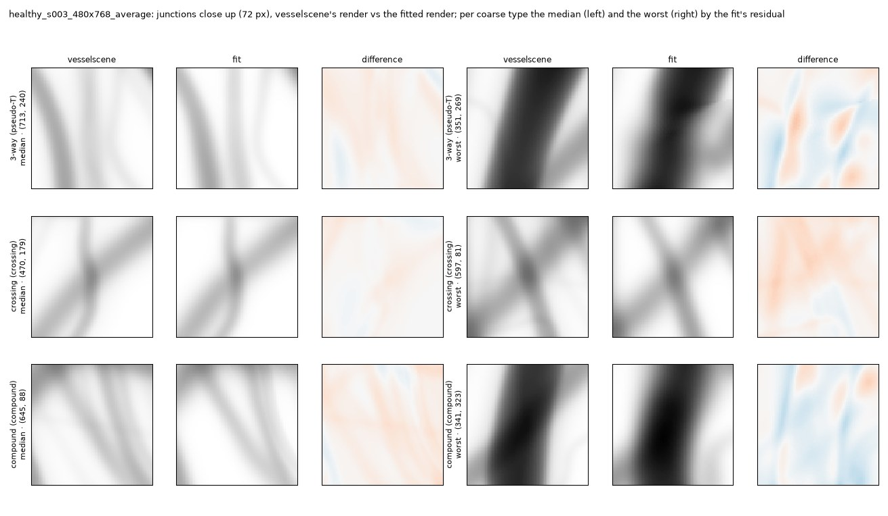

*The same windows as the junction close-ups above. At 72 px the fitted render matches vesselscene's at every
junction type. Off the large vessel what differs is a slight red under-prediction. On it, red–blue patches
(mostly blue, an over-prediction, at the worst compound) and, at the worst pseudo-T, a step where the lumen is
fitted in pieces.*


*Healthy 2 average: explains 0.845. Two wide vessels of moderate contrast are absent from the fitted render:
one runs diagonally across the left half, the other is at the bottom right. Both are about 0.25–0.35 OD at
their centres, against about 0.55 for the main vessel. The thin vessels match well.*

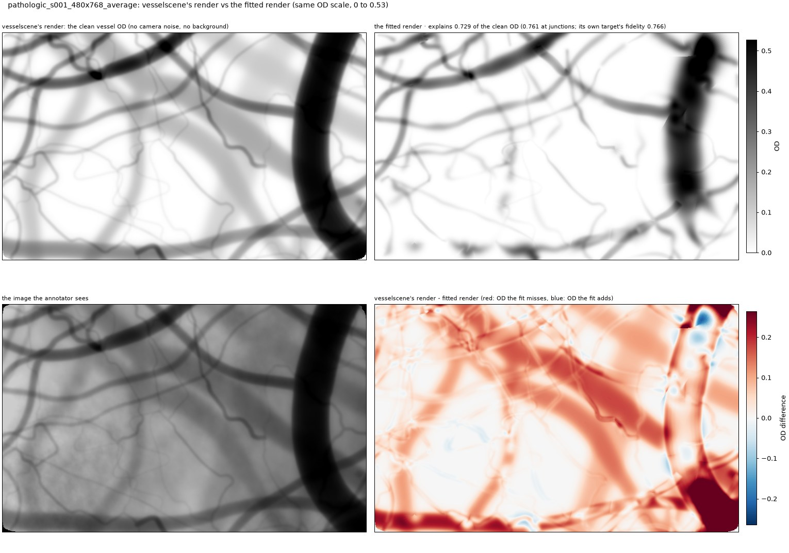

*Pathologic 1 average: explains 0.729. The wide, low-contrast vessels crossing the field and the lower part
of the large vessel at the right are missing from the fitted render. The fit draws the large vessel narrower
(66–77 px against 75–84 px wide at half maximum, on rows 150, 240 and 330) and lumpy, so both its flanks are red and its bulges blue; at its top the render
steps where an edge ends.*

All 6 images can be compared interactively with a wipe between the two renders (section 9, `viewer`).

### Every held-out image

<!-- PERIMAGE -->
Means are in section 3; these are the single averaged stills. Each cell is fit / proposals / vesselmap. *digest* says whether the figures' outputs reproduce the committed held-out rows bit for bit (rounded to 0.001 px and 1e-4 OD).

| image | untouched | truth junctions (3-way, X, compound) | composite | explained | explained at junctions | line F1 | junc F1 strict | crossing R | digest |
|---|---|---|---|---|---|---|---|---|---|
| healthy 1 average | no | 58 (22, 19, 17) | 0.788 / 0.755 / 0.706 | 0.99 / 0.87 / 0.99 | 0.99 / 0.87 / 0.99 | 0.85 / 0.84 / 0.68 | 0.70 / 0.70 / 0.44 | 0.26 / 0.16 / 0.16 | same |
| healthy 2 average | no | 118 (30, 33, 55) | 0.716 / 0.714 / 0.631 | 0.85 / 0.75 / 0.96 | 0.90 / 0.82 / 0.97 | 0.76 / 0.75 / 0.63 | 0.63 / 0.63 / 0.49 | 0.24 / 0.24 / 0.06 | same |
| healthy 3 average | yes | 85 (48, 15, 22) | 0.804 / 0.777 / 0.679 | 0.99 / 0.80 / 0.98 | 0.99 / 0.75 / 0.98 | 0.91 / 0.90 / 0.66 | 0.64 / 0.70 / 0.43 | 0.27 / 0.27 / 0.13 | same |
| healthy 5 average | yes | 79 (22, 28, 29) | 0.840 / 0.841 / 0.727 | 0.99 / 0.93 / 0.98 | 0.99 / 0.94 / 0.99 | 0.89 / 0.90 / 0.69 | 0.75 / 0.76 / 0.49 | 0.64 / 0.64 / 0.18 | same |
| healthy 6 average | yes | 62 (31, 16, 15) | 0.816 / 0.791 / 0.669 | 0.98 / 0.84 / 0.93 | 0.99 / 0.82 / 0.93 | 0.90 / 0.90 / 0.61 | 0.68 / 0.67 / 0.35 | 0.38 / 0.31 / 0.12 | same |
| pathologic 1 average | yes | 98 (23, 24, 51) | 0.657 / 0.656 / 0.594 | 0.73 / 0.61 / 0.88 | 0.76 / 0.64 / 0.91 | 0.73 / 0.72 / 0.60 | 0.63 / 0.63 / 0.47 | 0.33 / 0.29 / 0.04 | same |
<!-- /PERIMAGE -->

### Gallery: the fitted network on every held-out image

<!-- GALLERY -->
<div class="gallery">
<figure>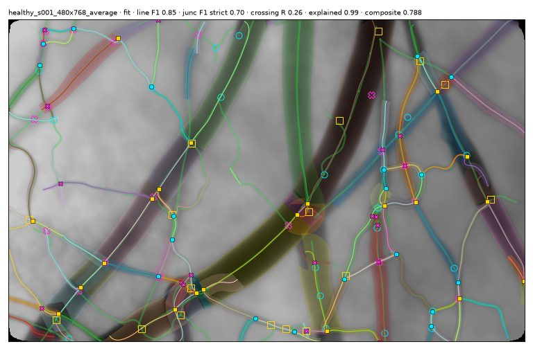<figcaption>healthy 1 average: composite 0.788, explained 0.99, line F1 0.85</figcaption></figure>
<figure>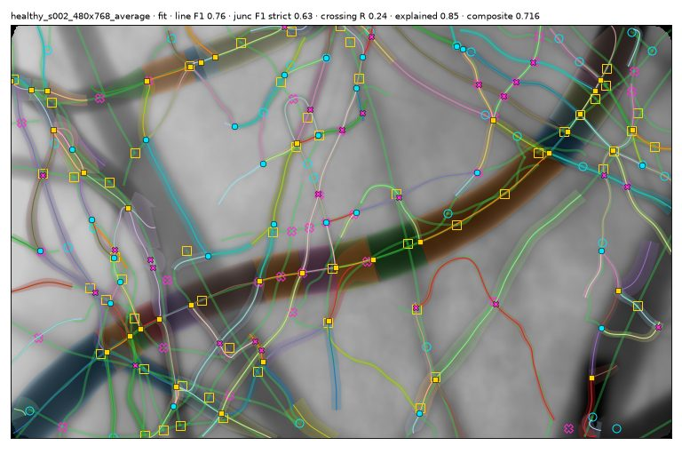<figcaption>healthy 2 average: composite 0.716, explained 0.85, line F1 0.76</figcaption></figure>
<figure>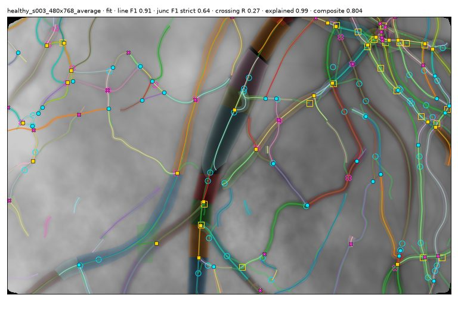<figcaption>healthy 3 average (untouched): composite 0.804, explained 0.99, line F1 0.91</figcaption></figure>
<figure>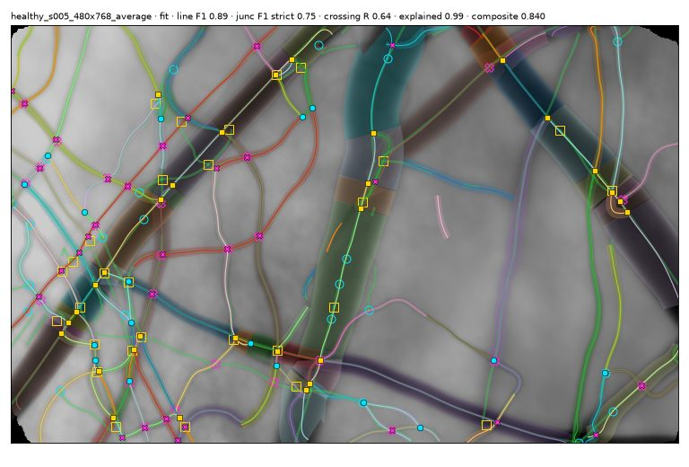<figcaption>healthy 5 average (untouched): composite 0.840, explained 0.99, line F1 0.89</figcaption></figure>
<figure>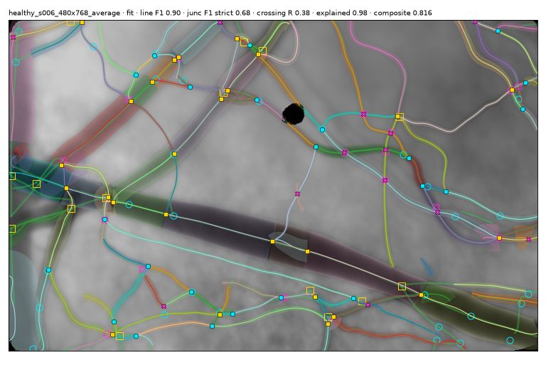<figcaption>healthy 6 average (untouched): composite 0.816, explained 0.98, line F1 0.90</figcaption></figure>
<figure>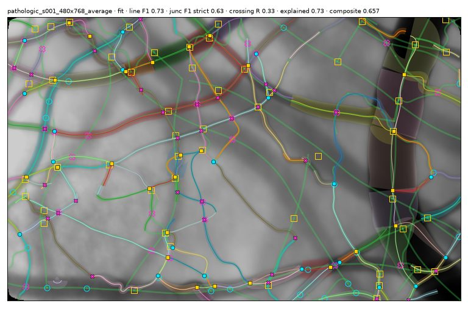<figcaption>pathologic 1 average (untouched): composite 0.657, explained 0.73, line F1 0.73</figcaption></figure>
</div>
<!-- /GALLERY -->

## 5. The overnight autoresearch loop

Modelled on Karpathy's autoresearch:
- **The charter.** A frozen evaluator (`check_frozen.py` checks its hashes), one metric, and fixed-budget
  experiments that are kept or reset with git. Every run goes into a results log, and the
  [program.md](splinefit/program.md) charter governs it.
- **Two tiers.** During the night, tier 1 (about 5 min) was 10 fast crops, one per development scene and
  kind, plus a psychophysics battery of 34 small stimuli with exact truth; tier 2 (about 30 min) was every
  development image of both kinds, twice, which must be deterministic.
  - A change was confirmed only by a paired per-scene tier-2 gain with no guard-metric veto.
  - That rule was added during the night, after reviews caught gains that did not hold.
  - Since R2 both tiers are average-only: tier 1 is 10 crops, two per development scene, on the average plus
    the battery's 30 average-still stimuli; tier 2 is the 5 development averages, twice (program.md 4).
- **The neuroscience framing.**
  - The render is the top-down prediction, and the residual is the prediction error.
  - Probe stimuli give tuning curves and thresholds, as in psychophysics.
  - Changes are tested as lesions, against multi-seed controls.
  - Hypotheses were pre-registered with their predicted effect.

About 10.5 hours after the freeze, the loop had run 7 batches: 21 experiments, 27 tier-1 runs and 10 tier-2
runs. Each kept change in batches 1-6 was reviewed adversarially, and the reviews opened the next batch.

**What survived** (tier 2 on the development averages: 0.7578 to 0.7665):
- **E3: geometry frozen in the final fit** (+0.0085 on the averages, higher on 5 of 5 scenes), the one large
  gain. A cleaner target exposes OD the network does not yet explain, and free centrelines slide into it.
- **E5/E6: a faint wide edge must be seen on both flanks.** This removes false wide vessels over illumination
  lumps in the probes. On whole images it changes almost nothing (tier 2 on the averages +0.0002, one scene
  moved): confirmed under the night's earlier not-regressed rule, provisional under the final one.
- **E9: two MDL terms deleted** that never decided anything.
- **A determinism fix:** vesselmap's render runs eagerly, because torch.compile's per-shape cache made an
  image's result depend on the images run before it.

**What did not survive** (kept as switches, off):
- **Re-proposing arms from the residual** (predictive coding's "attend where error remains"). About half
  the arms were real, but no acceptance test separated faint true arms from texture echoes.
- **A coarse "magnocellular" channel** for deep, blurred vessels. Its gain was small and the guard metrics
  vetoed it, on both kinds and on the averages alone.

**Re-judged on the averages alone (R2).** Every tier-1 run but E12's kept its per-crop and per-probe rows, so
each decision can be replayed on the night's 5 average crops (one per scene; R2's tier 1 adds a second) and the
30 average-still probes without a new run. Every replayed run matches its logged composite
(splinefit/results/dev/rejudge_average.txt).
- **Three tier-1 verdicts flip.** E7 (the stage-7 graph as the proposal) and E8 (E7 with a stronger MDL cost)
  add stage-7 edges, which raised the average crops by +0.022 and +0.017 while the frame crops fell (-0.004
  and -0.026). E13 (arms re-proposed from the residual) gained +0.014 on the average crops, all of it on one
  crop (pathologic, +0.072); the frames, which it left unchanged, halved its crop gain and left it below the
  bar (+0.0017 on both kinds). Had E7
  been kept, E8 would still have been discarded against it (-0.0024). E12, which kept no run JSON, stays a
  discard on the averages (+0.0016 to +0.0019, bounded from its log).
- **Three more logged decisions differ from the bare tier-1 rule, for reasons unrelated to the image kind.**
  E18 and E19 passed tier 1 on both kinds too (+0.0080, +0.0063) and were discarded by the controls veto,
  which still holds on the averages; E11 (+0.0014 on both kinds, +0.0018 on the averages) was kept as a
  correctness fix within 0.002.
- **No tier-2 verdict and no controls veto changes.** Under the final rule (paired per scene, guards), every
  tier-2 comparison gets the same verdict on the 5 development averages as on both kinds. On the
  average-still controls, E14, E18 and E19 fall below E9 (0.584, 0.612 and 0.614 against 0.618), and E20 is
  again a hair below it (0.61804 against 0.61810, as on both kinds), the sub-noise fall the night waived
  without pre-registration.
- The frames changed tier-1 verdicts more than the ideas the loop pursued: stage-7 proposals returned as E10,
  re-proposal as E14, the coarse channel as E20. E10 (E7's change plus a soft-edge test) regressed at tier 2
  together with E11, on the averages too (-0.013, 5 of 5 scenes down). E13's 20x cost on new arms rejected
  every arm on the development images it was checked on (pathologic s000 and healthy s004 averages), and E14,
  the same idea at the ordinary cost, fails the average-still controls.

**Re-tests under the average-only evaluator** (R2 re-baseline, the unchanged E9 pipeline: tier 1 0.7926, tier 2
0.7665, average-still controls 0.618):
- **E7 alone** (stage-7 proposals) passes tier 1 (0.7987, +0.0061: crops +0.016, probes -0.003). <!-- E7T2 -->
- **V1 alone as the proposer** (section 2's finding, at V1's own thresholds) fails tier 1 (0.7893, -0.0032).
  Its crops gain +0.034, but it draws a 207 px false vessel on the empty probe, and on the multi-seed controls
  it scores 0.562 with 193 px of false length on the empty backgrounds. Its held-out advantage of section 2
  comes with false alarms that the held-out scores do not penalise.

**Lessons:**
- Where a cleaner target enters decides whether it helps.
- On hard images the target, not the render, is the ceiling.
- Typing errors start in the proposer's event clustering, which the fit never revisits.
- Fast crops and a single-seed probe battery mislead in both directions. Whole images with a paired test and
  multi-seed controls are the honest test.
- Scoring an image kind that will not be used biases the search. On the frames (their noise and red-cell
  texture) the stage-7 proposals lost 0.018-0.029, which reversed E7 and E8; E13's one-crop gain was halved
  by frames it did not change.

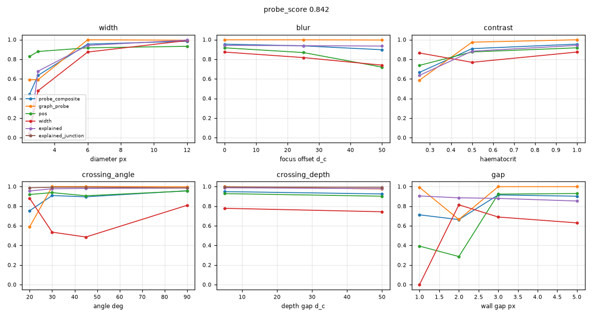

*The psychophysics battery at the loop's start (v0, both kinds): the fitter's scores against vessel
diameter, focus, haematocrit, crossing angle and depth, and the wall gap between parallel vessels. Width (red)
is the weakest score. It is lowest for thin vessels (diameter under 4 px), for crossings at 30-45° and for a
1 px wall gap.*

## 6. What the evidence supports, and what it corrected

- **Supported:**
  - The joint fit explains more of the vessel OD than the proposals do, at junctions and overall, on
    every held-out image.
  - It improves positions on 5 of 6 images.
  - It beats vesselmap on composite, graph, position, line F1, strict junction F1 and crossings, on every
    held-out image.
- **Refuted, the junction-aware render.** On the 5 development averages, an additive-render lesion of the
  same pipeline scores the same at junctions. Fit minus lesion: +0.0000 explained at junctions and +0.0003
  composite (the lesion higher on 2 and 3 of 5), and the lesion's widths are better on all 5. On the true network, the union composition adds +0.014 at junctions
  on average (at most +0.043 on one image).
- **Corrected, where the error is.** The fit under-predicts, and not only at junctions.
  - Its net junction bias is negative on all 6 held-out images (-0.04 to -0.42). Per truth junction, the
    render is below the scorer's OD (mean over the junction's disc) at 437 of 500 junctions; the largest gaps
    are on the pathologic and healthy-2 images, mostly at compounds (up to -0.47 OD).
  - The shortfall is as large or larger along the vessels: the net bias over the rest of the band is more
    negative than in the junction discs on 4 of 6 images.
  - It is the target's. The target is below the scorer's OD at 439 of the 500 junctions, while the render is
    below its own target at only 303 and within 0.007 OD of it on average. The background takes 4-39 % of the
    true OD in the junction discs and 2-49 % elsewhere in the band (more elsewhere on 5 of 6 images), most of
    it on wide vessels (section 4).
- **Corrected, why vesselmap explains more.** The fit's explained follows its target's fidelity to the true
  vessel OD (1 - SSE / SS over the band):
  - 0.98-0.99 explained where the fidelity is 0.99 (healthy 1, 3, 5, 6);
  - 0.73 and 0.85 where it is 0.77 and 0.89 (pathologic 1, healthy 2).

  vesselmap's mean explained is higher only because of those 2 images, where its own background kept more
  of the OD (there the fit explains 0.12-0.15 less). On the other 4 the fit explains 0.019 more on average,
  and is higher on 3 of 4.
- **Diagnostic, the fit started from the truth.** It keeps better widths and positions but prunes observable
  vessels it was given. Three gaps remain, and they are not separated:
  - the target's background leak;
  - width identifiability;
  - topology.

## 7. Caveats

- **Synthetic scenes only**, and few of them: 5 development scenes and 6 held-out scenes, one pathologic in
  each, one averaged still each.
- **Developed on both kinds, reported on averages.** The proposer's thresholds and the loop's kept changes
  were chosen with single frames in the score. Section 5 shows which loop decisions depended on them.
- **The held-out scenes were used twice**, by the neuromimetic study and then the fit. During the first
  study an agent read the junction-type counts of healthy seeds 1 and 2. The four untouched scenes are
  reported separately and agree. The V1-only finding of section 2 comes from a held-out ablation; it was
  tested as a change on the development images only, where it failed.
- **vesselmap was not run as designed.** Only `build_map` ran, at its defaults, typed by an adapter rule. On
  averaged stills, the only kind reported here, it is outside its design.
- **Pre-registration was mostly, not fully, kept** (the E6 and E10 thresholds, E20's keep).

## 8. Next steps

This is my ranking, given sections 5 and 6. The loop's own batch-7 ranking put deep edges first.

1. **Fix the target's background leak** first: the background takes OD all along the band, most on wide,
   low-contrast vessels, and at junctions too (sections 4 and 6). A vesselness mask that also covers wide
   vessels applies the residual rule more thoroughly; the coarse channel (E18-E20) was a first attempt.
2. **Topology moves decided by fit comparison** at junction clusters: fork against crossing against T, and
   adding or dropping an arm. This is where graph, crossings and types are lost.
3. **Deep edges with a pre-registered gate**, on more scenes with deep vessels.
4. **Blur as optics** (a per-image PSF floor), for the widths of thin vessels.
5. **Real stills**, once the synthetic gaps close.

## 9. Reproduce

```
export OMP_NUM_THREADS=2 SPLINEFIT_DEV=<heldout scenes> SPLINEFIT_ALLOW_HELDOUT=1
python -m experiments.splinefit.run_experiment --tier 2 --repeat 2 --out fit.json            # the fit (averages)
python -m experiments.splinefit.evaluate_fit --tier 2 --rows proposals vesselmap true_complete \
    --oracle-fit experiments.splinefit.oracle:fit --out ref/
python -m experiments.splinefit.heldout_report --fit fit.json --reference ref/ --out experiments/splinefit/results/heldout
python -m experiments.splinefit.report_figures run  <scene> average ...                      # annotated scenes
python -m experiments.splinefit.report_figures plot <scene> average ... --out experiments/splinefit/results/heldout/figures/annotated
python -m experiments.splinefit.report_figures viewer <scene> average ... --out render_vs_fit.html  # the wipe viewer
python -m experiments.splinefit.report_html experiments/REPORT.md report.html                # this page, self-contained
python -m experiments.splinefit.report_diagnostics <scene> ...                              # sections 4 and 6
python -m experiments.splinefit.rejudge_average                 # section 5, re-judged (reads $SPLINEFIT_WORK)
```

The committed held-out JSONs come from the pre-R2 run of both kinds; the tables use their 6 average rows,
which these average-only commands reproduce.
