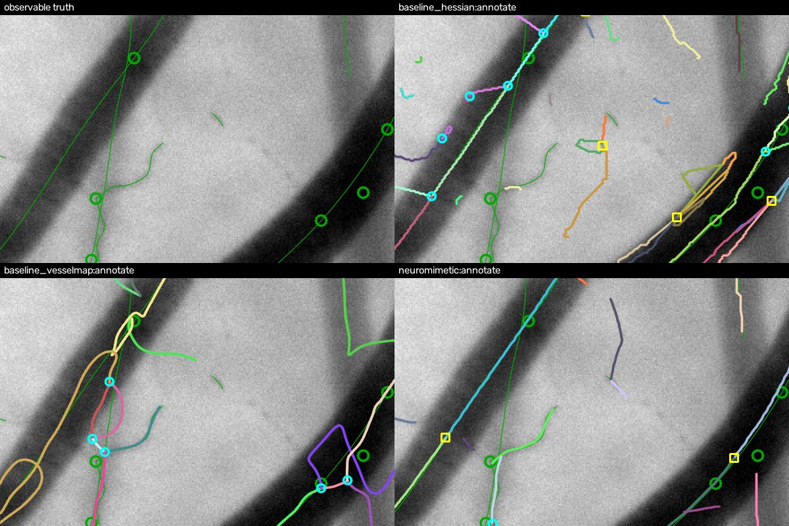
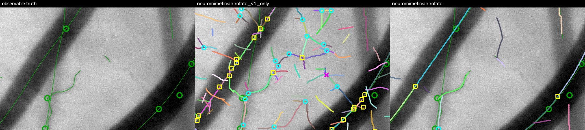

# Neuromimetic vessel annotation: an experiment

**Question.** Can lessons from how the retina and early visual cortex detect contrast, edges and contours,
and from diffusion models (Stable Diffusion), give a deterministic annotator whose output matches the vessel
graph of a vesselscene still better than curvature (Hessian) analysis?

**Answer, on six held-out scenes: yes for lines and junctions, and for finding crossings. Junction types are
only weakly better, and the diffusion-model idea did not help.**
- **Lines and junctions.** The neuromimetic annotator beats both curvature annotators on all 12 held-out
  images (6 scenes, each an averaged still and a single frame) in centreline F1 and strict junction F1.
  - The two curvature annotators are a tuned Hessian ridge + skeleton pipeline and the first stage of LIMBUS
    vesselmap (`build_map`).
  - The neuromimetic annotator is also higher on edge cover in 23 of 24 image pairs and on purity in 24 of
    24.
  - The average and the frame of a scene share their anatomy, so these counts rest on 6 independent scenes,
    one of them pathologic.
- **Crossings.** It finds 25-32 % of the observable crossings; the curvature annotators find 5-12 %.
  - Its crossing precision on averaged stills only ties the Hessian baseline's (0.59 against 0.61).
- **Junction types.** Telling a crossing from a fork from a compound beats a constant majority label by only
  0.05-0.10. That margin depends on a prior fitted on the development scenes.
- **What did the work.** The full gap to the Hessian baseline is 0.17 on a composite score (line F1, strict
  junction F1, balanced typing, edge cover).
  - About half of it, at most 0.08-0.09, is the V1-like orientation score that replaces the Hessian:
    elongated, phase-gated filters at 16 orientations, with every orientation kept at every pixel. Its
    clearest effect is line precision, +0.19-0.20 on 12 of 12 images.
  - The other half is the pipeline around it, which helps a Hessian input too: the background fitted outside
    the vesselness mask, tracing in (x, y, theta), and the end-stopping graph logic.
- **Contour integration and surround suppression are modest.** At thresholds tuned for each variant, they add
  precision on noisy single frames: junction precision +0.18 on 6 of 6 frames. They cost some recall, and
  they do not help on averaged stills.
- **The diffusion-model half came back negative.** The render, compare and prune refinement borrowed from
  diffusion models is neutral for line F1 and lowers recall. Re-proposing vessels from the residual hurts.
  - The iterative completion that does help, the association field, comes from the contour-integration
    literature (stochastic completion fields), not from diffusion models.
- **Determinism and speed.** Two runs give the same output digest (to 0.001 px) on every image, and an image
  takes about 8 s on 2 CPU threads. vesselmap takes about 10 minutes per image.



*A held-out single frame (healthy seed 1, 2x zoom). Panels: observable truth (green lines, rings at
junctions), the Hessian baseline, vesselmap, and the neuromimetic annotator. Each traced edge has its own
colour. Junctions: cyan circle = 3-way, magenta X = crossing, yellow square = compound.*
- The Hessian traces both walls of the wide vessel and short texture lines.
- vesselmap's splines loop.
- The neuromimetic annotator follows the wide vessel's axis and keeps thin vessels as their own lines, but
  misses part of a faint vessel.

## What was built

[DESIGN.md](DESIGN.md) gives the design, and [NOTES_neuromimetic.md](NOTES_neuromimetic.md) gives each
stage's biology and maths, the parameters, the development log and what failed. In short:

| stage | biology | algorithm (`neuromimetic.py`) |
|---|---|---|
| 1 | photoreceptors, horizontal cells | log image; background fitted only outside the vesselness mask; target OD = background - log I |
| 2 | OFF-centre ganglion cells, contrast gain control | centre-surround bands of OD divided by their local noise: a CNR (used for the mask and a visibility floor) |
| 3 | V1 simple cells | even and odd oriented filters, 16 orientations, 9 scales in three spatial-frequency channels; the full orientation stack is kept |
| 4 | non-classical surround | subtract the isotropic part of the orientation tuning; flank suppression by the weaker side |
| 5 | horizontal connections (association field, bipole cells) | three deterministic steps of collinear completion in (x, y, theta): gaps fill, line ends do not grow |
| 6 | readout | non-maximum suppression across space and orientation; tracing along the tangent in SE(2), so a line passes through a crossing in its own orientation layer |
| 7 | end-stopped cells | line ends on another line make a 3-way junction, two lines through each other a crossing, more arms a compound |
| 8 | diffusion-style refinement | render the graph in OD, residual against the cleaned OD, prune edges that do not pay for themselves (MDL) |

**The residual rule.** Wherever a render of the candidate graph is compared with the image, the target is
the image's own optical density.
- The background is fitted on the vesselness mask's negative, and that background cleans the original image
  into OD = B - log I.
- A vesselness or orientation map is never a target.
- An adversarial review checked this in the code: every residual and profile fit receives the very array
  stage 1 produced.

## How it was tested

- **Scenes** (`make_scene`, CPU, k = 4).
  - The scenes are 480 x 768 px: the anatomy is generated for a field of that size. They are not crops of a
    1920 x 1200 scene.
  - Development: healthy seeds 0 and 4 (seed 4 at 320 x 512) and pathologic seed 0. All tuning used only
    these.
  - Held out: healthy seeds 1, 2, 3, 5 and 6, and pathologic seed 1.
  - Each scene gives two images, the averaged still and a single frame. The 12 held-out images hold 500 + 417
    observable junctions.
- **Scoring** (`harness.py`, against each image's observable truth):
  - Centreline recall, precision and F1 within 3 px.
  - Junction F1, plain and strict.
    - The plain match is vesselscene's (`truth.score_tracing`): a traced junction matches within the truth
      junction's radius. That radius reaches 44-90 px on these scenes, and about half the truth junctions
      are wider than 2 lambda (24 px).
    - The strict match caps the radius at 2 lambda.
    - Crossing recall and precision, and all typing scores, use the plain matches.
  - Coarse junction type (3-way / crossing / compound) with two references: a constant majority label and
    balanced accuracy, where a constant label scores 0.33.
  - Edge cover (does one traced edge cover each true edge?) and purity (does a traced edge stay on one true
    edge?), on polylines cut at their junctions.
  - Runtime, and a determinism digest over two runs.
- **Comparisons:**
  - `baseline_hessian.py`: the curvature pipeline (vesselmap's own ridge measure, skeleton graph,
    arm-count typing), with its thresholds tuned on the development scenes.
  - `baseline_vesselmap.py`: the first step of LIMBUS vesselmap, `build_map`, at its default config. Its
    `refine` and `faint` steps were not run.
    - The adapter does more than export the network. It types vesselmap's nodes with the Hessian baseline's
      arm-count rule, and it adds crossings from overlapping edges, filtered to transversal pairs away from
      edge ends.
    - vesselmap's junction-type and crossing scores therefore partly reflect the adapter's rules.
- **Unequal development effort.** The neuromimetic annotator went through about 26 logged development
  iterations on the development scenes. The Hessian baseline got grid searches of its thresholds, and
  vesselmap ran at its defaults.
- **Review.** An agent built each annotator, and another tried to refute it. The harness, both baselines,
  the neuromimetic annotator and this write-up were corrected after review. The findings are in the commit
  messages and NOTES.

## Results on the held-out scenes

Means over the 6 held-out scenes. The ceiling is the truth's own graph scored by the same harness.

| average still | line R | line P | line F1 | junc F1 | junc F1 strict | crossing R / P | coarse type (majority ref) | coarse balanced | edge cover | purity | s / image |
|---|---|---|---|---|---|---|---|---|---|---|---|
| ceiling | 0.96 | 1.00 | 0.98 | 1.00 | 1.00 | 1.00 / 1.00 | 1.00 (0.47) | 1.00 | 1.00 | 1.00 | - |
| **neuromimetic** | 0.76 | **0.93** | **0.83** | **0.70** | **0.68** | **0.32** / 0.59 | **0.56** (0.46) | **0.60** | **0.70** | **0.91** | 8 |
| Hessian | 0.59 | 0.74 | 0.66 | 0.56 | 0.50 | 0.10 / 0.61 | 0.47 (0.45) | 0.51 | 0.54 | 0.79 | 1 |
| vesselmap | 0.77 | 0.56 | 0.64 | 0.51 | 0.44 | 0.12 / 0.25 | 0.33 (0.48) | 0.37 | 0.62 | 0.77 | 697 |

| single frame | line R | line P | line F1 | junc F1 | junc F1 strict | crossing R / P | coarse type (majority ref) | coarse balanced | edge cover | purity | s / image |
|---|---|---|---|---|---|---|---|---|---|---|---|
| ceiling | 0.97 | 1.00 | 0.98 | 1.00 | 1.00 | 1.00 / 1.00 | 1.00 (0.46) | 1.00 | 1.00 | 1.00 | - |
| **neuromimetic** | 0.75 | **0.89** | **0.81** | **0.66** | **0.64** | **0.25** / **0.50** | **0.50** (0.45) | **0.50** | **0.69** | **0.89** | 8 |
| Hessian | 0.65 | 0.48 | 0.55 | 0.47 | 0.41 | 0.05 / 0.19 | 0.45 (0.46) | 0.39 | 0.52 | 0.83 | 2 |
| vesselmap | 0.72 | 0.71 | 0.72 | 0.51 | 0.44 | 0.10 / 0.31 | 0.34 (0.48) | 0.39 | 0.65 | 0.74 | 534 |

**Paired per image.** Each cell is the mean difference, neuromimetic minus baseline, with the number of
images where the neuromimetic annotator is higher:

| neuromimetic minus | line F1 | junc F1 strict | crossing R | coarse balanced | edge cover | purity |
|---|---|---|---|---|---|---|
| Hessian | +0.22 (12/12) | +0.21 (12/12) | +0.21 (11/12) | +0.10 (9/12) | +0.16 (12/12) | +0.09 (12/12) |
| vesselmap | +0.14 (12/12) | +0.22 (12/12) | +0.18 (11/12) | +0.17 (11/12) | +0.06 (11/12) | +0.14 (12/12) |

- **Against vesselmap, line recall is a tie** (+0.01, higher on 6 of 12 images). The gain is precision and
  graph structure, not more vessels found.
- **On the one pathologic scene the baselines win some scores.**
  - The Hessian's frame junction F1 is 0.61, against the neuromimetic's 0.58.
  - Line recall is higher for the Hessian on the frame (0.57 against 0.55) and for vesselmap on the average
    (0.66 against 0.60).
  - Junction precision is higher for the Hessian on the average (0.80 against 0.78) and for vesselmap on the
    frame (0.76 against 0.72).

All tables, per scene and per kind, are in [results/heldout](results/heldout). `report.py` regenerates them
from the JSONs:
- `table_all.md`: means and ranges of every annotator and variant;
- `paired.md`: per-image differences by kind;
- the JSONs: every row, with the type confusion counts.

## Isolating the orientation score

`baseline_hessian` differs from the neuromimetic annotator in everything at once. So a variant swaps only
stage 3.
- **The swap.** `annotate_hessian_score` keeps the same pipeline, but stage 3 is vesselmap's ridge measure
  s² max(0, -l1 - |l2|) on the same cleaned OD. It sits in the Hessian's along-vessel orientation layer only,
  so each pixel and scale has one orientation.
- **Two bin assignments.** `annotate_hessian_score_nearest` puts the whole strength in the nearest of the 16
  orientation bins; `annotate_hessian_score` splits it linearly between the two nearest.
- **Tuning.** Only the thresholds were re-tuned, on the development scenes. NOTES has the design and the grids.

Held-out means; each pair is average / frame:

| variant | composite | line F1 | line P | junc F1 strict | crossing R | edge cover |
|---|---|---|---|---|---|---|
| full neuromimetic (orientation score) | 0.70 / 0.66 | 0.83 / 0.81 | 0.93 / 0.89 | 0.68 / 0.64 | 0.32 / 0.25 | 0.70 / 0.69 |
| same pipeline, Hessian layer, nearest bin | 0.62 / 0.56 | 0.73 / 0.70 | 0.74 / 0.70 | 0.59 / 0.48 | 0.31 / 0.13 | 0.63 / 0.59 |
| same pipeline, Hessian layer, linear split | 0.61 / 0.59 | 0.72 / 0.70 | 0.74 / 0.72 | 0.58 / 0.56 | 0.21 / 0.11 | 0.61 / 0.59 |
| Hessian baseline | 0.55 / 0.47 | 0.66 / 0.55 | 0.74 / 0.48 | 0.50 / 0.41 | 0.10 / 0.05 | 0.54 / 0.52 |

The composite is the mean of line F1, strict junction F1, balanced coarse type accuracy and edge cover.

- **About half of the held-out gap is the orientation score.**
  - Full against baseline: 0.68 against 0.51 on the composite (mean of both kinds), a gap of 0.17.
  - With a Hessian layer in the same pipeline it is 0.59-0.60. Keeping the full orientation score is
    therefore worth 0.08-0.09 of the 0.17, and the pipeline the other 0.08-0.09.
  - On the development scenes the orientation score's share was smaller: 0.055-0.083 of 0.152, a third to a
    half.
  - This share is an upper bound: every downstream parameter was tuned together with the orientation score.
- **Line precision is where it shows most.** Full minus the nearest-bin Hessian variant: line precision +0.19
  / +0.20 and line F1 +0.10 / +0.11 (6 of 6 images in each kind), strict junction F1 +0.09 / +0.16 (6 of 6).
  - The elongated, phase-gated filters keep texture and wall echoes out at a threshold that still reaches
    faint vessels.
- **Crossings depend on the image kind.**
  - On averaged stills the pipeline fed one Hessian orientation per pixel (nearest bin) finds crossings as
    well as the orientation score: 0.31 against 0.32. The SE(2) tracing and end-stopping logic carry that.
  - On single frames the orientation score doubles crossing recall: 0.25 against 0.11-0.13.
- **What the swap does not separate.** Stage 3 differs from the Hessian in three ways at once:
  - several orientations per pixel;
  - filters elongated along the vessel;
  - odd-symmetric phase gating.

  This ablation does not tell them apart.

## Which stages matter

Held-out means; each pair is average / frame. "V1 only" drops stages 4, 5 and 8.

| variant | line F1 | line P | junc F1 | junc P | crossing R | coarse balanced |
|---|---|---|---|---|---|---|
| full (stages 1-8) | 0.83 / 0.81 | 0.93 / 0.89 | 0.70 / 0.66 | 0.80 / 0.78 | 0.32 / 0.25 | 0.60 / 0.50 |
| V1 only, at its own development-best thresholds (3.5 / 2.0) | 0.85 / 0.77 | 0.91 / 0.78 | 0.72 / 0.61 | 0.80 / 0.61 | 0.41 / 0.29 | 0.60 / 0.51 |
| V1 only, at the full annotator's thresholds (3.0 / 1.5) | 0.84 / 0.64 | 0.86 / 0.54 | 0.71 / 0.39 | 0.70 / 0.27 | 0.39 / 0.25 | 0.56 / 0.46 |
| no refinement (stages 1-7) | 0.84 / 0.81 | 0.92 / 0.87 | 0.71 / 0.65 | 0.78 / 0.71 | 0.34 / 0.30 | 0.58 / 0.51 |
| no association field | 0.84 / 0.78 | 0.91 / 0.80 | 0.71 / 0.61 | 0.78 / 0.58 | 0.39 / 0.18 | 0.60 / 0.47 |
| no surround | 0.83 / 0.81 | 0.91 / 0.88 | 0.70 / 0.64 | 0.76 / 0.70 | 0.34 / 0.26 | 0.58 / 0.51 |
| re-proposal from the residual | 0.79 / 0.79 | 0.80 / 0.83 | 0.56 / 0.63 | 0.46 / 0.59 | 0.30 / 0.26 | 0.53 / 0.48 |
| background leak fixed (`bg_traced`) | 0.84 / 0.80 | 0.91 / 0.86 | 0.72 / 0.64 | 0.75 / 0.65 | 0.42 / 0.24 | 0.57 / 0.50 |
| no compound-radius prior | 0.83 / 0.81 | 0.93 / 0.89 | 0.70 / 0.66 | 0.80 / 0.78 | 0.37 / 0.28 | 0.55 / 0.46 |

- **Contour integration and surround suppression buy precision on frames, and only modestly.**
  - Compared at each variant's own development-best thresholds (full minus V1 only), the contextual stages
    add on single frames:
    - junction precision +0.18 (higher on 6 of 6 frames);
    - line precision +0.11 (6 of 6);
    - junction F1 +0.05 (6 of 6).
  - They cost recall: line recall -0.04 (lower on 6 of 6 frames) and crossing recall -0.04 (lower on 3 of 6,
    tied on 3).
  - On averaged stills they add nothing, and they cost crossing recall (0.32 against 0.41, lower on 5 of 6).
  - At the full annotator's shared thresholds the frame gap looks much larger (junction precision 0.27
    against 0.78). Most of that is V1 only running at a looser operating point.
- **Of the two contextual stages, the association field matters more.** At shared thresholds it is worth
  +0.20 junction precision on frames (6 of 6), while the surround is worth +0.09 and leaves line F1
  unchanged. This is contour integration doing what it is thought to do in vision: a line is salient by its
  collinear support, so isolated texture loses.
- **The diffusion-style refinement (stage 8) is neutral for line F1 and lowers recall.**
  - It raises junction precision: +0.02 on averages (higher on 5 of 6) and +0.07 on frames (6 of 6).
  - It lowers line recall on all 12 images, and frame crossing recall from 0.30 to 0.25 (lower on 3 of 6
    frames, tied on 3).
  - It adds 2-3 s per image.
  - Re-proposing vessels from the residual, the full "denoising loop", adds false T arms. It lowers junction
    precision by 0.34 on averages.



*The same held-out frame. Left: truth. Middle: V1 only at the full annotator's thresholds, which fires on
texture. Right: the full annotator. V1 only at its own, stricter thresholds is much cleaner (table above).*

## The residual rule and the background

- **The rule holds in the code.** The review confirmed that every residual is OD_target - render, with
  OD_target from the background fitted outside the vesselness mask.
- **The mask misses faint vessels.** On the development scenes, 5-32 % of observable centreline pixels fell
  outside it. The background was then pulled towards them, and their OD attenuated to 0.56-0.70 of a
  leak-free refit.
- **A fix grows the mask from the traced lumens.** `bg_trace_k` does this and refits the background. It
  removes most of the leak.
  - On the held-out averages it raises crossing recall from 0.32 to 0.42 (6 of 6), at the cost of junction
    precision (0.80 to 0.75, 6 of 6).
  - On frames it brings no crossing gain (0.25 to 0.24), and junction precision falls from 0.78 to 0.65.
  - The refit also lowers the noise floor of every CNR, which acts like a lower threshold. So this does not
    show that the leak matters specifically at junctions. It is off by default, because it did not help on
    the development scenes.
- **The crossing knot cue did not work.** In OD, two vessels crossing roughly add their densities, so a
  crossing should show a darker knot than a fork.
  - On the development scenes, the residual at junction centres did not separate the types. The
    annotator's additive render over-predicts every junction type, and crossings most: the median residual
    is -2.4 thinner-arm contrasts at crossings, against -1.4 at 3-way junctions.
  - vesselscene composites crossings almost additively (crossing additivity 0.87 in its reference), so the
    scene's image formation explains only a small part of this. Most of the error is the annotator's own
    render at junctions, from its per-trace profiles and butt ends.
  - A better junction render is the next step if the residual is to type junctions.

## Junction types

- **Bifurcation versus confluence** needs the flow direction, which a still does not show. Every 3-way
  junction is called 'pseudo-T', the commonest 3-way type.
- **The coarse type** (3-way, crossing or compound) beats the image's majority label only modestly: 0.56
  against 0.46 on averages and 0.50 against 0.45 on frames. It is above the reference on 4 of 6 images of
  each kind.
- **That margin comes from one rule fitted on the development truth.**
  - The rule: a junction whose region is at least 16 px in radius is a compound. The region's radius
    includes half the width of the widest vessel in it, so every junction on a vessel about 24 px or wider
    becomes a compound.
  - Without the rule, coarse accuracy is 0.48 / 0.45, at the reference.
  - On the held-out scenes the rule raises coarse accuracy on 5 of 6 averages (1 tie), but on only 3 of 6
    frames (2 lower, 1 tie).
  - It also costs crossing recall: 0.37 to 0.32 on averages and 0.28 to 0.25 on frames. It never raises it.
- **Balanced accuracy** is 0.60 / 0.50 (Hessian 0.51 / 0.39, vesselmap 0.37 / 0.39).
- **Typing is detection-limited.** On the development scenes, a truth compound typically had 5-6 lines, of
  which 3-4 were traced.

## Determinism and speed

- **Determinism of the neuromimetic annotator.**
  - Every variant gave the same output digest in two in-process runs on all 12 held-out images. The digest
    rounds coordinates to 0.001 px.
  - A separate re-run of the full annotator and both baselines on the held-out scenes reproduced every
    committed digest and score.
  - A thread-count check (1, 2 and 4 threads, separate processes) was run on one development scene.
  - There are no random numbers, iteration counts are fixed, and sorts break ties by coordinate.
- **vesselmap is not bit-reproducible.** Two builds of one development image differed by 0.13 in junction
  recall. Its rows come from one build per image, served from a local cache.
- **Speed** (480 x 768 px on 2 threads, on a 4-core machine shared with other jobs; vesselmap's times are
  inflated by that):
  - neuromimetic: 7-8 s per image, and about 70 s for a 1920 x 1200 frame;
  - Hessian: 1-3 s;
  - vesselmap: 426-1161 s. Its own README gives about 40 min for 1920 x 1200 on 4 cores.

## Caveats

- **Synthetic only.** The scenes are vesselscene's, with its known realism gaps (README, Limitations).
  Nothing here has been measured on real stills.
  - The thresholds are noise-normalised like the truth's CNR, but they should be recalibrated on real stills.
- **A small test set.** Six held-out scenes, one of them pathologic, each 480 x 768 px.
  - The average and the frame of a scene are not independent.
  - There are no confidence intervals.
- **Lenient junction matching.** Plain junction, crossing and typing scores accept a traced junction anywhere
  within a truth junction's radius (up to about 90 px here). The strict junction F1 caps it at 24 px.
- **vesselmap outside its design, and only in part.** Its README says the low-noise averaged still is the
  wrong input: texture passes its noise-relative tests and is traced as vessels.
  - Its averaged-still rows therefore understate it.
  - Only `build_map` ran, at default settings, typed by the adapter's rules.
  - On frames, its intended input, its line F1 (0.72) is the better of the two baselines, but still below the
    neuromimetic's 0.81.
- **Development effort was unequal.** See How it was tested.
- **A held-out leak, contained.** A baseline reviewer once globbed the scene folders and read the junction-type
  counts of two held-out scenes (healthy seeds 1 and 2). No annotator was run or tuned on a held-out image.
  - Two fresh scenes (seeds 5 and 6) were then rendered, and all held-out scenes were moved out of the
    agents' reach.
  - On the four scenes no agent ever touched, the neuromimetic annotator still wins in both kinds on 4 of 4
    scenes: line F1, strict junction F1, crossing recall and edge cover. The one exception is plain junction
    F1 on frames against the Hessian (3 of 4).
- **Development-fitted priors.** Thresholds and the compound-radius rule were tuned on three development
  scenes. Their held-out behaviour is reported above.

## What to try next

1. **The pipeline around vesselmap.** Half the gain works with Hessian input too. Three pieces could be used
   with vesselmap's existing ridges:
   - the background fitted outside the vesselness mask;
   - the tracing in (x, y, theta);
   - the end-stopping graph logic.
2. **The orientation score as vesselmap's proposal stage**, for line precision and for crossings in single
   frames. vesselmap's spline fit would be kept for widths, blur and contrast.
3. **Separate the three ingredients of stage 3**: several orientations per pixel, elongation and phase gating.
4. **A better junction render for the refinement**, so the residual becomes a typing cue. This is where the
   residual rule should pay off; with the current render it does not yet.
5. **Calibration on real stills** from LIMBUS.

## Reproduce

Run from the repository root (the `experiments` package is not installed by `pip`).
- **Rendering.** The six held-out scenes took about 70 min on the CPU. They were made with the vesselscene
  package unchanged since commit 5026a53 (v0.2), torch 2.14.1+cpu, numpy 2.4.6 and scipy 1.17.1. Other
  versions or a GPU may give slightly different images.
- **The baselines need LIMBUS** (https://github.com/karimghabra/limbus; the results used commit 0810720, with
  vesselmap source hash ffa106c7c6c35f9d). Point `$LIMBUS_DATA` at it or clone it next to this repository as
  `../limbus`, and install its `requirements-vesselmap.txt`.
- **vesselmap is slow and not reproducible.** Its networks are cached only locally (`_cache/`, gitignored).
  Expect about 10 min per image, so about 2 h for the 12 held-out images, and scores that differ a little from
  `results/heldout`.

```bash
pip install -e ".[test]"
python -m vesselscene scene --seed 1 2 3 5 6 --preset healthy --shape 480,768 --device cpu -o scenes  # scenes/healthy_s00N
python -m vesselscene scene --seed 1 --preset pathologic --shape 480,768 --device cpu -o scenes/pathologic_s001
S="scenes/healthy_s001 scenes/healthy_s002 scenes/healthy_s003 scenes/healthy_s005 scenes/healthy_s006 scenes/pathologic_s001"
N=experiments.neuromimetic.neuromimetic
python -m experiments.neuromimetic.evaluate --scenes $S --out results \
    --annotators $N:annotate experiments.neuromimetic.baseline_hessian:annotate \
                 experiments.neuromimetic.baseline_vesselmap:annotate \
                 $N:annotate_no_verify $N:annotate_no_association $N:annotate_no_surround $N:annotate_v1_only \
                 $N:annotate_v1_only_own $N:annotate_repropose $N:annotate_bg_traced $N:annotate_no_compound_prior \
                 $N:annotate_hessian_score $N:annotate_hessian_score_nearest \
    --no-repeat experiments.neuromimetic.baseline_vesselmap:annotate
python -m experiments.neuromimetic.report results --ceiling --scenes $S   # table_all.md, paired.md, ceiling.json
python -m experiments.neuromimetic.figures scenes/healthy_s001 --kind frame --crop 140,170,200,300 --zoom 2 --cols 2 \
    --annotators experiments.neuromimetic.baseline_hessian:annotate experiments.neuromimetic.baseline_vesselmap:annotate \
                 $N:annotate -o heldout_frame_comparison.png
python -m experiments.neuromimetic.figures scenes/healthy_s001 --kind frame --crop 140,170,200,300 --zoom 2 \
    --annotators $N:annotate_v1_only $N:annotate -o heldout_frame_ablation.png
```

- **Scene folder names.** The scene CLI names folders `healthy_s001` and so on. `results/heldout` names them
  `healthy_s001_480x768`, so a reproduced row's `scene` field differs.
- **Reuse of results.** `evaluate.py` reuses any `<out>/<annotator>.json` that already exists; delete it to
  re-run.

Files:
- `harness.py`: the scorer.
- `evaluate.py`: runs several annotators into per-annotator JSONs and one table.
- `report.py`: `table_all.md`, `paired.md` and the ceiling.
- `figures.py`: the figure panels.
- `neuromimetic.py`: the annotator. Entry points:
  - `annotate`;
  - the ablations `annotate_no_verify`, `annotate_no_association`, `annotate_no_surround`, `annotate_v1_only`,
    `annotate_v1_only_own`, `annotate_repropose`, `annotate_bg_traced` and `annotate_no_compound_prior`;
  - the isolation variants `annotate_hessian_score` and `annotate_hessian_score_nearest`.
- `baseline_hessian.py`, `baseline_vesselmap.py`: the baselines.
- `results/heldout/`: every held-out score.
