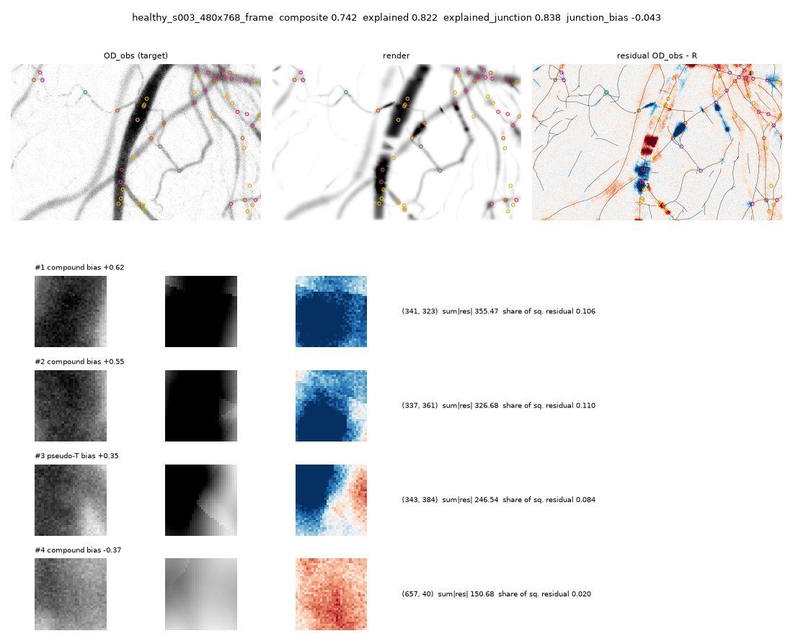
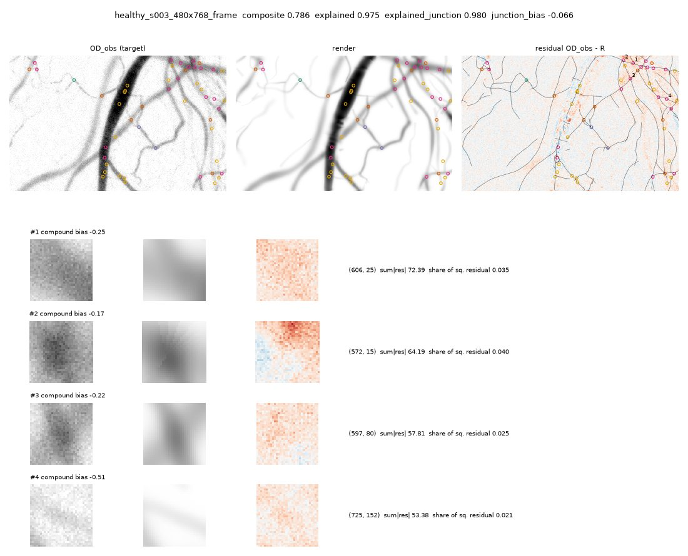

# experiments/splinefit: a jointly fitted, junction-aware spline render of the whole image

The neuromimetic annotator (`experiments/neuromimetic`) **proposes** vessels and junctions; this package turns
the proposal into a spline network and fits its differentiable render, jointly, to the whole image's optical
density. The end product is the network: centreline B-splines with radius r, blur s and contrast a profiles,
nodes at forks and confluences, crossings of vessels at different depths as overlaps without a node. The
work is organised as an *autoresearch* loop (Karpathy): a frozen evaluator, one metric, fixed-budget
experiments that are kept or reset, a results log. The charter every experiment follows is
[program.md](program.md); the history and the findings are in [LOG.md](LOG.md).

## Results

**On six held-out scenes (12 images), the fitted spline render explains the image far better than the
proposals do, at junctions above all. It keeps their graph and improves the vessel positions. It beats LIMBUS
vesselmap on graph, position, crossings and composite on every image.** The final pipeline is the state the
autoresearch loop confirmed on the development scenes (results.tsv commit 70c6072, the E9 pipeline). It was
frozen before the held-out scenes were read, and run once on them.

Means over the 6 held-out scenes (healthy seeds 1, 2, 3, 5, 6 and pathologic seed 1, 480 x 768 px), averaged
still / single frame. Composite = 0.5 graph + 0.5 mean(pos, width, explained) (score.py).

| row | composite | graph | pos | width | explained | explained at junctions | line F1 | junc F1 strict | crossing R | s / image |
|---|---|---|---|---|---|---|---|---|---|---|
| **fit (this package)** | **0.770 / 0.756** | 0.697 / 0.667 | 0.808 / 0.797 | 0.800 / 0.827 | 0.921 / 0.909 | 0.936 / 0.926 | 0.840 / 0.829 | 0.672 / 0.635 | 0.354 / 0.285 | 116 / 99 |
| proposals alone (neuromimetic) | 0.756 / 0.723 | 0.706 / 0.656 | 0.788 / 0.717 | 0.828 / 0.835 | 0.801 / 0.815 | 0.804 / 0.828 | 0.835 / 0.808 | 0.682 / 0.637 | 0.319 / 0.241 | 8 / 8 |
| vesselmap `build_map` | 0.668 / 0.692 | 0.520 / 0.547 | 0.708 / 0.703 | 0.786 / 0.841 | 0.953 / 0.968 | 0.964 / 0.982 | 0.644 / 0.716 | 0.444 / 0.439 | 0.116 / 0.100 | ~600 (cached) |
| fit started from the truth (oracle) | 0.740 / 0.730 | 0.570 / 0.559 | 0.852 / 0.833 | 0.930 / 0.935 | 0.949 / 0.937 | 0.963 / 0.949 | 0.556 / 0.547 | 0.519 / 0.491 | 0.630 / 0.453 | 187 / 178 |
| the true network, rendered | 0.790 / 0.774 | 0.589 / 0.559 | 1.000 / 1.000 | 0.998 / 0.998 | 0.976 / 0.967 | 0.968 / 0.957 | 0.490 / 0.440 | 0.522 / 0.484 | 0.826 / 0.760 | - |

Each cell below is the fit minus the row, as the mean per-image difference over all 12 images. The brackets
give the images where the fit is higher (and ties):

| fit minus | composite | graph | pos | width | explained | explained at junctions | line F1 | junc F1 strict | crossing R |
|---|---|---|---|---|---|---|---|---|---|
| proposals alone | +0.024 (11/12) | +0.001 (7/12) | +0.050 (11/12) | -0.018 (6/12) | +0.107 (12/12) | +0.115 (12/12) | +0.014 (10/12) | -0.006 (6/12) | +0.040 (6/12, 6 ties) |
| vesselmap | +0.083 (12/12) | +0.149 (12/12) | +0.097 (12/12) | +0.000 (8/12) | -0.046 (4/12) | -0.042 (3/12) | +0.155 (12/12) | +0.212 (12/12) | +0.212 (12/12) |
| oracle init | +0.028 (9/12) | +0.118 (12/12) | -0.040 (0/12) | -0.119 (0/12) | -0.028 (0/12) | -0.025 (0/12) | +0.283 (12/12) | +0.148 (12/12) | -0.222 (2/12, 1 tie) |

What this says:
- **The fit does what a whole-image render fit should.** It explains 0.91-0.92 of the vessel OD against
  0.80-0.82 for the proposals' own profiles, and 0.93 against 0.80-0.83 in the junction discs. The
  junction-aware render (a union of lumens at a node, additive OD at a crossing) is what lets it explain the
  junctions. The figures below show the proposals' render with its large errors at compound junctions and
  along the wide vessel, and the fitted render, flat except where faint vessels were never proposed.
- **It keeps the proposal's graph.** Graph is +0.001, and junction F1 is within 0.01. Topology still comes
  from the proposal, and the fit does not revisit junction types. Positions improve: +0.05, and +0.08 on
  frames, 11 of 12 images. Widths are slightly worse than the proposals' own profile widths (-0.018).
- **Against vesselmap:** much better graph, positions, crossings and line F1, on every image. vesselmap
  explains more of the image (0.95-0.97), partly with edges its graph does not support.
- **The remaining gap is topology, not the render model.** The same fit started from the true network
  explains more (0.94-0.95) and gets far better widths (0.93 against 0.80-0.83) and positions. Its graph score
  is low only because the complete truth includes vessels that are not observable. So the render and the fit
  are capable, and what they lack is a better network to start from. Missed faint vessels and junction arms
  count most: the fit cannot recover them, and the neighbouring vessels then absorb their OD.
- **No sign of overfitting to the development scenes.** Development tier 2 is 0.7606; held-out is 0.7629.
  On the four held-out scenes that no development agent ever read (healthy 3, 5, 6, pathologic 1), the fit
  minus the proposals is +0.024 composite (7 of 8 images) and +0.117 explained (8 of 8). The fit minus
  vesselmap there is +0.092 (8 of 8).
- **Determinism and speed.** Two runs per image gave identical digests on all 12 held-out images, and the
  confirmed development state reproduced its digest across sessions. A fit takes about 100-120 s per
  480 x 768 image on 2 CPU threads.




*Held-out healthy seed 3, single frame (a scene no development agent read). Each figure shows the target
OD_obs, the render, and the residual OD_obs - render; below are the four worst junctions. Top: the proposals'
own profiles (explained 0.82; compound junctions over-predicted by up to +0.62). Bottom: the fitted render
(explained 0.975, 0.98 at junctions). Its residual is flat except along faint vessels at the right, which were
never proposed.*

Tables: [results/heldout/table.md](results/heldout/table.md) (all held-out scenes and the untouched four,
every part) and [results/heldout/paired.md](results/heldout/paired.md). Made by `heldout_report.py` from
`run_experiment --tier 2` and `evaluate_fit` on the held-out scenes (`SPLINEFIT_DEV=<heldout>
SPLINEFIT_ALLOW_HELDOUT=1`).

## What the autoresearch loop did and learned

About 12.5 hours, 7 batches, 21 experiments (E1-E21), 27 tier-1 runs and 11 tier-2 runs, plus one tier-2 confirmation re-run after a container restart. Each batch was
reviewed adversarially, and a lab-head review came every 3 batches. Every hypothesis was pre-registered with
its predicted effect. [LOG.md](LOG.md) has every experiment, its prediction and what happened;
`results/results.tsv` is the run log. On the development set, tier 2 went from 0.7539 (v0) to 0.7606. Four
changes survived:
- **E3: freeze the geometry in the final fit** (+0.0066 on tier 2). This was the one large gain. A cleaner
  target exposes OD the network does not explain yet, and free centrelines slide into it. So positions are
  fitted on the first target, and widths, contrasts and optics on the cleaned one.
- **E5 and E6: a faint, wide edge must be seen on both flanks.** These are false wide vessels laid over
  illumination lumps at the frame (the negative control).
- **E9: deleting two terms of the MDL prune** that never decided anything. The score is identical, and the
  code simpler.

Ideas that did not survive, kept as provisional switches (off):
- **Re-proposing arms from the fit residual** (E13/E14). This is predictive coding's "attention where error
  remains". About half the arms were real vessels, but no acceptance test (MDL cost, CFAR) separated the
  faint true arms from texture echoes.
- **A coarse 'magnocellular' channel** (E18-E20). Novel coarse ridges join the background mask, and deep edges
  are proposed. It is consistent but small (+0.0014 +- 0.0008 per scene). Without a cause for the deep OD it
  restores, neighbouring vessels absorb it as contrast.

The main lessons, in the loop's own words (LOG.md):
- **Where a cleaner target enters decides whether it helps** (E1, E3, E20). Positions must not chase OD the
  model cannot yet explain.
- **On the hard images the target is the ceiling.** Stage 1's background keeps only 64-82 % of the true
  OD on s004 and pathologic, before any fit.
- **Junction errors are missing arms, and typing errors start in the proposal's event clustering**
  (neuromimetic stage 7), which the fit never revisits.
- **Fast crops and the single-seed probe battery over-reward added edges** (E7, E10, E13, E14). Whole
  images (tier 2), with a paired per-scene test and multi-seed controls, are the honest test. The paired
  per-scene rule, guard metrics and controls were added to program.md during the night, after reviews caught
  gains that did not hold.

Next steps, from the last batch:
1. Topology moves decided by fit comparison at junction clusters: fork, crossing, T, and add or drop an arm.
2. Deep edges with a pre-registered gate, tested on more scenes. With 5 development scenes, only 2 have deep
   vessels.
3. Blur as optics (a per-image PSF floor), for width identifiability of thin vessels.
4. A context-matched acceptance test for residual re-proposals.

Caveats:
- **Synthetic scenes only.** The effective sample is 6 held-out scenes, one of them pathologic.
- **vesselmap ran as `build_map` at its defaults.** On averaged stills it is outside its design (its
  README), and its junctions are typed by the adapter's rule.
- **The development set is 5 scenes**, and the loop ran 27 tier-1 and 12 tier-2 runs on it. The held-out
  result above was measured once, after the freeze.
- **The oracle row is a diagnostic:** it starts from the truth.

## Method (v0)

1. **Target (the residual rule).** OD = B - ln I, with the background B fitted only on the pixels **outside**
   the vesselness mask of neuromimetic stage 1 (`photoreceptors`). The fit never sees a vesselness or
   orientation map or a mask as its target. Precision weights w = 1 / sigma^2, sigma the local RMS of the
   high-passed OD over the background (texture dominates the noise of an average still).
2. **Proposal** (`proposals.py`). `neuromimetic.run` (stages 1-8) gives traced vessels cut at typed
   junctions with OD profiles; a junction typed 'crossing' with four ends becomes two through edges and a
   recorded crossing (no node), other 3+ way junctions become nodes, continuing ends of one trace pass
   through. Each chain is a clamped cubic B-spline with r, s, a profile splines (box profile converted to
   vesselmap's blurred cylinder chord).
3. **Render** (`render.py`, `JunctionModel`, a subclass of LIMBUS vesselmap's `NetworkModel`). Per edge the
   blurred cylinder chord in closed form, summed, then corrected in small windows: at a **node** the lumens
   are one blood volume, so the OD is that of their **union** (max of capped chords minus the sum of butt
   ends); at a **crossing** the ODs add with an image-wide additivity kappa (initial 0.87). An image-wide
   halo follows.
4. **Fit** (`fit.py`). Every parameter (control points, shared node positions, r/s/a profiles, halo, kappa)
   descends the same precision-weighted residual: profiles first, then everything jointly, MDL pruning (an
   edge must explain more NLL than its description costs, with the gain of the junction-aware prediction;
   a wide edge must also beat a smooth background, and a faint wide edge must be seen against background on
   both flanks, batch 2, E5/E6), topology clean-up, **retarget** (B re-fitted
   outside stage 1's mask OR the fitted render's support), and a final fit of the profiles and optics with
   the geometry frozen (batch 1, E3: free centrelines slide into the OD the re-cleaned target exposes).
5. **Export** (`pipeline.py`). One polyline per edge (junction to junction), nodes typed, crossings found
   geometrically in the fitted network, `od_render`, `od_target`.

`pipeline.annotate(image, valid)` reads the image and its valid mask only.

## The evaluator (frozen; program.md lists the files and hashes)

- `score.py`: graph (harness.score on the network's polylines and typed junctions), geometry against the
  TRUE network on observable samples (offset, r, s, a errors; pos, width), render (explained against the
  image's own OD with an oracle background, explained_junction, junction_bias, chi2) and
  `composite = 0.5 * graph_score + 0.5 * mean(pos, width, explained)`.
- `fastset.py` / `fastset.json`: the fast tier, ten 256 x 256 crops of the dev images (one per scene and kind,
  the most junctions).
- `probes.py` / `probe_battery.json`: the psychophysics battery, 34 small canonical stimuli with exact truth
  (width, blur, contrast, forks, crossing angle / depth / width, T and pseudo-T, parallel pairs, ends,
  red-cell gaps, empty backgrounds) and the fitter's tuning curves and thresholds. The data (9 MB) is
  regenerated deterministically on first use and checked against the committed manifest.
- `run_experiment.py`: one experiment. Tier 1 (the loop, ~4.5 min on 2 threads):
  `composite = 0.5 * fast_composite + 0.5 * probe_score`. Tier 2 (confirmation, ~30 min): every dev image,
  both kinds, twice; must be deterministic.
- `evaluate_fit.py`: reference rows (proposals alone, LIMBUS vesselmap, the truth, oracle rows) into
  `results/dev/<name>/table.md`. `oracle.py`: ORACLE diagnostics (fit started from the truth = positive
  control; the truth through the junction-aware render = the render model's ceiling).
- `check_frozen.py` / `frozen.json`: verifies the frozen files and the dev set.

Diagnostic, not frozen: `residuals.py` (records the residual OD_obs - render at the truth's junctions and
crossings; reads the truth to know where to look) and `determinism.py` (re-runs rows of a saved
run_experiment JSON, each in a fresh process, and compares digests: tier 2's 'deterministic' flag only
compares two runs inside one process). vesselmap's torch.compile is off (`set_threads` sets
VESSELMAP_COMPILE=0): its per-shape cache made an image's floats depend on the images run before it.
`controls.py` re-renders six battery stimuli (empty average / frame, line_d3, line_d6_h0.25, fork_wide,
cross_a45) with imaging seeds 1-7 and reports the mean probe_composite per stimulus: the battery uses ONE
imaging draw (seed 11), so a change that moves probes must also move these controls to count as real
(`python -m experiments.splinefit.controls`, ~4 min).
`tier2diag.py` breaks the whole-image residual down by true vessel-width class and per junction disc and
measures target_keep, the fraction of the true OD the pipeline's own target keeps (the background leak).
Record during tier 2 with `DIAG2_RUN=<name> python -m experiments.splinefit.run_experiment --tier 2
--pipeline experiments.splinefit.tier2diag:annotate_saving` (the output, digests and metric are unchanged),
then `python -m experiments.splinefit.tier2diag --run <name> [--compare <other>]`.

Since batch 4 the fit can re-propose ARMS from its own prediction error (`repropose.py`, after the MDL prune):
neuromimetic stages 3-6 on max(OD - R, 0), kept when novel (outside the render's support) and attached to an
existing edge (to its node, or splitting it), then 40 joint iterations and a second prune; if every arm is
rejected the network reverts to its state before the re-proposal. Since batch 6 it is OFF by default
(`FitConfig.repropose`; provisional): its tier-2 gain was +0.0002 +- 0.0013 and it added false arms to the
multi-seed controls.

Since batch 6 a coarse 'magnocellular' channel (`coarse.py`) cleans the target further: Hessian ridges of
log I at sigma 4-16 px that are elongated and NOVEL (mostly outside stage 1's mask) join the retarget's
vesselness mask, so B is re-estimated on the mask's negative without the deep, blurred vessels that stage 1's
fine-scale mask lets into it (s004 and pathologic target_keep +0.02 to +0.06). It is provisional and off
(`pipeline.Config.coarse`, batch 7): +0.0014 +- 0.0008 over the 5 scenes, and without a cause for the deep
OD it restores, neighbouring vessels absorb it as contrast. The same channel can propose free DEEP edges (no
node where they pass under a sharp vessel; `pipeline.Config.deep`, provisional, off). `paired.py` is the
paired per-SCENE test of program.md's tier-2 confirm rule, with guard metrics (blur, contrast and width
errors and biases) that can veto a confirmation.

## How to run

```
cd /home/user/vesselscene && export OMP_NUM_THREADS=2
python -m experiments.splinefit.check_frozen                        # the evaluator is intact
python -m experiments.splinefit.run_experiment --tier 1 > run.log 2>&1
grep "^composite:\|^fast_composite:\|^probe_score:\|^graph:\|^pos:\|^width:\|^explained\|^seconds:\|^status:" run.log
python -m experiments.splinefit.run_experiment --tier 2 --repeat 2 > run2.log 2>&1
python -m experiments.splinefit.probes run --pipeline experiments.splinefit.pipeline:annotate   # tuning curves
python -m experiments.splinefit.residuals --fast 0 2 8 --probe fork_wide cross_a20 empty_average
python -m experiments.splinefit.determinism --json $SPLINEFIT_WORK/runs/last_tier1.json --rows 0 8
python -m experiments.splinefit.evaluate_fit --tier 2 --rows proposals --pipeline experiments.splinefit.pipeline:annotate --out experiments/splinefit/results/dev/<name>
python -m pytest -q experiments/splinefit/tests
```

Work files (results.tsv, runs, the probe data) live in `$SPLINEFIT_WORK` (default the session scratchpad's
`work/splinefit/`); the dev scenes in `$SPLINEFIT_DEV`. Held-out scenes are refused by every entry point.

## Attribution

`render.py` subclasses and `fit.py` adapts LIMBUS vesselmap (`/home/user/limbus`, `vesselmap/render.py`
NetworkModel and `vesselmap/fit.py` optimize, n_params, MDL pruning; same author), used read-only. The loop
is modelled on Andrej Karpathy's autoresearch (`program.md`, `prepare.py` frozen, `results.tsv`).
